# Pinjie Mall 终极全域数据库字典

> 文档状态：长期目标设计基线；本机开发库与隔离测试库已升级至 `20260923_02`，最新修复的 Backend 动态验证记录见第 13.1 节；真实渠道、小程序和完整运营闭环仍有未完成项；更新日期：2026-09-24。
>
> 适用范围：15 个文档业务分组，67 张具名物理表设计，包含共用配置表、存量运费表及已落地的会员资格与积分表。
>
> 文档定位：本文件是项目唯一维护的全域目标数据库字典。第 4 章定义字段，第 7 至 12 章定义使用契约与验收，第 13 章登记当前实现差异及演进门禁。表数量随经确认的产品范围演进，不作为固定配额。

## 0. 权威边界与覆盖结论

[产品需求基线](../PROJECT_REQUIREMENTS.md)定义目标与验收，本文件定义目标物理模型；[商城后端实施设计](commerce-backend.md)、实际 Model、Alembic 和根 OpenAPI 定义现有实现。修改字典不会自动改变数据库或接口。`temp/` 参考稿及交互 HTML 为历史参考展示，不独立维护字段；发生差异时以本 Markdown 为准。

| 覆盖层级 | 本次核对结论 | 可以据此作出的判断 |
| --- | --- | --- |
| 两份原稿表名 | 第 4 章各有 65 张实体，共用 `system_settings` 另计，合计 66 张 | 原“50 张”统计错误；模块 06 实为 7 张、模块 15 实为 11 张；配置行不可重复计表 |
| 本版目标表名 | 原有 66 张全部保留，补齐小程序身份映射 `user_external_identities`，合计 67 张 | 66 张目标运行表与 1 张存量运费表 |
| 当前仓库表名 | ORM 共 67 张，本版均有字典条目 | 23 张目标新增运行表均已进入源码与 `20260922_01` 至 `20260922_06` 的 Alembic 图；`20260922_07`、`20260923_01` 和 `20260923_02` 继续补齐元数据、接单事件及财务完整性约束 |
| 字段与约束 | 23 张目标新增表及相应既有表改造已有 Model 和迁移；其余现行差异见第 13 章 | 静态清单与迁移图不代表实际数据库结构、并发行为或完整业务验收已经一致 |
| 运行数据库 | 2026-09-23 本机 `pinjie_mall_dev` 和隔离 `_test` 库已升级至 `20260923_02`，空库、重复升级、恢复演练和 `alembic check` 通过 | 实际证据范围见第 13.1 节，不扩展为生产环境或真实渠道已验证 |
| 项目闭环 | 主要内部业务已有源码、迁移和接口；真实渠道、小程序认证、常驻调度及部分 Admin 新模型适配尚未完成 | 整个项目尚未实现端到端闭环，表齐全和本地实现均不能代替最新动态验收 |

15 个分组用于查阅，不等同于 15 个已实现的后端领域。新增领域继续遵守[模块边界](module-boundaries.md)。实现标记中的“目标新增”表示相对原基线新增，不代表尚未实现；是否已有 Model、迁移、业务入口和动态验证须分别读取标记及第 13 章。“现有表”不代表字段与本版完全一致。

阅读顺序：第 3 章查表，第 4 章查字段，第 6 章查事实归属，第 7 章查 JSON，第 8 章查状态与流程，第 9 章查事务与恢复，第 10 章查演算，第 11 章查安全，第 12 章查验收，第 13 章查迁移差异。

---

## 1. 架构全局约定与规范

为保证所有业务同事在阅读和理解数据表时口径一致，全系统遵循以下底层标准约定：

1. 主键规范：独立实体采用应用统一入口生成 UUID v7；已有实体保留稳定 ID，纯关系表可使用复合主键。已有 `member_profiles`、`inventory_accounts`、`refund_items` 保留实体 `id` 和业务唯一键，不为格式统一变更现存主键。
2. 金额与精度：货币统一为人民币（CNY）。存储类型统一为 `NUMERIC(15,2)`（最多 13 位整数，2 位小数），严禁使用浮点数。金额舍入统一遵循 ROUND_HALF_UP（四舍五入到分）。
3. 比率与因子：折扣因子、佣金比例统一采用 `NUMERIC(7,6)`（支持 6 位小数，例如 9.5 折存储为 `0.950000`）。
4. 时间与时区：所有时间字段均采用带时区的时间戳 `TIMESTAMPTZ`，存储层面统一为 UTC，展示层按当地时区转换。
5. 并发与乐观锁：可编辑聚合根和账户设置正整数 `revision`；所属 SKU、图片和属性关系在商品聚合根版本下修改，政策子规则在政策草稿版本下修改。每个状态事件与对应版本同事务保存，不能只增加版本而不校验旧值。
6. 不可变业务事实：订单成交内容、佣金身份及原应得金额、业务事件和资金流水写后不可变；订单状态、佣金结算及追回状态允许通过状态机更新。流水纠错追加冲销，不覆盖旧金额。审计的开始/完成记录按既有审计协议闭合，不能借完成动作修改已保存业务事实。
7. 字段表的“生成方式”包括应用写入和数据库 DEFAULT，二者必须区分。既有 UUID、时间戳和多数状态默认值来自 ORM；本文“应用当前 UTC 时间”不宣称现有 DDL 有 `DEFAULT now()`。直接 SQL、迁移回填和任务写入必须显式提供无服务端默认的必填列。
8. 金额先验证有限性、精度和范围，拒绝 NaN、Infinity 及超精度输入；所有非增量金额非负，外部支付/退款/提现必须正数。SQL CHECK 必须处理可空列，不允许 NULL 绕过模式约束。JSON 中金额用十进制字符串，不能标作真实 NUMERIC 类型。
9. 外键默认 `ON DELETE RESTRICT`，仅会话令牌、纯权限关系及明确“最后修改人”列按各表例外处理。历史业务 ID 不循环利用；多态主体/引用没有虚构外键，由所属服务核验类型、归属与存在性。
10. `sort_order` 统一可空、默认 NULL，小值优先，NULL 置后、同值按 UUID v7 `id` 倒序；复合关系使用所属对象稳定 ID 作同值次序。大数据业务列表默认按 `id DESC` 分页，调度按到期时间和 ID 排序。

---

## 2. 实体关系总图

```mermaid
erDiagram
    USERS ||--o{ USER_EXTERNAL_IDENTITIES : "可信小程序身份"
    USERS ||--o{ USER_SESSIONS : "拥有会话"
    USER_SESSIONS ||--o{ USER_REFRESH_TOKENS : "签发刷新令牌"
    ADMINS ||--o{ ADMIN_ROLES : "分配角色"
    ROLES ||--o{ ADMIN_ROLES : "角色包含管理员"
    ROLES ||--o{ ROLE_PERMISSIONS : "配置权限"
    PERMISSIONS ||--o{ ROLE_PERMISSIONS : "权限关联角色"
    ADMINS ||--o{ ADMIN_SESSIONS : "拥有会话"
    ADMIN_SESSIONS ||--o{ ADMIN_REFRESH_TOKENS : "签发刷新令牌"

    ASSETS ||--o{ BRANDS : "品牌LOGO"
    ASSETS ||--o{ PRODUCT_IMAGES : "商品配图"
    PRODUCTS ||--o{ PRODUCT_IMAGES : "包含图片列表"

    BRANDS ||--o{ PRODUCTS : "品牌关联(可空)"
    PRODUCT_CATEGORIES ||--o{ PRODUCTS : "主分类归属"
    PRODUCT_CATEGORIES ||--o{ PRODUCT_CATEGORIES : "父子分类树(最多三级)"
    PRODUCTS ||--|{ PRODUCT_SKUS : "包含(无规格默认或多规格实际行)"
    SPEC_ATTRIBUTES ||--|{ SPEC_ATTRIBUTE_VALUES : "拥有公共候选值"
    PRODUCT_CATEGORIES ||--o{ CATEGORY_SPEC_ATTRIBUTES : "绑定属性模板"
    SPEC_ATTRIBUTES ||--o{ CATEGORY_SPEC_ATTRIBUTES : "被分类模板引用"
    PRODUCTS ||--o{ PRODUCT_SPEC_ATTRIBUTES : "采用属性快照"
    PRODUCT_SPEC_ATTRIBUTES ||--o{ PRODUCT_SPEC_VALUES : "商品选定规格值"
    PRODUCT_SKUS ||--o{ PRODUCT_SKU_SPEC_VALUES : "笛卡尔积组合身份"
    PRODUCTS ||--o{ PRODUCT_ATTRIBUTE_VALUES : "商品描述参数"

    MEMBER_LEVELS ||--o{ MEMBER_PROFILES : "当前等级(可空)"
    MEMBER_LEVELS ||--o{ MEMBER_PRICE_RULES : "专属价格规则"
    PRODUCTS ||--o{ MEMBER_PRICE_RULES : "商品级价格规则"
    PRODUCT_SKUS ||--o{ MEMBER_PRICE_RULES : "SKU级价格规则"

    COMMISSION_POLICIES ||--o{ COMMISSION_AMOUNT_RULES : "商品/SKU来源规则"
    COMMISSION_POLICIES ||--o{ COMMISSION_DISTRIBUTION_RULES : "三级分销矩阵"

    PRODUCT_SKUS ||--|| INVENTORY_ACCOUNTS : "独立库存账户"
    INVENTORY_ACCOUNTS ||--o{ INVENTORY_MOVEMENTS : "库存变动流水"
    PRODUCT_SKUS ||--o{ INVENTORY_RESERVATIONS : "订单预占"

    USERS ||--o{ ORDERS : "下单"
    ORDERS ||--|{ ORDER_ITEMS : "包含商品明细"
    PRODUCT_SKUS ||--o{ ORDER_ITEMS : "购买快照引用"
    ORDERS ||--o{ PAYMENT_ATTEMPTS : "支付尝试"
    ORDERS ||--o{ FULFILLMENTS : "履约事实"
    ORDERS ||--o{ REFUND_REQUESTS : "整单退款申请"
    REFUND_REQUESTS ||--|{ REFUND_ITEMS : "退款明细(系统全量展开)"
    REFUND_REQUESTS ||--o{ REFUND_ATTEMPTS : "退款资金执行"

    ORDER_ITEMS ||--o{ COMMISSION_RECORDS : "明细级分佣事实"
    COMMISSION_RECORDS ||--o{ COMMISSION_RECOVERIES : "退款追回记录"
    USERS ||--o{ WALLET_ACCOUNTS : "双轨钱包(佣金/消费)"
    WALLET_ACCOUNTS ||--o{ WALLET_LEDGERS : "资金变动流水"
    WALLET_ACCOUNTS ||--o{ WITHDRAWAL_REQUESTS : "提现申请"

    ORDER_ITEMS ||--o{ PRODUCT_REVIEWS : "交付后评价"
    PAYMENT_ATTEMPTS ||--o{ RECONCILIATION_RECORDS : "对账匹配"
    USERS ||--o{ CART_ITEMS : "购买意图"
    USERS ||--o{ USER_ADDRESSES : "地址簿"
    USERS ||--o| MEMBER_PROFILES : "会员及推荐关系"
    USERS ||--o{ MEMBER_PROFILES : "直接推荐人"
    SPEC_ATTRIBUTES |o--o{ PRODUCT_SPEC_ATTRIBUTES : "公用属性采用(商品独有属性可空)"
    PRODUCT_SPEC_VALUES ||--o{ PRODUCT_SKU_SPEC_VALUES : "组合取值"
    PRODUCT_SPEC_ATTRIBUTES ||--o| PRODUCT_ATTRIBUTE_VALUES : "非变体描述"
    INVENTORY_RESERVATIONS ||--o{ INVENTORY_RESERVATION_EVENTS : "占用事件"
    ORDERS ||--o{ ORDER_EVENTS : "主状态及接单事件"
    PAYMENT_ATTEMPTS ||--o{ PAYMENT_EVENTS : "资金事件"
    FULFILLMENTS ||--o{ FULFILLMENT_EVENTS : "交付事件"
    REFUND_REQUESTS |o--o{ REFUND_EVENTS : "申请事件"
    REFUND_ATTEMPTS |o--o{ REFUND_EVENTS : "资金事件"
    PAYMENT_ATTEMPTS ||--o{ REFUND_ATTEMPTS : "原路退款"
    REFUND_ATTEMPTS |o--o{ RECONCILIATION_RECORDS : "退款对账"
    WITHDRAWAL_REQUESTS |o--o{ RECONCILIATION_RECORDS : "打款对账"
    USERS ||--o{ PRODUCT_PURCHASE_LIMITS : "累计限购账户"
    PRODUCTS ||--o{ PRODUCT_PURCHASE_LIMITS : "商品额度"
    ORDERS ||--o{ PRODUCT_PURCHASE_RECORDS : "限购贡献"
    MEMBER_LEVELS ||--o{ MEMBER_LEVEL_CONDITIONS : "资格条件"
    USERS ||--o{ MEMBERSHIP_QUALIFICATION_EVENTS : "资格贡献事件"
    USERS ||--o{ MEMBER_LEVEL_EVENTS : "等级变更历史"
    USERS ||--o| POINTS_ACCOUNTS : "积分账户"
    POINTS_ACCOUNTS ||--o{ POINTS_LEDGERS : "积分流水"
```



关系图用于理解主要业务关联，完整物理 FK、复合归属及可空规则以第 4 章为准。审计主体、钱包多态来源与任务业务键通过服务校验关联，不画成虚构物理 FK；system_settings、durable_tasks、审计日志和存量 shipping_templates 等独立/多态实体仍纳入完整表清单。

---

## 3. 模块与数据表速查目录

67 张表按以下 15 个文档分组登记。配置物理表只在 07 计数，09 复用其配置行；15 中包含 1 张存量运费表和 5 张已落地的会员资格与积分表，积分消费政策仍属后续范围。

| 模块序号 | 业务模块 | 表数量 | 包含数据表 | 状态性质 |
| --- | --- | --- | --- | --- |
| 01 | 用户身份与前台认证 | 4 | `users`, `user_sessions`, `user_refresh_tokens`, `user_external_identities` | 4 表已有模型及迁移；小程序换码与 Bearer 会话未接入 |
| 02 | 管理员与后台 RBAC 权限 | 7 | `admins`, `roles`, `permissions`, `admin_roles`, `role_permissions`, `admin_sessions`, `admin_refresh_tokens` | 运行基座 |
| 03 | 审计事件与链路日志 | 3 | `security_login_events`, `audit_events`, `request_logs` | 运行基座 |
| 04 | 统一文件与媒体资产 | 2 | `assets`, `product_images` | 运行基座 |
| 05 | 商品、品牌与基础分类 | 4 | `product_categories`, `brands`, `products`, `product_skus` | 核心业务 |
| 06 | 规格属性库与分类模板 | 7 | `spec_attributes`, `spec_attribute_values`, `category_spec_attributes`, `product_spec_attributes`, `product_spec_values`, `product_sku_spec_values`, `product_attribute_values` | 商品首期已实现 |
| 07 | 全局系统设置与平台运费 | 1 | `system_settings`（复用固定分组） | 现有物理表，新增目标分组 |
| 08 | 会员等级与统一会员价格 | 3 | `member_levels`, `member_profiles`, `member_price_rules` | 核心业务 |
| 09 | 分销政策与多级分佣矩阵 | 3 | `commission_policies`, `commission_amount_rules`, `commission_distribution_rules`；复用 07 的 `commission_control` 分组 | 阶段 3 后端已实现 |
| 10 | 独立库存与购物车 | 5 | `inventory_accounts`, `inventory_movements`, `inventory_reservations`, `inventory_reservation_events`, `cart_items` | 核心业务 |
| 11 | 收货地址与交易订单 | 4 | `user_addresses`, `orders`, `order_items`, `order_events` | 核心业务 |
| 12 | 支付确认与履约交付 | 4 | `payment_attempts`, `payment_events`, `fulfillments`, `fulfillment_events` | 核心业务 |
| 13 | 整单售后与退款执行 | 4 | `refund_requests`, `refund_items`, `refund_attempts`, `refund_events` | 核心业务 |
| 14 | 分佣事实、追回与双轨钱包 | 5 | `commission_records`, `commission_recoveries`, `wallet_accounts`, `wallet_ledgers`, `withdrawal_requests` | 核心业务 |
| 15 | 限购控制、异步任务、评价对账与后续扩展 | 11 | `product_purchase_limits`, `product_purchase_records`, `durable_tasks`, `product_reviews`, `reconciliation_records`, `shipping_templates`（存量）, `member_level_conditions`, `membership_qualification_events`, `member_level_events`, `points_accounts`, `points_ledgers` | 已有模型及迁移；常驻调度、有效邀请和积分消费政策仍待专项 |

---

## 4. 详细数据表字典

### 4.01 用户身份与前台认证模块

#### 4.01.1 C 端用户账户表 `users`

实现标记：现有表，字段/约束按本版目标核对，具体差异见第 13 章。

用途：商城小程序与 C 端用户账户权威主表，记录基础账号与安全凭据版本。

| 字段名 | 数据类型 | 可空 | 默认值/生成方式 | 业务含义与约束规则 |
| --- | --- | --- | --- | --- |
| `id` | UUID | 否 | 应用生成 UUID v7 | 用户主键 |
| `username` | VARCHAR(50) | 否 | 用户注册录入 | 规范化用户名，全局唯一 |
| `email` | VARCHAR(320) | 是 | NULL | 可选用户邮箱，全局唯一 |
| `display_name` | VARCHAR(100) | 是 | NULL | 用户公开昵称 |
| `avatar` | VARCHAR(500) | 是 | NULL | 头像资源访问 URL 或站内路径 |
| `password_hash` | VARCHAR(255) | 是 | 有密码身份时生成 | Argon2id 密码哈希；小程序独立建号可为 NULL，无密码禁止密码登录，不能写公共默认密码 |
| `is_active` | BOOLEAN | 否 | true | 是否允许正常登录与交易 |
| `credential_version` | INTEGER | 否 | 1 | 密码与安全凭据版本号，修改密码递增以使旧 Token 失效 |
| `created_at` | TIMESTAMPTZ | 否 | 应用当前 UTC 时间 | 注册时间 |
| `updated_at` | TIMESTAMPTZ | 否 | 系统写入 | 最近更新时间 |
| `deleted_at` | TIMESTAMPTZ | 是 | NULL | 软删除时间 |
| `deleted_by_id` | UUID | 是 | NULL | 执行删除操作的主体 ID |
| `deleted_by_type` | VARCHAR(16) | 是 | NULL | 删除主体类型：`admin`、`user`、`system` |
| `deletion_reason` | VARCHAR(100) | 是 | NULL | 现有软删除原因，保留审计语义 |

- 约束：检查约束保证软删除的三项字段要么全部为 NULL，要么全部非空。

#### 4.01.2 C 端用户登录会话表 `user_sessions`

实现标记：现有表，字段/约束按本版目标核对，具体差异见第 13 章。

用途：C 端登录会话权威记录，用于双 Token 轮换、多端会话踢出与空闲超时管理。

| 字段名 | 数据类型 | 可空 | 默认值/生成方式 | 业务含义与约束规则 |
| --- | --- | --- | --- | --- |
| `id` | UUID | 否 | 应用生成 UUID v7 | 会话主键 |
| `user_id` | UUID | 否 | 登录写入 | 外键，关联 `users.id`，RESTRICT |
| `family_id` | UUID | 否 | 会话初始化生成 | Refresh Token 令牌族标识，用于检测令牌重放攻击 |
| `credential_profile` | VARCHAR(32) | 否 | 服务端明确写入 | 目标 C 端固定 `miniapp_bearer`；当前仅支持 `browser_cookie`，迁移前不得开放小程序认证 |
| `client_id` | VARCHAR(64) | 否 | 服务端明确写入 | 目标固定 `pinjie-miniapp`；当前 `pinjie-web` 为存量标识，不授权运行 Web |
| `csrf_digest` | VARCHAR(64) | 是 | 按凭据模式 | 小程序 Bearer 为 NULL；存量 Cookie 模式必须有摘要，转换前须撤销旧会话 |
| `ip_address` | INET | 是 | NULL | 登录客户端 IP 地址 |
| `user_agent_summary` | VARCHAR(512) | 是 | NULL | 浏览器与系统 UA 摘要 |
| `device_name` | VARCHAR(100) | 是 | NULL | 设备识别名称 |
| `last_seen_at` | TIMESTAMPTZ | 否 | 每次交互更新 | 最近一次活跃请求时间 |
| `idle_expires_at` | TIMESTAMPTZ | 否 | 系统计算 | 会话空闲超时绝对时间点 |
| `absolute_expires_at` | TIMESTAMPTZ | 否 | 登录+固定周期 | 会话强制过期绝对时间点 |
| `revoked_at` | TIMESTAMPTZ | 是 | NULL | 会话主动注销或被踢下线的时间 |
| `revoke_reason` | VARCHAR(64) | 是 | NULL | 撤销原因代码 |
| `created_at` | TIMESTAMPTZ | 否 | 应用当前 UTC 时间 | 会话创建时间 |
| `updated_at` | TIMESTAMPTZ | 否 | 系统写入 | 最近更新时间 |

- 约束：`idle_expires_at <= absolute_expires_at`。

#### 4.01.3 C 端刷新令牌流转表 `user_refresh_tokens`

实现标记：现有表，字段/约束按本版目标核对，具体差异见第 13 章。

用途：存储单次消费型 Refresh Token，支持轮换追踪与安全吊销。

| 字段名 | 数据类型 | 可空 | 默认值/生成方式 | 业务含义与约束规则 |
| --- | --- | --- | --- | --- |
| `id` | UUID | 否 | 应用生成 UUID v7 | 主键 |
| `session_id` | UUID | 否 | 所属会话 | 外键，关联 `user_sessions.id`，CASCADE |
| `token_digest` | VARCHAR(64) | 否 | 系统生成 | 刷新令牌的 HMAC 摘要，全局唯一 |
| `issued_at` | TIMESTAMPTZ | 否 | 签发时间 | 令牌生效时间点 |
| `expires_at` | TIMESTAMPTZ | 否 | 签发+有效期 | 令牌过期时间点 |
| `consumed_at` | TIMESTAMPTZ | 是 | NULL | 刷新使用被消耗的时间（单次有效） |
| `revoked_at` | TIMESTAMPTZ | 是 | NULL | 吊销时间点 |
| `revoke_reason` | VARCHAR(64) | 是 | NULL | 吊销原因代码 |
| `replaced_by_id` | UUID | 是 | NULL | 轮换生成的新令牌外键，关联自身 `id` |

---

#### 4.01.4 小程序外部身份映射表 `user_external_identities`

实现标记：阶段 2 已定义 Model 与 Alembic revision `20260922_02`，已完成本机开发与隔离测试库升级；小程序渠道接入尚未实施。

用途：将微信可信返回的 OpenID 绑定到既有 `users.id`，补齐 MP-AUTH-001 的物理身份入口。此表目标新增，不表示小程序登录已实现。

| 字段名 | 数据类型 | 可空 | 默认值/生成方式 | 业务含义与约束规则 |
| --- | --- | --- | --- | --- |
| `id` | UUID | 否 | 应用生成 UUID v7 | 身份主键 |
| `user_id` | UUID | 否 | 服务端建号或可信绑定 | 外键 `users.id`，RESTRICT |
| `provider` | VARCHAR(16) | 否 | `wechat` | 首期仅微信 |
| `app_id` | VARCHAR(64) | 否 | 服务端配置 | 平台应用标识，不能由客户端任意指定 |
| `subject_id` | VARCHAR(128) | 否 | 服务端交换一次性 code | 对应该 AppID 的 OpenID，禁止从昵称/手机号推断身份 |
| `union_id` | VARCHAR(128) | 是 | 可信响应或 NULL | 仅记录可验证返回，不作为缺失时的猜测合并键 |
| `created_at` | TIMESTAMPTZ | 否 | 应用当前 UTC 时间 | 首次绑定时间 |
| `updated_at` | TIMESTAMPTZ | 否 | 应用当前 UTC 时间 | 最近可信资料更新时间 |

- 约束：`UNIQUE(provider, app_id, subject_id)`、`UNIQUE(user_id, provider, app_id)`；同一微信身份只归属一个商城用户。绑定关系不可由普通资料编辑更换。
- 首次身份创建与用户创建同事务，竞争由唯一键仲裁；已有密码账户必须先验证原账户再绑定，不能凭相同邮箱、头像、昵称或客户端 OpenID 自动合并。
- `users.username` 保留非空唯一要求，小程序账户由服务端生成不可冒领的内部账号名；密码为 NULL 时密码认证明确不可用。不存在可用密码且没有已验证外部身份的账户不得进入可登录状态。
- 不存一次性 code、AppSecret、微信 session_key 或 Refresh 明文；内部 Token 继续复用 `user_sessions` 和 `user_refresh_tokens` 的轮换、撤销及重放保护。小程序凭据模式实施时另行完成安全契约及真实平台验收。

### 4.02 管理员与后台 RBAC 权限模块

#### 4.02.1 B 端管理员账户表 `admins`

实现标记：现有表，字段/约束按本版目标核对，具体差异见第 13 章。

用途：管理后台工作人员账户，具备超级管理员标记与权限隔离。

| 字段名 | 数据类型 | 可空 | 默认值/生成方式 | 业务含义与约束规则 |
| --- | --- | --- | --- | --- |
| `id` | UUID | 否 | 应用生成 UUID v7 | 管理员主键 |
| `username` | VARCHAR(50) | 否 | 创建录入 | 管理员账号名称，全局唯一 |
| `display_name` | VARCHAR(100) | 是 | NULL | 管理员真实姓名或昵称 |
| `avatar` | VARCHAR(500) | 是 | NULL | 头像访问路径 |
| `password_hash` | VARCHAR(255) | 否 | 系统生成 | Argon2id 密码哈希摘要 |
| `is_active` | BOOLEAN | 否 | true | 是否允许登录管理后台 |
| `is_superuser` | BOOLEAN | 否 | false | 是否为超级管理员（跳过 RBAC 检查） |
| `credential_version` | INTEGER | 否 | 1 | 凭据版本号，修改密码递增 |
| `created_at` | TIMESTAMPTZ | 否 | 应用当前 UTC 时间 | 创建时间 |
| `updated_at` | TIMESTAMPTZ | 否 | 系统写入 | 最近更新时间 |

#### 4.02.2 角色定义表 `roles`

实现标记：现有表，字段/约束按本版目标核对，具体差异见第 13 章。

用途：后台 RBAC 角色，关联一组权限点。

| 字段名 | 数据类型 | 可空 | 默认值/生成方式 | 业务含义与约束规则 |
| --- | --- | --- | --- | --- |
| `id` | UUID | 否 | 应用生成 UUID v7 | 角色主键 |
| `code` | VARCHAR(100) | 否 | 录入 | 稳定角色代码（例如 `super_admin`, `finance_operator`），全局唯一 |
| `name` | VARCHAR(100) | 否 | 录入 | 角色展示名称 |
| `description` | TEXT | 是 | NULL | 角色职责与权限范围说明 |
| `is_active` | BOOLEAN | 否 | true | 角色启用状态 |
| `created_at` | TIMESTAMPTZ | 否 | 应用当前 UTC 时间 | 创建时间 |
| `updated_at` | TIMESTAMPTZ | 否 | 系统写入 | 最近更新时间 |

#### 4.02.3 权限点目录表 `permissions`

实现标记：现有表，字段/约束按本版目标核对，具体差异见第 13 章。

用途：系统代码定义的细粒度权限项在数据库中的映射注册表。

| 字段名 | 数据类型 | 可空 | 默认值/生成方式 | 业务含义与约束规则 |
| --- | --- | --- | --- | --- |
| `id` | UUID | 否 | 应用生成 UUID v7 | 权限主键 |
| `code` | VARCHAR(150) | 否 | 源码声明 | 全局唯一权限标识（例如 `product:write`, `order:ship`） |
| `name` | VARCHAR(100) | 否 | 声明 | 权限功能名称 |
| `description` | TEXT | 是 | NULL | 权限说明 |
| `is_active` | BOOLEAN | 否 | true | 权限启用状态 |
| `catalog_version` | VARCHAR(64) | 否 | 部署同步 | 权限目录版本标识 |
| `created_at` | TIMESTAMPTZ | 否 | 应用当前 UTC 时间 | 创建时间 |
| `updated_at` | TIMESTAMPTZ | 否 | 系统写入 | 最近更新时间 |

#### 4.02.4 管理员与角色关联表 `admin_roles`

实现标记：现有表，字段/约束按本版目标核对，具体差异见第 13 章。

用途：多对多映射，给管理员分配角色。

| 字段名 | 数据类型 | 可空 | 默认值/生成方式 | 业务含义与约束规则 |
| --- | --- | --- | --- | --- |
| `admin_id` | UUID | 否 | 分配写入 | 外键，关联 `admins.id`，CASCADE |
| `role_id` | UUID | 否 | 分配写入 | 外键，关联 `roles.id`，RESTRICT |

- 约束：复合主键 `(admin_id, role_id)`。

#### 4.02.5 角色与权限关联表 `role_permissions`

实现标记：现有表，字段/约束按本版目标核对，具体差异见第 13 章。

用途：多对多映射，给角色分配权限点。

| 字段名 | 数据类型 | 可空 | 默认值/生成方式 | 业务含义与约束规则 |
| --- | --- | --- | --- | --- |
| `role_id` | UUID | 否 | 分配写入 | 外键，关联 `roles.id`，CASCADE |
| `permission_id` | UUID | 否 | 分配写入 | 外键，关联 `permissions.id`，RESTRICT |

- 约束：复合主键 `(role_id, permission_id)`。

#### 4.02.6 B 端管理员会话表 `admin_sessions`

实现标记：现有表，字段/约束按本版目标核对，具体差异见第 13 章。

用途：管理后台工作人员登录会话权威记录。

| 字段名 | 数据类型 | 可空 | 默认值/生成方式 | 业务含义与约束规则 |
| --- | --- | --- | --- | --- |
| `id` | UUID | 否 | 应用生成 UUID v7 | 会话主键 |
| `admin_id` | UUID | 否 | 登录写入 | 外键，关联 `admins.id`，RESTRICT |
| `family_id` | UUID | 否 | 登录生成 | Refresh Token 令牌族标识 |
| `credential_profile` | VARCHAR(32) | 否 | `browser_cookie` | 凭据模式 |
| `client_id` | VARCHAR(64) | 否 | `pinjie-admin` | 客户端来源 |
| `csrf_digest` | VARCHAR(64) | 否 | 系统计算 | CSRF Token HMAC 摘要 |
| `ip_address` | INET | 是 | NULL | 管理员客户端 IP |
| `user_agent_summary` | VARCHAR(512) | 是 | NULL | 管理员浏览器与设备 UA 摘要 |
| `device_name` | VARCHAR(100) | 是 | NULL | 设备标识 |
| `last_seen_at` | TIMESTAMPTZ | 否 | 每次请求更新 | 最近活跃时间 |
| `idle_expires_at` | TIMESTAMPTZ | 否 | 计算写入 | 空闲过期时间 |
| `absolute_expires_at` | TIMESTAMPTZ | 否 | 登录+固定天数 | 强制过期时间 |
| `revoked_at` | TIMESTAMPTZ | 是 | NULL | 注销时间 |
| `revoke_reason` | VARCHAR(64) | 是 | NULL | 撤销原因 |
| `created_at` | TIMESTAMPTZ | 否 | 应用当前 UTC 时间 | 创建时间 |
| `updated_at` | TIMESTAMPTZ | 否 | 系统写入 | 最近更新时间 |

#### 4.02.7 B 端刷新令牌表 `admin_refresh_tokens`

实现标记：现有表，字段/约束按本版目标核对，具体差异见第 13 章。

用途：管理后台单次消费型 Refresh Token 记录。

| 字段名 | 数据类型 | 可空 | 默认值/生成方式 | 业务含义与约束规则 |
| --- | --- | --- | --- | --- |
| `id` | UUID | 否 | 应用生成 UUID v7 | 主键 |
| `session_id` | UUID | 否 | 所属会话 | 外键，关联 `admin_sessions.id`，CASCADE |
| `token_digest` | VARCHAR(64) | 否 | 系统生成 | 令牌 HMAC 摘要，全局唯一 |
| `issued_at` | TIMESTAMPTZ | 否 | 签发时间 | 生效时间 |
| `expires_at` | TIMESTAMPTZ | 否 | 签发+有效期 | 过期时间 |
| `consumed_at` | TIMESTAMPTZ | 是 | NULL | 消费时间（单次有效） |
| `revoked_at` | TIMESTAMPTZ | 是 | NULL | 吊销时间 |
| `revoke_reason` | VARCHAR(64) | 是 | NULL | 吊销原因代码 |
| `replaced_by_id` | UUID | 是 | NULL | 轮换生成的新令牌，关联自身 `id` |

---

### 4.03 审计事件与链路日志模块

#### 4.03.1 安全登录审计事件表 `security_login_events`

实现标记：现有表，字段/约束按本版目标核对，具体差异见第 13 章。

用途：记录前后台全部登录尝试、令牌刷新、踢出等安全风控事件。

| 字段名 | 数据类型 | 可空 | 默认值/生成方式 | 业务含义与约束规则 |
| --- | --- | --- | --- | --- |
| `id` | UUID | 否 | 应用生成 UUID v7 | 事件主键 |
| `principal_type` | VARCHAR(16) | 否 | 系统判定 | 主体类型：`user` 或 `admin` |
| `principal_id` | UUID | 是 | 识别写入 | 用户或管理员 ID，登录失败未知时为 NULL |
| `identifier_digest` | VARCHAR(64) | 是 | 脱敏摘要 | 尝试登录的账号标识哈希，防明文泄露 |
| `event_type` | VARCHAR(64) | 否 | 系统定义 | 事件类型（例如 `login_password`, `token_refresh`, `logout`） |
| `succeeded` | BOOLEAN | 否 | 验证结果 | 是否登录成功 |
| `reason_code` | VARCHAR(64) | 否 | 结果代码 | 结果或失败原因码（例如 `success`, `invalid_password`） |
| `ip_address` | INET | 是 | NULL | 客户端 IP |
| `user_agent_summary` | VARCHAR(512) | 是 | NULL | UA 摘要 |
| `request_id` | VARCHAR(128) | 否 | 请求链路传递 | 请求追踪标识 |
| `trace_id` | VARCHAR(128) | 否 | 分布式链路传递 | 链路追踪 ID |
| `release_version` | VARCHAR(128) | 是 | 环境变量注入 | 部署系统版本号 |
| `occurred_at` | TIMESTAMPTZ | 否 | 事件发生时间 | 真实发生时点，不可修改 |

#### 4.03.2 高风险管理操作审计表 `audit_events`

实现标记：阶段 E 已在 ORM 与前向迁移补齐主体类型、目标版本、提现状态事件目标约束和唯一版本索引；本机两库已核验存量并升级，具体证据与其他环境边界见第 13 章。

用途：同事务固化管理员高危操作、用户提现创建及对账差异处置的审计事实。

| 字段名 | 数据类型 | 可空 | 默认值/生成方式 | 业务含义与约束规则 |
| --- | --- | --- | --- | --- |
| `id` | UUID | 否 | 应用生成 UUID v7 | 审计主键 |
| `actor_type` | VARCHAR(16) | 否 | 入口确定，历史待核验 | admin/user/system/channel；阶段 E 已接入管理员、用户提现及对账处置入口，system/channel 留待对应执行器与渠道适配器 |
| `actor_id` | UUID | 是 | 操作获取 | admin/user 对应已验证主体 ID，system/channel 为 NULL；多态主体不伪造 FK |
| `action` | VARCHAR(150) | 否 | 接口声明 | 动作标识（例如 `product:update_price`, `refund:approve`） |
| `target_type` | VARCHAR(64) | 否 | 目标识别 | 目标实体类型（例如 `products`, `orders`, `commission_policies`） |
| `target_id` | UUID | 是 | 目标获取 | 被操作实体的物理主键 |
| `target_revision` | INTEGER | 是 | 业务版本或 NULL | 提现状态事件必填正整数，与请求版本同事务；其他动作按需填写 |
| `result` | VARCHAR(16) | 否 | 事务执行结果 | 状态：`started`, `succeeded`, `denied`, `failed` |
| `changed_fields` | JSONB | 否 | 计算生成 | 变更字段对比（包含变动前原值与变动后新值） |
| `request_id` | VARCHAR(128) | 否 | 链路传递 | 请求标识 |
| `trace_id` | VARCHAR(128) | 否 | 链路传递 | 追踪 ID |
| `release_version` | VARCHAR(128) | 是 | 注入 | 系统版本 |
| `ip_address` | INET | 是 | NULL | 操作者 IP |
| `occurred_at` | TIMESTAMPTZ | 否 | 事务开始时间 | 操作开始时点 |
| `completed_at` | TIMESTAMPTZ | 是 | NULL | 操作完成时点 |

#### 4.03.3 HTTP 请求追踪日志表 `request_logs`

实现标记：现有表，字段/约束按本版目标核对，具体差异见第 13 章。

用途：可选请求元数据日志，仅保存脱敏后的错误请求入参，用于线上排错。

| 字段名 | 数据类型 | 可空 | 默认值/生成方式 | 业务含义与约束规则 |
| --- | --- | --- | --- | --- |
| `id` | UUID | 否 | 应用生成 UUID v7 | 主键 |
| `request_id` | VARCHAR(128) | 否 | 标头提取或生成 | 请求唯一 ID，全局唯一索引 |
| `trace_id` | VARCHAR(128) | 否 | 追踪提取 | 链路追踪 ID |
| `method` | VARCHAR(10) | 否 | 提取 | HTTP 请求方法（GET, POST 等） |
| `route_template` | VARCHAR(255) | 否 | 路由匹配 | 规范化路由模板（例如 `/api/v1/products/{id}`） |
| `status_code` | INTEGER | 否 | 响应返回 | HTTP 状态响应码 |
| `duration_ms` | BIGINT | 否 | 耗时计算 | 请求处理耗时毫秒数（大于等于 0） |
| `principal_type` | VARCHAR(16) | 是 | NULL | 主体类型 |
| `principal_digest` | VARCHAR(64) | 是 | NULL | 主体标识哈希 |
| `release_version` | VARCHAR(128) | 是 | 注入 | 系统版本 |
| `occurred_at` | TIMESTAMPTZ | 否 | 请求发起时间 | 请求接收时点 |
| `request_body` | TEXT | 是 | NULL | 仅在非 2xx/3xx 时记录的脱敏请求入参 |

---

### 4.04 统一文件与媒体资产模块

#### 4.04.1 统一文件资产表 `assets`

实现标记：现有表，字段/约束按本版目标核对，具体差异见第 13 章。

用途：全站文件上传统一归口，基于内容哈希去重，提供安全的访问路径。

| 字段名 | 数据类型 | 可空 | 默认值/生成方式 | 业务含义与约束规则 |
| --- | --- | --- | --- | --- |
| `id` | UUID | 否 | 应用生成 UUID v7 | 资产主键，品牌与图片均引用此 ID |
| `uploader_type` | VARCHAR(20) | 否 | 上传上下文获取 | 上传主体类型：`admin`、`user`、`system` |
| `uploader_id` | UUID | 是 | 上传上下文获取 | 上传人 ID，系统任务时为 NULL |
| `storage_driver` | VARCHAR(20) | 否 | `local` | 存储驱动：当前为本地存储 `local` |
| `file_key` | VARCHAR(500) | 否 | 计算生成 | 相对存储路径与文件名，全局唯一 |
| `original_name` | VARCHAR(255) | 否 | 原始上传名称 | 文件原始名称，去特殊字符 |
| `mime_type` | VARCHAR(100) | 否 | 二进制嗅探 | 探测得到的真实 MIME 类型（例如 `image/jpeg`） |
| `file_size` | BIGINT | 否 | 字节统计 | 文件物理大小（大于 0） |
| `file_hash` | VARCHAR(64) | 否 | 计算生成 | SHA-256 内容哈希（固定 64 字符） |
| `url` | VARCHAR(1000) | 否 | 服务端拼接 | 公开访问 URL 或站内绝对路径 |
| `scene` | VARCHAR(50) | 否 | 业务声明 | 业务使用场景（例如 `product_image`, `brand_logo`） |
| `created_at` | TIMESTAMPTZ | 否 | 应用当前 UTC 时间 | 创建时间 |
| `updated_at` | TIMESTAMPTZ | 否 | 系统写入 | 最近更新时间 |

- 约束：唯一约束 `UNIQUE(uploader_type, uploader_id, scene, file_hash)` 防止同一主体重复上传相同文件。

#### 4.04.2 商品图片关联表 `product_images`

实现标记：现有表，字段/约束按本版目标核对，具体差异见第 13 章。

用途：多对多关系表，记录商品拥有的图片资产及展示顺序，首张为主图。

| 字段名 | 数据类型 | 可空 | 默认值/生成方式 | 业务含义与约束规则 |
| --- | --- | --- | --- | --- |
| `product_id` | UUID | 否 | 关联商品 | 外键，关联 `products.id`，RESTRICT |
| `asset_id` | UUID | 否 | 引用资产 | 外键，关联 `assets.id`，RESTRICT |
| `position` | INTEGER | 否 | 运营排序 | 图片展示顺序（大于等于 0，数字最小者作为列表主图） |

- 约束：复合主键 `(product_id, asset_id)`，唯一约束 `UNIQUE(product_id, position)` 保证同商品下位置不重叠。

---

### 4.05 商品、品牌与基础分类模块

#### 4.05.1 商品分类表 `product_categories`

实现标记：现有表，字段/约束按本版目标核对，具体差异见第 13 章。

用途：商品树形分类体系，最多支持三级，兼作会员价格最近祖先继承的锚点。

| 字段名 | 数据类型 | 可空 | 默认值/生成方式 | 业务含义与约束规则 |
| --- | --- | --- | --- | --- |
| `id` | UUID | 否 | 应用生成 UUID v7 | 分类主键 |
| `name` | VARCHAR(100) | 否 | 运营录入 | 分类名称，去除首尾空白后非空 |
| `parent_id` | UUID | 是 | NULL | 父分类外键，指向自身 id。顶级为 NULL，禁止自身引用成环 |
| `sort_order` | INTEGER | 是 | NULL | 同级排序号，数字越小越靠前 |
| `is_active` | BOOLEAN | 否 | true | 启用状态。停用分类会直接导致其下商品不可售 |
| `revision` | INTEGER | 否 | 1 | 乐观锁版本号，每次修改递增 |
| `created_at` | TIMESTAMPTZ | 否 | 应用当前 UTC 时间 | 创建时间 |
| `updated_at` | TIMESTAMPTZ | 否 | 系统写入 | 最近更新时间 |

#### 4.05.2 品牌表 `brands`

实现标记：商品首期已实现，见 `catalog.py` 与 revision `20260922_01`。

用途：独立品牌资料实体，供商品按需关联。

| 字段名 | 数据类型 | 可空 | 默认值/生成方式 | 业务含义与约束规则 |
| --- | --- | --- | --- | --- |
| `id` | UUID | 否 | 应用生成 UUID v7 | 品牌主键 |
| `name` | VARCHAR(100) | 否 | 运营录入 | 品牌名称，非空 |
| `logo_asset_id` | UUID | 是 | NULL | 品牌 LOGO 资产 ID，关联 `assets.id`，受引用删除保护 |
| `description` | TEXT | 否 | 空字符串 | 品牌详细介绍说明 |
| `sort_order` | INTEGER | 是 | NULL | 排序权重，数字越小越靠前 |
| `is_active` | BOOLEAN | 否 | true | 启用状态。停用后禁止新商品关联，已关联商品保留展示 |
| `revision` | INTEGER | 否 | 1 | 乐观锁版本号 |
| `created_at` | TIMESTAMPTZ | 否 | 应用当前 UTC 时间 | 创建时间 |
| `updated_at` | TIMESTAMPTZ | 否 | 系统写入 | 最近更新时间 |

#### 4.05.3 商品主表 `products`

实现标记：现有表，字段/约束按本版目标核对，具体差异见第 13 章。

用途：存储商品公共资料，不包含具体售价与库存（价格与库存由 SKU 承担）。

| 字段名 | 数据类型 | 可空 | 默认值/生成方式 | 业务含义与约束规则 |
| --- | --- | --- | --- | --- |
| `id` | UUID | 否 | 应用生成 UUID v7 | 商品主键 |
| `name` | VARCHAR(200) | 否 | 运营录入 | 商品名称，非空，最多 200 字符 |
| `description` | TEXT | 否 | 空字符串 | 商品纯文本介绍说明 |
| `product_type` | VARCHAR(16) | 否 | 运营选择 | 商品类型：`physical`（实物商品）、`virtual`（虚拟商品） |
| `category_id` | UUID | 否 | 运营选择 | 主分类外键，关联 `product_categories.id`，RESTRICT 保护 |
| `brand_id` | UUID | 是 | NULL | 品牌外键，关联 `brands.id`，允许为空 |
| `status` | VARCHAR(16) | 否 | `draft` | 商品生命周期：`draft`（草稿）、`on_sale`（在售）、`off_sale`（下架） |
| `purchase_limit_quantity` | INTEGER | 否 | 0 | 每用户累计限购总件数（跨 SKU 合并计算），0 表示不限制购买 |
| `revision` | INTEGER | 否 | 1 | 乐观锁版本号，商品及所辖 SKU 编辑共享此版本号 |
| `created_at` | TIMESTAMPTZ | 否 | 应用当前 UTC 时间 | 创建时间 |
| `updated_at` | TIMESTAMPTZ | 否 | 系统写入 | 最近更新时间 |

#### 4.05.4 商品 SKU 表 `product_skus`

实现标记：现有表，字段/约束按本版目标核对，具体差异见第 13 章。

用途：承载真实可售单元、基价、成本价、市场价、批发阶梯及规格组合快照。

| 字段名 | 数据类型 | 可空 | 默认值/生成方式 | 业务含义与约束规则 |
| --- | --- | --- | --- | --- |
| `id` | UUID | 否 | 应用生成 UUID v7 | SKU 稳定物理主键，订单与库存的核心引用目标 |
| `product_id` | UUID | 否 | 所属商品 | 外键，关联 `products.id`，不可跨商品变更 |
| `sku_no` | INTEGER | 否 | 系统分配 | 商品内部序号。无规格默认 SKU 固定为 0；多规格实际行大于 0 |
| `code` | VARCHAR(100) | 否 | 运营填或生成 | 全局唯一商品编码，业务对账与扫码标识 |
| `specifications` | JSONB | 否 | 默认 `{}` | 规格键值文本快照，例如 `{"颜色":"白色","尺码":"M"}` |
| `specification_key` | VARCHAR(1000) | 否 | 服务端生成 | 规范化组合唯一键（按属性 UUID 升序拼接），无规格为 `default` |
| `price` | NUMERIC(15,2) | 否 | 运营录入 | 基础销售价，必须大于等于 0，允许为 0.00，严禁为空 |
| `cost_price` | NUMERIC(15,2) | 是 | NULL | 商家成本价，仅管理后台可见，未填为 NULL（不当成 0 计算） |
| `market_price` | NUMERIC(15,2) | 是 | NULL | 划线市场参考价，仅供展示，不参与任何折扣计算 |
| `wholesale_prices` | JSONB | 否 | `[]` | 批发阶梯数组，单项包含 `min_quantity` 和 `unit_price` |
| `weight_grams` | INTEGER | 是 | NULL | 单件商品物流克重，实物选填，不参与订单金额运费计算 |
| `is_active` | BOOLEAN | 否 | true | 启停状态。停用时不可下单 |
| `archived_at` | TIMESTAMPTZ | 是 | NULL | 归档退出当前集合时间。规格转换时旧 SKU 标记此字段，历史引用保留 |
| `created_at` | TIMESTAMPTZ | 否 | 应用当前 UTC 时间 | 创建时间 |
| `updated_at` | TIMESTAMPTZ | 否 | 系统写入 | 最近更新时间 |

- 约束：
  - 部分唯一约束：`UNIQUE(product_id, sku_no) WHERE archived_at IS NULL`。
  - 部分唯一约束：`UNIQUE(product_id, specification_key) WHERE archived_at IS NULL`。
  - 规格模式判定规则：统计 `archived_at IS NULL` 的集合，若仅包含一条 `sku_no=0` 的记录则判定为无规格；若包含若干 `sku_no>0` 记录且无默认行，则判定为多规格。

---

### 4.06 规格属性库与分类模板模块

#### 4.06.1 规格/描述属性定义表 `spec_attributes`

实现标记：商品首期已实现，见 `catalog.py` 与 revision `20260922_01`。

用途：全平台公共属性定义池，同时承载销售变体规格与展示描述参数。

| 字段名 | 数据类型 | 可空 | 默认值/生成方式 | 业务含义与约束规则 |
| --- | --- | --- | --- | --- |
| `id` | UUID | 否 | 应用生成 UUID v7 | 属性主键 |
| `code` | VARCHAR(64) | 否 | 运营录入 | 全局唯一属性编码（例如 `color`, `clothing_size`, `fabric`） |
| `name` | VARCHAR(100) | 否 | 运营录入 | 属性中文名称（例如“颜色”、“尺码”、“面料”） |
| `value_type` | VARCHAR(16) | 否 | 运营选择 | 取值类型：`text`, `number`, `select`, `multi_select` |
| `unit` | VARCHAR(32) | 是 | NULL | 物理计量单位（例如 `cm`, `g`），仅数值类型使用 |
| `validation` | JSONB | 否 | 按类型明确写入 | 类型专属验证对象，第 7 章定义，不存可执行表达式 |
| `revision` | INTEGER | 否 | 应用初值 1 | 公共属性编辑版本 |
| `sort_order` | INTEGER | 是 | NULL | 排序权重 |
| `is_active` | BOOLEAN | 否 | true | 启用状态 |
| `created_at` | TIMESTAMPTZ | 否 | 应用当前 UTC 时间 | 创建时间 |
| `updated_at` | TIMESTAMPTZ | 否 | 系统写入 | 最近更新时间 |

#### 4.06.2 属性标准值字典表 `spec_attribute_values`

实现标记：商品首期已实现，见 `catalog.py` 与 revision `20260922_01`。

用途：枚举型属性的标准候选值库。

| 字段名 | 数据类型 | 可空 | 默认值/生成方式 | 业务含义与约束规则 |
| --- | --- | --- | --- | --- |
| `id` | UUID | 否 | 应用生成 UUID v7 | 属性值主键 |
| `attribute_id` | UUID | 否 | 所属属性 | 外键，关联 `spec_attributes.id` |
| `revision` | INTEGER | 否 | 应用初值 1 | 公共候选值编辑版本，变更时同步属性版本 |
| `code` | VARCHAR(64) | 否 | 运营录入 | 同一属性下唯一的候选值编码（例如 `red`, `XL`） |
| `name` | VARCHAR(100) | 否 | 运营录入 | 候选值展示文本（例如“红色”、“特大号XL”） |
| `sort_order` | INTEGER | 是 | NULL | 展示顺序 |
| `is_active` | BOOLEAN | 否 | true | 启用状态。停用后已有商品关联的当前 SKU 不可售 |
| `created_at` | TIMESTAMPTZ | 否 | 应用当前 UTC 时间 | 创建时间 |
| `updated_at` | TIMESTAMPTZ | 否 | 系统写入 | 最近更新时间 |

#### 4.06.3 分类属性模板绑定表 `category_spec_attributes`

实现标记：商品首期已实现，见 `catalog.py` 与 revision `20260922_01`。

用途：建立分类推荐属性模板，区分变体属性与展示属性。

| 字段名 | 数据类型 | 可空 | 默认值/生成方式 | 业务含义与约束规则 |
| --- | --- | --- | --- | --- |
| `category_id` | UUID | 否 | 绑定分类 | 外键，关联 `product_categories.id` |
| `attribute_id` | UUID | 否 | 绑定属性 | 外键，关联 `spec_attributes.id` |
| `is_variant` | BOOLEAN | 否 | false | 是否为生成 SKU 的销售规格变体；false 为纯展示描述参数 |
| `is_required` | BOOLEAN | 否 | false | 商品录入时是否必填 |
| `sort_order` | INTEGER | 是 | NULL | 在分类表单中的渲染顺序 |
| `allow_custom_value` | BOOLEAN | 否 | false | 是否允许运营在商品录入时手填自定义值 |

- 约束：复合主键 `(category_id, attribute_id)`。

#### 4.06.4 商品采用属性版本表 `product_spec_attributes`

实现标记：商品首期已实现，见 `catalog.py` 与 revision `20260922_01`。

用途：商品冻结采用属性定义，防止平台属性字典更名破坏历史商品资料；同时支持商品自建独有规格属性，无需预先录入平台公共字典。

| 字段名 | 数据类型 | 可空 | 默认值/生成方式 | 业务含义与约束规则 |
| --- | --- | --- | --- | --- |
| `id` | UUID | 否 | 应用生成 UUID v7 | 采用记录主键 |
| `product_id` | UUID | 否 | 所属商品 | 外键，关联 `products.id` |
| `attribute_id` | UUID | 是 | 采用公用属性或 NULL | 外键，关联 `spec_attributes.id`；商品自建独有规格属性时为 NULL |
| `adoption_version` | INTEGER | 否 | 1 | 商品采用版本号 |
| `name_snapshot` | VARCHAR(100) | 否 | 冻结复制或自建输入 | 采用时的属性名称快照；自建独有属性时为运营输入的规格属性名 |
| `value_type_snapshot` | VARCHAR(16) | 否 | 冻结复制或指定 | 采用时的 text/number/select/multi_select 类型；变体规格默认为 select |
| `unit_snapshot` | VARCHAR(32) | 是 | 冻结复制或 NULL | 采用时的计量单位 |
| `validation_snapshot` | JSONB | 否 | 冻结复制或默认 | 采用时类型验证对象 |
| `source_category_id` | UUID | 是 | 采用来源或 NULL | 外键 `product_categories.id`，RESTRICT；自建属性或未绑定分类时为 NULL |
| `source_category_revision` | INTEGER | 是 | NULL | 来源分类及模板版本；自建属性为 NULL |
| `source_attribute_revision` | INTEGER | 是 | NULL | 来源公共属性版本；自建属性为 NULL |
| `is_required` | BOOLEAN | 否 | 复制或默认 | 该版本必填规则 |
| `allow_custom_value` | BOOLEAN | 否 | 复制或 true | 销售规格是否允许局部候选值；自建属性默认允许自由录入候选值 |
| `is_variant` | BOOLEAN | 否 | 复制模板或指定 | 是否作为变体规格 |
| `is_current` | BOOLEAN | 否 | true | 是否为当前生效采用记录 |
| `created_at` | TIMESTAMPTZ | 否 | 应用当前 UTC 时间 | 采用时间，内容写后冻结 |

- 约束：
  - 检查约束保证属性来源明确：`attribute_id IS NOT NULL OR (source_category_id IS NULL AND name_snapshot IS NOT NULL)`。
  - 部分唯一约束：`UNIQUE(product_id, attribute_id) WHERE is_current AND attribute_id IS NOT NULL` 保证同商品下当前公用属性唯一。
  - 部分唯一约束：`UNIQUE(product_id, name_snapshot) WHERE is_current` 保证同商品下生效属性展示名称全局唯一，避免重名歧义。

#### 4.06.5 商品规格候选值表 `product_spec_values`

实现标记：商品首期已实现，见 `catalog.py` 与 revision `20260922_01`。

用途：记录商品在某个采用属性下选中的候选值集合（支持公用标准值与商品独有自定义值）。

| 字段名 | 数据类型 | 可空 | 默认值/生成方式 | 业务含义与约束规则 |
| --- | --- | --- | --- | --- |
| `id` | UUID | 否 | 应用生成 UUID v7 | 主键 |
| `adoption_id` | UUID | 否 | 对应采用记录 | 外键，关联 `product_spec_attributes.id` |
| `product_id` | UUID | 否 | 所属商品 | 外键，关联 `products.id` |
| `attribute_id` | UUID | 是 | NULL | 对应平台公用属性，自建独有属性时为 NULL；外键关联 `spec_attributes.id` |
| `value_id` | UUID | 是 | 枚举关联或 NULL | 关联标准值 `spec_attribute_values.id`；商品自建独有值或独有属性时为 NULL |
| `display_value` | VARCHAR(100) | 否 | 复制或手填 | 候选值展示文本快照（如“红色”、“特大号”、“自选刻字”） |
| `normalized_value` | VARCHAR(100) | 否 | 服务端 NFC 及去首尾空白 | 同采用下候选值去重键，防止同属性下录入重复候选值 |
| `is_current` | BOOLEAN | 否 | true | 是否为当前在用候选值 |
| `created_at` | TIMESTAMPTZ | 否 | 应用当前 UTC 时间 | 候选值创建时间 |

- 约束：
  - 部分唯一约束：`UNIQUE(adoption_id, value_id) WHERE is_current AND value_id IS NOT NULL`。
  - 部分唯一约束：`UNIQUE(adoption_id, normalized_value) WHERE is_current AND value_id IS NULL`。

#### 4.06.6 SKU 规格组合身份表 `product_sku_spec_values`

实现标记：商品首期已实现，见 `catalog.py` 与 revision `20260922_01`。

用途：多对多映射关系，记录每个实际 SKU 是由哪些具体的属性值组合而成（支持公用属性与商品独有属性）。

| 字段名 | 数据类型 | 可空 | 默认值/生成方式 | 业务含义与约束规则 |
| --- | --- | --- | --- | --- |
| `product_id` | UUID | 否 | 所属商品 | 外键，关联 `products.id` |
| `sku_id` | UUID | 否 | 对应 SKU | 外键，关联 `product_skus.id` |
| `adoption_id` | UUID | 否 | 采用版本 | 属性维度标识，外键关联 `product_spec_attributes.id` |
| `attribute_id` | UUID | 是 | NULL | 冗余公用属性 ID，自建独有属性为 NULL；外键关联 `spec_attributes.id` |
| `spec_value_id` | UUID | 否 | 所选候选值 | 外键，关联 `product_spec_values.id` |

- 约束：复合主键 `(sku_id, adoption_id)`。每个实际 SKU 在每个生效的采用属性维度（无论是公用属性还是商品独有属性）下必须且只能对应一个候选值。

#### 4.06.7 商品描述参数值表 `product_attribute_values`

实现标记：商品首期已实现，见 `catalog.py` 与 revision `20260922_01`。

用途：存放商品的非变体描述参数（产地、面料、风格等），不参与 SKU 笛卡尔积生成。

| 字段名 | 数据类型 | 可空 | 默认值/生成方式 | 业务含义与约束规则 |
| --- | --- | --- | --- | --- |
| `adoption_id` | UUID | 否 | 采用版本 | 主键，外键 `product_spec_attributes.id`，每采用版本一份描述值 |
| `product_id` | UUID | 否 | 所属商品 | 外键，关联 `products.id` |
| `attribute_id` | UUID | 是 | NULL | 对应平台公用属性，商品独有描述属性为 NULL；外键关联 `spec_attributes.id` |
| `value` | JSONB | 否 | 格式化存入 | 根据类型分别存放纯文本字符串、数值、或单选项/多选项 ID 数组 |
| `schema_version` | INTEGER | 否 | 1 | value/display_snapshot 编码版本，当前为 1；与采用版本分别管理 |
| `display_snapshot` | JSONB | 否 | 服务端生成 | 枚举值的文本快照，用于商品详情前台直接展示 |
| `created_at` | TIMESTAMPTZ | 否 | 应用当前 UTC 时间 | 创建时间 |
| `updated_at` | TIMESTAMPTZ | 否 | 系统写入 | 最近更新时间 |

- 约束：主键 `adoption_id`；复合外键 `(adoption_id, product_id)` 指向同一采用记录。仅非变体采用允许描述值，历史值随采用版本保留。

---

### 4.07 全局系统设置与平台运费模块

#### 4.07.1 全局系统设置物理表 `system_settings`

实现标记：现有表，字段/约束按本版目标核对，具体差异见第 13 章。

用途：固定配置分组每组一行。保留现有 `site`、`registration`，扩展 `miniapp_registration`、`order_shipping`、`commission_control`；分组不是独立表或独立数据库列。

| 字段名 | 数据类型 | 可空 | 默认值/生成方式 | 业务含义与约束规则 |
| --- | --- | --- | --- | --- |
| `id` | UUID | 否 | 应用生成 UUID v7 | 配置行主键 |
| `setting_group` | VARCHAR(50) | 否 | 迁移显式写入 | 固定分组名，全局唯一，运行时拒绝未知分组 |
| `setting_value` | JSONB | 否 | 迁移初始化或受控更新 | 必须为对象，使用对应强类型 Schema，缺行/损坏拒绝服务 |
| `revision` | INTEGER | 否 | 应用初值 1 | 每次修改递增，正整数 |
| `updated_by` | UUID | 是 | NULL | 外键 `admins.id`，SET NULL；ORM 属性名为 `updated_by_id` |
| `created_at` | TIMESTAMPTZ | 否 | 应用当前 UTC 时间 | 创建时间 |
| `updated_at` | TIMESTAMPTZ | 否 | 应用当前 UTC 时间 | 修改时间 |

- 约束：`UNIQUE(setting_group)`、`revision > 0`、`jsonb_typeof(setting_value) = 'object'`。
- 生命周期：分组创建和停用经迁移与消费者适配，运行时不能自动补行或猜测值。更新需准确权限、revision 和审计。
- 当前配置及密钥边界、目标 JSON 的完整登记见第 7.1 节。现有 `site` 的历史 Web 字段不授权启动 Web，也不直接当成 Admin 品牌配置。

#### 4.07.2 平台运费配置行

运费配置统一定义在 `system_settings` 的 `order_shipping` 分组下，全平台按订单汇总计算运费。

- 配置字段 JSONB 结构说明：

| JSON 键路径 | 类型 | 必填 | 业务含义与约束说明 |
| --- | --- | --- | --- |
| `schema_version` | INTEGER | 是 | 规则架构版本（当前固定为 1） |
| `region_level` | STRING | 是 | 固定 province，按省级行政编码匹配 |
| `default_rule.free_shipping_threshold` | STRING 或 JSON null | 是 | 两位金额字符串；0 表示无条件包邮，null 表示不设门槛 |
| `default_rule.fixed_fee` | STRING | 是 | 两位非负金额字符串，未达门槛时固定运费 |
| `region_rules[]` | ARRAY | 是 | 特殊省级地区规则数组，未配置为空数组，上限 100 组 |
| `region_rules[].id` | UUID | 是 | 地区规则唯一标识 |
| `region_rules[].name` | VARCHAR(100) | 是 | 规则备注名称（例如“西北偏远地区”） |
| `region_rules[].province_codes` | ARRAY[VARCHAR(6)] | 是 | 适用省级行政编码列表（例如 `["650000"]` 新疆），各组间严禁重叠 |
| `region_rules[].free_shipping_threshold` | STRING 或 JSON null | 是 | 两位金额字符串；0 表示包邮，null 表示不设包邮 |
| `region_rules[].fixed_fee` | STRING | 是 | 两位非负金额字符串，命中后整组覆盖默认规则 |

---

### 4.08 会员等级与统一会员价格模块

#### 4.08.1 会员等级表 `member_levels`

实现标记：阶段 2 已定义 Model 与 Alembic revision `20260922_02`，已完成本机开发与隔离测试库升级。

用途：定义会员身份等级。支持等级空表，未配置等级不阻碍系统正常运行。

| 字段名 | 数据类型 | 可空 | 默认值/生成方式 | 业务含义与约束规则 |
| --- | --- | --- | --- | --- |
| `id` | UUID | 否 | 应用生成 UUID v7 | 等级主键 |
| `code` | VARCHAR(32) | 否 | 运营录入 | 全局唯一编码（例如 `vip_1`, `gold`） |
| `name` | VARCHAR(100) | 否 | 运营录入 | 等级展示名称（例如“黄金会员”） |
| `discount_factor` | NUMERIC(7,6) | 否 | 1.000000 | 该等级默认商品折扣因子，0 到 1，0.950000 代表 9.5 折 |
| `level_rank` | INTEGER | 否 | 运营设置 | 资格重评时的等级高低权重（大于 0，越大级别越高，全局唯一） |
| `sort_order` | INTEGER | 是 | NULL | 前台展示排序权重 |
| `revision` | INTEGER | 否 | 应用初值 1 | 等级与默认折扣编辑版本 |
| `is_active` | BOOLEAN | 否 | true | 启用状态。停用后持有人立即丧失会员折扣与分销权益 |
| `created_at` | TIMESTAMPTZ | 否 | 应用当前 UTC 时间 | 创建时间 |
| `updated_at` | TIMESTAMPTZ | 否 | 系统写入 | 最近更新时间 |

#### 4.08.2 会员档案与推荐关系表 `member_profiles`

实现标记：现有表，字段/约束按本版目标核对，具体差异见第 13 章。

用途：记录用户等级持有事实与上级推荐绑定关系。

| 字段名 | 数据类型 | 可空 | 默认值/生成方式 | 业务含义与约束规则 |
| --- | --- | --- | --- | --- |
| `id` | UUID | 否 | 应用生成 UUID v7 | 保留现有档案主键 |
| `user_id` | UUID | 否 | 注册创建 | 唯一，外键关联 `users.id` |
| `invitation_code` | VARCHAR(16) | 否 | 系统生成 | 个人全局唯一的推荐邀请码 |
| `level_id` | UUID | 是 | NULL | 当前持有的会员等级。NULL 表示正常无等级状态 |
| `level_changed_at` | TIMESTAMPTZ | 否 | 写入时间 | 最近一次取得/变更等级的时间 |
| `inviter_id` | UUID | 是 | 绑定生成 | 推荐人用户 ID，外键关联 `users.id`，严禁自邀与闭环关系 |
| `bound_at` | TIMESTAMPTZ | 是 | NULL | 推荐关系绑定时间 |
| `revision` | INTEGER | 否 | 应用初值 1 | 资料与等级变动版本 |
| `created_at` | TIMESTAMPTZ | 否 | 应用当前 UTC 时间 | 创建时间 |
| `updated_at` | TIMESTAMPTZ | 否 | 应用当前 UTC 时间 | 更新时间 |

#### 4.08.3 统一会员价格规则表 `member_price_rules`

实现标记：阶段 2 已定义 Model 与 Alembic revision `20260922_02`，已完成本机开发与隔离测试库升级。

用途：单表统一维护 SKU 级、商品级、分类级的会员一口价与会员折扣，消除多头配置。

| 字段名 | 数据类型 | 可空 | 默认值/生成方式 | 业务含义与约束规则 |
| --- | --- | --- | --- | --- |
| `id` | UUID | 否 | 应用生成 UUID v7 | 规则主键 |
| `member_level_id` | UUID | 否 | 对应等级 | 外键，关联 `member_levels.id` |
| `scope_type` | VARCHAR(16) | 否 | 运营选择 | 作用范围：`sku`, `product`, `category` |
| `sku_id` | UUID | 是 | NULL | 当 scope 为 sku 时必填，关联 `product_skus.id` |
| `product_id` | UUID | 是 | NULL | 当 scope 为 product 时必填，关联 `products.id` |
| `category_id` | UUID | 是 | NULL | 当 scope 为 category 时必填，关联 `product_categories.id` |
| `price_mode` | VARCHAR(16) | 否 | 运营选择 | 规则模式：`fixed`（一口价）、`discount`（打折）、`exclude`（排除会员价）；category 仅允许 discount/exclude |
| `fixed_price` | NUMERIC(15,2) | 是 | NULL | 当 mode 为 fixed 时必填（大于等于 0），其他模式必须为 NULL |
| `discount_factor` | NUMERIC(7,6) | 是 | NULL | 当 mode 为 discount 时必填（0 到 1），其他模式必须为 NULL |
| `is_active` | BOOLEAN | 否 | true | 规则启用状态 |
| `updated_by` | UUID | 是 | 系统写入 | 最后修改的管理员 ID |
| `revision` | INTEGER | 否 | 应用初值 1 | 规则编辑版本，同时维护所属商品、分类或等级控制版本 |
| `created_at` | TIMESTAMPTZ | 否 | 应用当前 UTC 时间 | 创建时间 |
| `updated_at` | TIMESTAMPTZ | 否 | 应用当前 UTC 时间 | 更新时间 |

- 约束：
  - 检查约束保证 `sku_id`、`product_id`、`category_id` 依据 `scope_type` 恰好有一个非空。
  - 分别建立部分唯一索引：`UNIQUE(member_level_id, sku_id)`、`UNIQUE(member_level_id, product_id)`、`UNIQUE(member_level_id, category_id)`，确保同一作用对象对同一等级只有一条有效规则。

当前统一报价明确区分零折扣与缺失配置：SKU、商品及分类继承规则的 `discount_factor=0` 产生零单价；discount 规则缺少因子时返回配置错误，不回退为原价。固定价、批发、exclude 和等级默认折扣的优先级保持一致。

---

### 4.09 分销政策与多级分佣模块

#### 4.09.1 全平台禁佣控制

统一定义在 `system_settings` 的 `commission_control` 分组下：
`commissions_enabled`（BOOLEAN）：全平台分佣总开关。若设为 `false`，全站所有订单在付款确认时均不产生任何佣金（包括会员固定额、比例分成、一级兜底），实现一键熔断。

#### 4.09.2 平台佣金政策主表 `commission_policies`

实现标记：阶段 3 已定义 Model 与 Alembic revision `20260922_03`，已完成本机开发与隔离测试库升级。

用途：分销政策版本头表。政策发布后内容不可变，新订单引用当前 `active` 政策，历史订单保留旧版本引用。

| 字段名 | 数据类型 | 可空 | 默认值/生成方式 | 业务含义与约束规则 |
| --- | --- | --- | --- | --- |
| `id` | UUID | 否 | 应用生成 UUID v7 | 政策主键 |
| `name` | VARCHAR(100) | 否 | 运营录入 | 政策版本名称 |
| `status` | VARCHAR(16) | 否 | `draft` | 政策状态：`draft`（草稿）、`active`（当前发布生效中）、`retired`（已归档） |
| `default_mode` | VARCHAR(16) | 是 | NULL | 平台默认佣金来源：`fixed_amount`, `percentage`, `disabled`, NULL（未配） |
| `default_amount_per_unit` | NUMERIC(15,2) | 是 | NULL | 默认每件固定来源金额（元每件） |
| `default_percentage_rate` | NUMERIC(7,6) | 是 | NULL | 默认成交行金额比例 |
| `max_depth` | SMALLINT | 否 | 3 | 返佣最大支持层级（1 到 3 级） |
| `settle_delay_days` | INTEGER | 否 | 7 | 交付完成后的结算等待冻结天数（天） |
| `activated_at` | TIMESTAMPTZ | 是 | NULL | 政策正式发布激活时间 |
| `content_version` | INTEGER | 否 | 创建政策时服务端分配序号 | 全局唯一正整数，草稿阶段已占号；发布后不可变，复制草稿使用新政策 ID 与序号 |
| `revision` | INTEGER | 否 | 应用初值 1 | 草稿及发布状态编辑版本 |
| `updated_by` | UUID | 是 | NULL | 外键 `admins.id`，SET NULL，最后修改人 |
| `created_at` | TIMESTAMPTZ | 否 | 应用当前 UTC 时间 | 创建时间 |
| `updated_at` | TIMESTAMPTZ | 否 | 应用当前 UTC 时间 | 更新时间 |

- 约束：部分唯一索引保证全平台最多只有一套 `status = 'active'` 的政策。

#### 4.09.3 商品/SKU 佣金来源规则表 `commission_amount_rules`

实现标记：阶段 3 已定义 Model 与 Alembic revision `20260922_03`，已完成本机开发与隔离测试库升级。

用途：定义单件商品或特定 SKU 的佣金计算来源基数 S。

| 字段名 | 数据类型 | 可空 | 默认值/生成方式 | 业务含义与约束规则 |
| --- | --- | --- | --- | --- |
| `id` | UUID | 否 | 应用生成 UUID v7 | 规则主键 |
| `policy_id` | UUID | 否 | 所属政策 | 外键，关联 `commission_policies.id` |
| `buyer_scope` | VARCHAR(8) | 否 | `any` | 买家范围：`any`（所有买家通用）、`level`（特定等级专属） |
| `buyer_level_id` | UUID | 是 | NULL | 当 scope 为 level 时必填，关联 `member_levels.id` |
| `product_id` | UUID | 是 | NULL | 商品范围外键，关联 `products.id` |
| `sku_id` | UUID | 是 | NULL | SKU 范围外键，关联 `product_skus.id` |
| `rule_mode` | VARCHAR(16) | 否 | 运营选择 | 模式：`fixed_amount`, `percentage`, `disabled` |
| `amount_per_unit` | NUMERIC(15,2) | 是 | NULL | 每件固定来源金额（元每件） |
| `percentage_rate` | NUMERIC(7,6) | 是 | NULL | 成交行金额抽成比例（0 到 1） |

#### 4.09.4 精确会员分佣矩阵表 `commission_distribution_rules`

实现标记：阶段 3 已定义 Model 与 Alembic revision `20260922_03`，已完成本机开发与隔离测试库升级。

用途：三级分销核心分配矩阵，同时精准匹配买家等级、上级距离与受益人等级。

| 字段名 | 数据类型 | 可空 | 默认值/生成方式 | 业务含义与约束规则 |
| --- | --- | --- | --- | --- |
| `id` | UUID | 否 | 应用生成 UUID v7 | 矩阵主键 |
| `policy_id` | UUID | 否 | 所属政策 | 外键，关联 `commission_policies.id` |
| `buyer_level_id` | UUID | 否 | 买家等级 | 外键，关联 `member_levels.id`（下单时锁定的买家旧等级） |
| `ancestor_depth` | SMALLINT | 否 | 推荐距离 | 推荐人相对买家的距离（1 为直接推荐人，2 为二级，3 为三级） |
| `beneficiary_level_id` | UUID | 否 | 受益人等级 | 外键，关联 `member_levels.id`（付款确认时推荐人的等级） |
| `allocation_mode` | VARCHAR(16) | 否 | 分配模式 | percentage 按来源 S 算候选额，fixed_amount 按件算候选额；实际均受 S 剩余预算限制 |
| `rate` | NUMERIC(7,6) | 是 | NULL | 分佣比例（例如 0.500000 代表拿来源 S 的 50%） |
| `amount_per_unit` | NUMERIC(15,2) | 是 | NULL | 固定候选金额，按件计算，实际发放仍受本行来源 S 总预算约束 |

- 约束：唯一约束 `UNIQUE(policy_id, buyer_level_id, ancestor_depth, beneficiary_level_id)`。

---

### 4.10 独立库存与购物车模块

#### 4.10.1 SKU 独立库存账户表 `inventory_accounts`

实现标记：现有表，字段/约束按本版目标核对，具体差异见第 13 章。

用途：管理每个 SKU 的实物库存状态，商品主表不存库存。

| 字段名 | 数据类型 | 可空 | 默认值/生成方式 | 业务含义与约束规则 |
| --- | --- | --- | --- | --- |
| `id` | UUID | 否 | 应用生成 UUID v7 | 保留现有库存账户主键 |
| `sku_id` | UUID | 否 | SKU 对应 | 唯一外键，关联 `product_skus.id`，严格一对一 |
| `available` | INTEGER | 否 | 0 | 当前实际可售库存（大于等于 0） |
| `reserved` | INTEGER | 否 | 0 | 待付款订单锁定的预占库存（大于等于 0） |
| `revision` | INTEGER | 否 | 应用初值 1 | 每次库存变化递增 |
| `created_at` | TIMESTAMPTZ | 否 | 应用当前 UTC 时间 | 创建时间 |
| `updated_at` | TIMESTAMPTZ | 否 | 应用当前 UTC 时间 | 更新时间 |

#### 4.10.2 人工与系统库存变动流水表 `inventory_movements`

实现标记：现有表，字段/约束按本版目标核对，具体差异见第 13 章。

用途：记录所有的库存人工盘点、规格转换清退、售后回补变动，写后不可变。

| 字段名 | 数据类型 | 可空 | 默认值/生成方式 | 业务含义与约束规则 |
| --- | --- | --- | --- | --- |
| `id` | UUID | 否 | 应用生成 UUID v7 | 流水主键 |
| `sku_id` | UUID | 否 | 变动 SKU | 外键，关联 `product_skus.id` |
| `request_id` | UUID | 否 | 操作幂等号 | 业务幂等标识，`UNIQUE(sku_id, request_id)` |
| `actor_type` | VARCHAR(16) | 否 | 系统写入 | 操作者类型：`admin`（管理员人工调库）、`system`（系统自动） |
| `actor_id` | UUID | 是 | NULL | 管理员 ID（system 操作时为 NULL） |
| `source_type` | VARCHAR(32) | 否 | 系统写入 | 变动原因来源：`manual_adjustment`, `sku_archive`, `refund_unshipped` 等 |
| `source_id` | UUID | 是 | 对应业务或 NULL | 系统调整必填，引用退款明细或归档 SKU；人工调整可空 |
| `request_hash` | VARCHAR(64) | 否 | 规范化请求摘要 | 幂等号相同而内容不同必须冲突 |
| `quantity_delta` | INTEGER | 否 | 计算增减 | 增减库存数量（非 0） |
| `before_available` | INTEGER | 否 | 锁表记录 | 变动前可售库存 |
| `after_available` | INTEGER | 否 | 计算记录 | 变动后可售库存 |
| `reason` | VARCHAR(200) | 否 | 操作录入 | 变更原因说明 |
| `expected_revision` | INTEGER | 否 | 请求版本 | 调整前库存版本 |
| `resulting_revision` | INTEGER | 否 | 事务递增 | 调整后库存版本，等于 expected_revision + 1 |
| `created_at` | TIMESTAMPTZ | 否 | 应用当前 UTC 时间 | 流水创建时间 |
| `updated_at` | TIMESTAMPTZ | 否 | 创建时间 | 与 created_at 一致，流水不更新 |

#### 4.10.3 订单库存占用表 `inventory_reservations`

实现标记：现有表，字段/约束按本版目标核对，具体差异见第 13 章。

用途：跟踪订单下单时的库存冻结与支付后的正式扣减。

| 字段名 | 数据类型 | 可空 | 默认值/生成方式 | 业务含义与约束规则 |
| --- | --- | --- | --- | --- |
| `id` | UUID | 否 | 应用生成 UUID v7 | 预占主键 |
| `order_id` | UUID | 否 | 关联订单 | 外键，关联 `orders.id` |
| `sku_id` | UUID | 否 | 关联 SKU | 外键，关联 `product_skus.id` |
| `quantity` | INTEGER | 否 | 下单数量 | 预占件数（1 到 999） |
| `status` | VARCHAR(16) | 否 | `reserved` | 预占状态：`reserved`（已冻结）、`confirmed`（支付完成已核销）、`released`（取消已释放） |
| `released_at` | TIMESTAMPTZ | 是 | NULL | 超时未付款或主动取消时的释放时间 |
| `revision` | INTEGER | 否 | 应用初值 1 | 占用状态版本，与事件对应 |
| `created_at` | TIMESTAMPTZ | 否 | 应用当前 UTC 时间 | 创建时间 |
| `updated_at` | TIMESTAMPTZ | 否 | 应用当前 UTC 时间 | 更新时间 |

- 约束：`UNIQUE(order_id, sku_id)`。

#### 4.10.4 订单库存事件表 `inventory_reservation_events`

实现标记：现有表，字段/约束按本版目标核对，具体差异见第 13 章。

用途：记录订单库存预占每一次状态流转的前后库存与账户版本快照。

| 字段名 | 数据类型 | 可空 | 默认值/生成方式 | 业务含义与约束规则 |
| --- | --- | --- | --- | --- |
| `id` | UUID | 否 | 应用生成 UUID v7 | 主键 |
| `reservation_id` | UUID | 否 | 所属预占 | 外键，关联 `inventory_reservations.id` |
| `revision` | INTEGER | 否 | 系统递增 | 预占记录版本号 |
| `to_status` | VARCHAR(16) | 否 | 系统写入 | 目标状态：`reserved`, `confirmed`, `released` |
| `before_available` | INTEGER | 否 | 变动前可售 | 变动前账户可用库存 |
| `after_available` | INTEGER | 否 | 变动后可售 | 变动后账户可用库存 |
| `before_reserved` | INTEGER | 否 | 变动前占用 | 变动前账户已占用库存 |
| `after_reserved` | INTEGER | 否 | 变动后占用 | 变动后账户已占用库存 |
| `resulting_inventory_revision` | INTEGER | 否 | 结果版本 | 变动完成后库存账户的版本号 |
| `created_at` | TIMESTAMPTZ | 否 | 应用当前 UTC 时间 | 创建时间 |
| `updated_at` | TIMESTAMPTZ | 否 | 系统写入 | 最近更新时间 |

- 约束：`UNIQUE(reservation_id, revision)`。

#### 4.10.5 购物车表 `cart_items`

实现标记：现有表，字段/约束按本版目标核对，具体差异见第 13 章。

用途：仅存储买家购买意图，不保存权威单价，不锁定库存。

| 字段名 | 数据类型 | 可空 | 默认值/生成方式 | 业务含义与约束规则 |
| --- | --- | --- | --- | --- |
| `id` | UUID | 否 | 应用生成 UUID v7 | 主键 |
| `user_id` | UUID | 否 | 当前用户 | 外键，关联 `users.id` |
| `sku_id` | UUID | 否 | 加购对象 | 外键，关联 `product_skus.id` |
| `quantity` | INTEGER | 否 | 1 | 加购数量（1 到 999） |
| `selected` | BOOLEAN | 否 | true | 结算页是否勾选 |
| `revision` | INTEGER | 否 | 应用初值 1 | 拒绝陈旧条目编辑 |
| `created_at` | TIMESTAMPTZ | 否 | 应用当前 UTC 时间 | 创建时间 |
| `updated_at` | TIMESTAMPTZ | 否 | 应用当前 UTC 时间 | 更新时间 |

- 约束：`UNIQUE(user_id, sku_id)`。

---

### 4.11 收货地址与交易订单模块

#### 4.11.1 用户收货地址表 `user_addresses`

实现标记：现有表，字段/约束按本版目标核对，具体差异见第 13 章。

用途：用户个人收货地址簿，订单使用独立地址快照，不随地址簿修改而变更。

| 字段名 | 数据类型 | 可空 | 默认值/生成方式 | 业务含义与约束规则 |
| --- | --- | --- | --- | --- |
| `id` | UUID | 否 | 应用生成 UUID v7 | 主键 |
| `user_id` | UUID | 否 | 当前用户 | 外键，关联 `users.id`，每用户最多 20 条 |
| `receiver_name` | VARCHAR(100) | 否 | 录入 | 收货人真实姓名 |
| `mobile` | VARCHAR(32) | 否 | 录入 | 联系手机号 |
| `province_code` | VARCHAR(6) | 否 | 录入 | 省份 6 位行政编码 |
| `city_code` | VARCHAR(6) | 否 | 录入 | 城市 6 位行政编码 |
| `district_code` | VARCHAR(6) | 否 | 录入 | 区县 6 位行政编码 |
| `province` | VARCHAR(100) | 否 | 匹配写入 | 省份文本名称 |
| `city` | VARCHAR(100) | 否 | 匹配写入 | 城市文本名称 |
| `district` | VARCHAR(100) | 否 | 匹配写入 | 区县文本名称 |
| `street_address` | VARCHAR(300) | 否 | 录入 | 详细门牌地址 |
| `is_default` | BOOLEAN | 否 | false | 是否为默认收货地址 |
| `revision` | INTEGER | 否 | 1 | 乐观锁版本号 |
| `created_at` | TIMESTAMPTZ | 否 | 应用当前 UTC 时间 | 创建时间 |
| `updated_at` | TIMESTAMPTZ | 否 | 系统写入 | 最近更新时间 |

- 约束：部分唯一索引 `UNIQUE(user_id) WHERE is_default = true` 保证每用户最多一条默认地址。

#### 4.11.2 订单主表 `orders`

实现标记：现有表，字段/约束按本版目标核对，具体差异见第 13 章。

用途：全平台交易聚合根，固化整单成交价格、运费、收货地址及分佣快照。

| 字段名 | 数据类型 | 可空 | 默认值/生成方式 | 业务含义与约束规则 |
| --- | --- | --- | --- | --- |
| `id` | UUID | 否 | 应用生成 UUID v7 | 订单主键 |
| `user_id` | UUID | 否 | 下单买家 | 外键，关联 `users.id` |
| `request_id` | UUID | 否 | 客户端提交 | 下单业务幂等号，`UNIQUE(user_id, request_id)` |
| `request_hash` | VARCHAR(64) | 否 | 服务端规范摘要 | 保留现有下单意图幂等内容比较 |
| `pricing_version` | VARCHAR(32) | 否 | 算法版本 | 目标 `platform_v1`；历史模板算法按原版本解释，不重算旧订单 |
| `revision` | INTEGER | 否 | 应用初值 1 | 订单状态与接单事件版本 |
| `quote_fingerprint` | VARCHAR(64) | 否 | 服务端哈希 | 报价指纹，校验商品售价、运费和规则版本未发生变化 |
| `product_type` | VARCHAR(16) | 否 | 下单确定 | 订单类型：`physical`（实物订单）、`virtual`（虚拟商品订单，禁止混单） |
| `status` | VARCHAR(24) | 否 | `pending_payment` | 订单主状态：`pending_payment`, `paid`, `cancelled` |
| `currency` | VARCHAR(3) | 否 | `CNY` | 货币代码 |
| `items_amount` | NUMERIC(15,2) | 否 | 服务端汇总 | 优惠后的商品行实付金额总计 |
| `freight_amount` | NUMERIC(15,2) | 否 | 服务端计算 | 整单运费（实物按规则计算，虚拟固定为 0.00） |
| `total_amount` | NUMERIC(15,2) | 否 | 服务端汇总 | 订单总应付金额（`items_amount + freight_amount`），允许为 0.00 |
| `address_snapshot` | JSONB | 是 | 下单固化 | 履约所需真实收件人、完整手机号、行政区与街道地址；私有存储，输出按权限脱敏；虚拟订单为 SQL NULL |
| `shipping_snapshot` | JSONB | 否 | 下单固化 | 平台运费匹配快照（包含命中规则版本、省份编码、门槛金额与实际收取的运费） |
| `buyer_level_id` | UUID | 是 | 下单固化 | 外键 member_levels.id，RESTRICT；下单时等级 ID，无等级为 NULL |
| `buyer_level_snapshot` | JSONB | 否 | 下单固化 | none/active/disabled、等级及折扣版本，禁止读取失败时伪装无等级 |
| `commission_policy_id` | UUID | 是 | 下单固化 | 外键 commission_policies.id，RESTRICT；无已发布政策为 NULL |
| `commission_result_snapshot` | JSONB | 是 | NULL | 付款确认时固化的分佣计算快照（三级受益人、金额或不返佣原因） |
| `paid_at` | TIMESTAMPTZ | 是 | NULL | 系统首次成功确认付款的业务时间（零元订单为内部确认时间） |
| `accepted_payment_attempt_id` | UUID | 是 | NULL | 唯一关联本订单被接受的正金额支付，复合归属见约束登记 |
| `settlement_kind` | VARCHAR(16) | 是 | 首次业务确认 | 未确认 NULL，正额 `channel`，零额 `zero_amount` |
| `zero_confirmation_id` | UUID | 是 | 零元内部确认生成 UUID v7 | 唯一内部成交号，正额必须 NULL，不伪造渠道流水 |
| `acceptance_status` | VARCHAR(16) | 否 | `pending` | 平台接单状态：`pending`（未接单）、`accepted`（已接单） |
| `accepted_at` | TIMESTAMPTZ | 是 | NULL | 平台接单操作时间 |
| `accepted_by_id` | UUID | 是 | NULL | 外键 admins.id，RESTRICT；接单后必填，与 accepted_at 成组 |
| `cancelled_at` | TIMESTAMPTZ | 是 | NULL | 待付款订单取消时写入，paid 不转换为 cancelled |
| `cancel_reason` | VARCHAR(200) | 是 | NULL | 与 cancelled_at 同时写入 |
| `expires_at` | TIMESTAMPTZ | 否 | 创建+30分 | 待支付超时取消时间点 |
| `created_at` | TIMESTAMPTZ | 否 | 应用当前 UTC 时间 | 订单创建时间 |
| `updated_at` | TIMESTAMPTZ | 否 | 系统写入 | 最近更新时间 |

#### 4.11.3 订单明细表 `order_items`

实现标记：现有表，字段/约束按本版目标核对，具体差异见第 13 章。

用途：记录订单下的具体商品行，固化当时的规格组合、成交价格与佣金来源快照。

| 字段名 | 数据类型 | 可空 | 默认值/生成方式 | 业务含义与约束规则 |
| --- | --- | --- | --- | --- |
| `id` | UUID | 否 | 应用生成 UUID v7 | 订单明细主键 |
| `order_id` | UUID | 否 | 所属订单 | 外键，关联 `orders.id` |
| `product_id` | UUID | 否 | 下单商品 | 外键，关联 `products.id`（保留历史引用） |
| `sku_id` | UUID | 否 | 下单 SKU | 外键，关联 `product_skus.id` |
| `product_name` | VARCHAR(200) | 否 | 固化复制 | 成交当时的商品名称快照 |
| `sku_code` | VARCHAR(100) | 否 | 固化复制 | 成交当时的 SKU 编码快照 |
| `specifications` | JSONB | 否 | 固化复制 | 规格文字快照，如 `{"颜色":"白色"}` |
| `quantity` | INTEGER | 否 | 购买件数 | 购买数量（1 到 999） |
| `unit_price` | NUMERIC(15,2) | 否 | 最终单价 | 实际成交单价（一口价或批发折后价） |
| `line_amount` | NUMERIC(15,2) | 否 | 计算写入 | 行总金额（`quantity * unit_price`） |
| `price_snapshot` | JSONB | 否 | 服务端生成 | 详细计价快照（包含基础价、批发命中阶梯、会员折扣因子、命中规则 ID） |
| `commission_snapshot`| JSONB | 否 | 服务端生成 | 下单锁定的该行佣金来源 S 及计算参数快照 |
| `category_snapshot` | JSONB | 否 | 下单固化 | 主分类及有序祖先的 ID、名称和版本 |
| `brand_snapshot` | JSONB | 是 | 下单固化或 SQL NULL | 品牌 ID、名称和版本，无品牌为空 |
| `weight_grams` | INTEGER | 是 | SKU 当时重量或 NULL | 保留现有历史重量，新目标不参与计费 |
| `product_revision` | INTEGER | 否 | 下单固化 | 商品编辑版本 |
| `created_at` | TIMESTAMPTZ | 否 | 应用当前 UTC 时间 | 创建时间 |
| `updated_at` | TIMESTAMPTZ | 否 | 创建时间 | 成交内容不更新 |

- 约束：`UNIQUE(order_id, sku_id)`。

#### 4.11.4 订单状态事件审计表 `order_events`

实现标记：现有表，字段/约束按本版目标核对，具体差异见第 13 章。

用途：记录订单状态机每一次跃迁的审计流水。

| 字段名 | 数据类型 | 可空 | 默认值/生成方式 | 业务含义与约束规则 |
| --- | --- | --- | --- | --- |
| `id` | UUID | 否 | 应用生成 UUID v7 | 主键 |
| `order_id` | UUID | 否 | 所属订单 | 外键，关联 `orders.id` |
| `revision` | INTEGER | 否 | 系统递增 | 对应事件发生的订单版本号 |
| `event_type` | VARCHAR(32) | 否 | 命令确定 | created/payment_confirmed/zero_confirmed/cancelled/accepted；接单可保持 from_status = to_status |
| `from_status` | VARCHAR(24) | 是 | NULL | 变更前状态 |
| `to_status` | VARCHAR(24) | 否 | 系统写入 | 变更后状态 |
| `actor_type` | VARCHAR(16) | 否 | 系统写入 | 操作者：`user`, `admin`, `system`, `payment` |
| `actor_id` | UUID | 是 | NULL | 操作者 ID |
| `reason` | VARCHAR(200) | 否 | 系统写入 | 状态变迁原因说明 |
| `created_at` | TIMESTAMPTZ | 否 | 应用当前 UTC 时间 | 创建时间 |
| `updated_at` | TIMESTAMPTZ | 否 | 系统写入 | 最近更新时间 |

---

### 4.12 支付确认与履约交付模块

#### 4.12.1 支付尝试与渠道流水表 `payment_attempts`

实现标记：现有表，字段/约束按本版目标核对，具体差异见第 13 章。

用途：记录发起的微信/支付宝支付意图与渠道返回的可信支付事实。

| 字段名 | 数据类型 | 可空 | 默认值/生成方式 | 业务含义与约束规则 |
| --- | --- | --- | --- | --- |
| `id` | UUID | 否 | 应用生成 UUID v7 | 支付尝试主键 |
| `order_id` | UUID | 否 | 对应订单 | 外键，关联 `orders.id` |
| `user_id` | UUID | 否 | 付款用户 | 外键，关联 `users.id` |
| `request_id` | UUID | 否 | 客户端提交 | 支付发起幂等标识 |
| `request_hash` | VARCHAR(64) | 否 | 系统计算 | 支付意图摘要 |
| `channel` | VARCHAR(16) | 否 | 用户选择 | 渠道代码：`wechat`, `alipay` |
| `merchant_reference` | VARCHAR(80) | 否 | 系统生成 | 商户支付交易流水号，全局唯一 |
| `status` | VARCHAR(16) | 否 | `created` | 状态：`created`, `unavailable`, `pending`, `succeeded`, `closed`, `unknown`；保留现有渠道不可用状态 |
| `amount` | NUMERIC(15,2) | 否 | 复制订单总额 | 发起支付的人民币金额（必须大于 0） |
| `currency` | VARCHAR(3) | 否 | `CNY` | 货币代码 |
| `channel_transaction_id`| VARCHAR(160)| 是 | NULL | 微信/支付宝官方支付订单流水号 |
| `channel_paid_at` | TIMESTAMPTZ | 是 | 可信渠道事实 | 渠道实际收款时间，区别本地 confirmed_at |
| `channel_context` | JSONB | 否 | 创建意图固化 | 非秘密商户/应用标识与适配器配置版本，禁止凭据 |
| `unavailable_reason` | VARCHAR(200) | 是 | NULL | 渠道不可用原因 |
| `confirmed_at` | TIMESTAMPTZ | 是 | NULL | 本地系统验签通过且确认成功入库的时间 |
| `revision` | INTEGER | 否 | 1 | 状态版本号 |
| `created_at` | TIMESTAMPTZ | 否 | 应用当前 UTC 时间 | 创建时间 |
| `updated_at` | TIMESTAMPTZ | 否 | 系统写入 | 最近更新时间 |

#### 4.12.2 支付状态事件表 `payment_events`

实现标记：现有表，字段/约束按本版目标核对，具体差异见第 13 章。

用途：记录支付意图从创建到确认或关闭的事件流水。

| 字段名 | 数据类型 | 可空 | 默认值/生成方式 | 业务含义与约束规则 |
| --- | --- | --- | --- | --- |
| `id` | UUID | 否 | 应用生成 UUID v7 | 主键 |
| `payment_attempt_id`| UUID | 否 | 所属支付 | 外键，关联 `payment_attempts.id` |
| `revision` | INTEGER | 否 | 递增 | 对应支付意图版本 |
| `from_status` | VARCHAR(16) | 是 | NULL | 变更前状态 |
| `to_status` | VARCHAR(16) | 否 | 写入 | 变更后状态 |
| `reason` | VARCHAR(200) | 否 | 写入 | 状态变动原因 |
| `payload_hash` | VARCHAR(64) | 是 | NULL | 渠道回调已验签载荷哈希 |
| `created_at` | TIMESTAMPTZ | 否 | 应用当前 UTC 时间 | 创建时间 |
| `updated_at` | TIMESTAMPTZ | 否 | 系统写入 | 最近更新时间 |

- 约束：`UNIQUE(payment_attempt_id, revision)`。

#### 4.12.3 订单履约事实表 `fulfillments`

实现标记：现有表，字段/约束按本版目标核对，具体差异见第 13 章。

用途：记录发货、快递单号与用户收货确认事实。

| 字段名 | 数据类型 | 可空 | 默认值/生成方式 | 业务含义与约束规则 |
| --- | --- | --- | --- | --- |
| `id` | UUID | 否 | 应用生成 UUID v7 | 主键 |
| `order_id` | UUID | 否 | 所属订单 | 外键，关联 `orders.id`，严格一对一 |
| `product_type` | VARCHAR(16) | 否 | 复制订单 | `physical`（实物需快递）、`virtual`（虚拟交付） |
| `status` | VARCHAR(24) | 否 | 初始化写入 | 状态：`awaiting_shipment`, `shipped`, `awaiting_delivery`, `delivered`, `cancelled`；cancelled 仅用于未交付前售后终止 |
| `carrier` | VARCHAR(80) | 是 | NULL | 快递承运商公司名称（实物发货时填写） |
| `tracking_number` | VARCHAR(120) | 是 | NULL | 物流快递单号 |
| `delivery_reference` | VARCHAR(200) | 是 | NULL | 虚拟商品交付凭据引用 |
| `shipped_at` | TIMESTAMPTZ | 是 | NULL | 管理员点击发货的业务时间 |
| `delivered_at` | TIMESTAMPTZ | 是 | NULL | 用户确认收货或系统自动确认收货的时间（佣金结算等待期的起始点） |
| `auto_confirm_at` | TIMESTAMPTZ | 是 | NULL | 实物发货后 7 天自动确认收货时间点 |
| `cancelled_at` | TIMESTAMPTZ | 是 | NULL | 未发货/未虚拟交付的售后终止时间 |
| `updated_by_id` | UUID | 是 | NULL | 最后操作发货的管理员 ID |
| `revision` | INTEGER | 否 | 1 | 履约状态版本号 |
| `created_at` | TIMESTAMPTZ | 否 | 应用当前 UTC 时间 | 创建时间 |
| `updated_at` | TIMESTAMPTZ | 否 | 系统写入 | 最近更新时间 |

#### 4.12.4 履约状态事件表 `fulfillment_events`

实现标记：现有表，字段/约束按本版目标核对，具体差异见第 13 章。

用途：记录发货、揽件、签收等交付事实的状态跃迁流水。

| 字段名 | 数据类型 | 可空 | 默认值/生成方式 | 业务含义与约束规则 |
| --- | --- | --- | --- | --- |
| `id` | UUID | 否 | 应用生成 UUID v7 | 主键 |
| `fulfillment_id` | UUID | 否 | 所属履约 | 外键，关联 `fulfillments.id` |
| `revision` | INTEGER | 否 | 递增 | 对应履约版本 |
| `from_status` | VARCHAR(24) | 是 | NULL | 原状态 |
| `to_status` | VARCHAR(24) | 否 | 写入 | 目标状态 |
| `reason` | VARCHAR(200) | 否 | 写入 | 状态流转原因 |
| `actor_type` | VARCHAR(16) | 否 | 写入 | 操作主体：`admin`, `user`, `system`, `payment`；payment 用于可信支付初始化 |
| `actor_id` | UUID | 是 | NULL | 操作人 ID |
| `created_at` | TIMESTAMPTZ | 否 | 应用当前 UTC 时间 | 创建时间 |
| `updated_at` | TIMESTAMPTZ | 否 | 系统写入 | 最近更新时间 |

- 约束：`UNIQUE(fulfillment_id, revision)`。

---

### 4.13 整单售后与退款模块

#### 4.13.1 整单售后申请表 `refund_requests`

实现标记：现有表，字段/约束按本版目标核对，具体差异见第 13 章。

用途：买家发起的整单退款申请。原商品实付与原实际运费全部退还。

| 字段名 | 数据类型 | 可空 | 默认值/生成方式 | 业务含义与约束规则 |
| --- | --- | --- | --- | --- |
| `id` | UUID | 否 | 应用生成 UUID v7 | 售后申请主键 |
| `order_id` | UUID | 否 | 申请订单 | 外键，关联 `orders.id` |
| `user_id` | UUID | 否 | 申请买家 | 外键，关联 `users.id` |
| `request_id` | UUID | 否 | 用户请求号 | UNIQUE(user_id, request_id) |
| `request_hash` | VARCHAR(64) | 否 | 规范化请求摘要 | 同键异内容冲突，不随审核结果变化 |
| `currency` | VARCHAR(3) | 否 | `CNY` | 与原订单一致 |
| `revision` | INTEGER | 否 | 应用初值 1 | 申请、审核及完成的版本 |
| `status` | VARCHAR(24) | 否 | `requested` | 状态：`requested`, `approved`, `rejected`, `completed` |
| `review_mode` | VARCHAR(16) | 否 | 系统判定 | 审批模式：`automatic`（未接单未发货自动通过）、`manual`（已接单人工审核） |
| `items_amount` | NUMERIC(15,2) | 否 | 复制订单 | 原商品实付总额 |
| `freight_amount` | NUMERIC(15,2) | 否 | 复制订单 | 原实际运费（整单全退） |
| `amount` | NUMERIC(15,2) | 否 | 计算汇总 | 总退款金额（`items_amount + freight_amount`） |
| `reason` | VARCHAR(300) | 否 | 买家填写 | 退款原因说明 |
| `review_note` | VARCHAR(300) | 是 | NULL | 审核说明，拒绝时必填 |
| `reviewed_by_id` | UUID | 是 | NULL | 人工审核管理员 ID（自动审批为 NULL） |
| `reviewed_at` | TIMESTAMPTZ | 是 | NULL | 自动/人工审核时间 |
| `fulfillment_status_snapshot` | VARCHAR(24) | 否 | 申请时锁定读取 | 申请时履约状态，不能用后来状态反推审核方式 |
| `completed_at` | TIMESTAMPTZ | 是 | NULL | 申请转 completed 时写入；正额退款取已保存的渠道退款确认时间，零额取内部售后完成时间；不表示补偿任务执行结束时间 |
| `created_at` | TIMESTAMPTZ | 否 | 应用当前 UTC 时间 | 创建时间 |
| `updated_at` | TIMESTAMPTZ | 否 | 系统写入 | 最近更新时间 |

- 约束：部分唯一约束保证同一订单在同一时间内最多只有一个处于非 `rejected` 状态的退款申请。

#### 4.13.2 退款商品覆盖明细表 `refund_items`

实现标记：现有表，字段/约束按本版目标核对，具体差异见第 13 章。

用途：系统全量展开原订单明细，防止部分退货引发的价格比例重算歧义。

| 字段名 | 数据类型 | 可空 | 默认值/生成方式 | 业务含义与约束规则 |
| --- | --- | --- | --- | --- |
| `id` | UUID | 否 | 应用生成 UUID v7 | 保留现有退款明细主键，作为库存回补来源身份 |
| `refund_request_id` | UUID | 否 | 所属申请 | 外键，关联 `refund_requests.id` |
| `order_item_id` | UUID | 否 | 对应明细 | 外键，关联 `order_items.id` |
| `quantity` | INTEGER | 否 | 复制原行 | 退款件数（严格等于原购买件数） |
| `amount` | NUMERIC(15,2) | 否 | 复制原行 | 退款金额（严格等于原行实付金额） |
| `created_at` | TIMESTAMPTZ | 否 | 应用当前 UTC 时间 | 创建时间 |
| `updated_at` | TIMESTAMPTZ | 否 | 应用当前 UTC 时间 | 保留既有时间列；原 quantity/amount 不变 |

- 约束：主键 `id`，`UNIQUE(refund_request_id, order_item_id)`；关联订单归属、全量覆盖及金额总和在锁订单的事务中验证。数量、金额冻结，本期库存回补为原数量，按明细身份幂等；不提供退货验收写入口。

#### 4.13.3 退款资金执行表 `refund_attempts`

实现标记：阶段 5 已定义 Model 与 Alembic revision `20260922_05`，已完成本机开发与隔离测试库升级。

用途：跟踪调用微信/支付宝官方退款接口的资金执行进度。

| 字段名 | 数据类型 | 可空 | 默认值/生成方式 | 业务含义与约束规则 |
| --- | --- | --- | --- | --- |
| `id` | UUID | 否 | 应用生成 UUID v7 | 退款执行主键 |
| `order_id` | UUID | 否 | 关联订单 | 外键，关联 `orders.id` |
| `payment_attempt_id`| UUID | 否 | 原支付记录 | 外键，关联原支付 `payment_attempts.id` |
| `refund_request_id` | UUID | 是 | 售后申请 | 外键，关联 `refund_requests.id`（异常多收款退款时为 NULL） |
| `purpose` | VARCHAR(24) | 否 | 创建意图写入 | after_sale/duplicate_payment/late_payment；仅 after_sale 关联申请 |
| `attempt_no` | INTEGER | 否 | 原支付下顺序分配 | 同一原支付/目的的执行序号，网络重试不增加序号 |
| `merchant_refund_reference` | VARCHAR(80) | 否 | 系统生成 | 全局唯一商户退款流水号 |
| `request_hash` | VARCHAR(64) | 否 | 固化请求摘要 | 固定原支付、目的、申请、金额、币种与渠道上下文 |
| `channel` | VARCHAR(16) | 否 | 复制原支付 | wechat/alipay，不能跨渠道退款 |
| `currency` | VARCHAR(3) | 否 | `CNY` | 与原支付一致 |
| `channel_refund_id` | VARCHAR(160) | 是 | NULL | 可信渠道退款流水，按 channel 唯一 |
| `amount` | NUMERIC(15,2) | 否 | 实际退款额 | 本次提交退款的金额（必须大于 0） |
| `status` | VARCHAR(24) | 否 | `created` | 状态：`created`, `processing`, `succeeded`, `abnormal`, `unknown`, `closed`；closed 必须有可信未退款终态证据 |
| `channel_refunded_at` | TIMESTAMPTZ | 是 | NULL | 渠道真实完成退款时间 |
| `closed_at` | TIMESTAMPTZ | 是 | NULL | 可信关闭时间，不能以超时填入 |
| `revision` | INTEGER | 否 | 应用初值 1 | 资金执行状态版本 |
| `confirmed_at` | TIMESTAMPTZ | 是 | NULL | 渠道可信退款成功确认落库时间 |
| `created_at` | TIMESTAMPTZ | 否 | 应用当前 UTC 时间 | 创建时间 |
| `updated_at` | TIMESTAMPTZ | 否 | 系统写入 | 最近更新时间 |

#### 4.13.4 退款事件审计表 `refund_events`

实现标记：现有表，字段/约束按本版目标核对，具体差异见第 13 章。

用途：记录售后审核与渠道退款执行的每一次状态变化。

| 字段名 | 数据类型 | 可空 | 默认值/生成方式 | 业务含义与约束规则 |
| --- | --- | --- | --- | --- |
| `id` | UUID | 否 | 应用生成 UUID v7 | 主键 |
| `refund_request_id` | UUID | 是 | 对应申请 | 外键，关联 `refund_requests.id`（与执行二选一） |
| `refund_attempt_id` | UUID | 是 | 对应执行 | 外键，关联 `refund_attempts.id`（与申请二选一） |
| `event_scope` | VARCHAR(16) | 否 | 事件目标 | request/attempt，与两个目标列严格互斥 |
| `event_type` | VARCHAR(32) | 否 | 命令确定 | state_changed；申请或资金执行的每次状态改变递增版本并留事件 |
| `payload_hash` | VARCHAR(64) | 是 | NULL | 可信渠道载荷摘要，迁移保留原字段，不记录密钥或原始支付载荷 |
| `revision` | INTEGER | 否 | 系统递增 | 版本号 |
| `from_status` | VARCHAR(24) | 是 | NULL | 变更前状态 |
| `to_status` | VARCHAR(24) | 否 | 写入 | 变更后状态 |
| `actor_type` | VARCHAR(16) | 否 | 写入 | 操作主体：`user`, `admin`, `system`, `channel` |
| `actor_id` | UUID | 是 | NULL | 操作人 ID |
| `reason` | VARCHAR(300) | 否 | 写入 | 变动原因 |
| `created_at` | TIMESTAMPTZ | 否 | 应用当前 UTC 时间 | 创建时间 |
| `updated_at` | TIMESTAMPTZ | 否 | 系统写入 | 最近更新时间 |

---

### 4.14 分佣事实、追回与双轨钱包模块

#### 4.14.1 最终分佣事实表 `commission_records`

实现标记：现有表，字段/约束按本版目标核对，具体差异见第 13 章。

用途：记录每条订单明细产生的各级佣金冻结、结算与撤销事实。

| 字段名 | 数据类型 | 可空 | 默认值/生成方式 | 业务含义与约束规则 |
| --- | --- | --- | --- | --- |
| `id` | UUID | 否 | 应用生成 UUID v7 | 佣金主键 |
| `order_id` | UUID | 否 | 所属订单 | 外键，关联 `orders.id` |
| `order_item_id` | UUID | 否 | 所属明细 | 外键，关联 `order_items.id` |
| `source_user_id` | UUID | 否 | 下单买家 | 外键，关联 `users.id` |
| `beneficiary_user_id`| UUID | 否 | 佣金受益人 | 外键，关联 `users.id`（直接或间接推荐人） |
| `level` | INTEGER | 否 | 推荐距离 | 真实关系层级 1 至 3，不跳级补位 |
| `policy_id` | UUID | 否 | 依据政策 | 外键，关联 `commission_policies.id` |
| `amount` | NUMERIC(15,2) | 否 | 计算得出 | 最终应发佣金金额（大于 0.00） |
| `base_amount` | NUMERIC(15,2) | 否 | 下单来源快照 | 该订单行来源预算 S，必须大于 0，不另按当前售价重算 |
| `rate` | NUMERIC(7,6) | 是 | 适用时复制 | 百分比模式复制比例，固定额/兜底为 NULL；旧 NUMERIC(5,4) 需迁移 |
| `recovered_amount` | NUMERIC(15,2) | 否 | 0.00 | 因售后退款已撤销或已追回的累计金额 |
| `status` | VARCHAR(16) | 否 | `frozen` | 状态：`frozen`（冻结待结算）、`settled`（已入账钱包）、`recovered`（已全部追回撤销） |
| `frozen_at` | TIMESTAMPTZ | 否 | 支付确认时间 | 首次成交确认时的佣金冻结时间点 |
| `settle_after` | TIMESTAMPTZ | 是 | 交付+等待期 | 计划自动转入可用余额的最早解冻时间点 |
| `settled_at` | TIMESTAMPTZ | 是 | NULL | 佣金实际转入钱包的时间点 |
| `recovered_at` | TIMESTAMPTZ | 是 | NULL | 原权益全部完成撤销或追回处置的时间，欠款可能仍未收齐 |
| `revision` | INTEGER | 否 | 应用初值 1 | 生命周期版本，身份及原 amount 不可改 |
| `rule_snapshot` | JSONB | 否 | 服务端生成 | 包含买家等级、受益人等级、匹配方式、比率/固定额的完整快照说明 |
| `created_at` | TIMESTAMPTZ | 否 | 应用当前 UTC 时间 | 创建时间 |
| `updated_at` | TIMESTAMPTZ | 否 | 系统写入 | 最近更新时间 |

- 约束：`UNIQUE(order_item_id, level)`，保证每条明细对每个层级只产生一条佣金事实。

#### 4.14.2 售后退款佣金追回关联表 `commission_recoveries`

实现标记：现有表，字段/约束按本版目标核对，具体差异见第 13 章。

用途：记录整单退款成功后，各笔佣金的冲销与欠款生成记录。

| 字段名 | 数据类型 | 可空 | 默认值/生成方式 | 业务含义与约束规则 |
| --- | --- | --- | --- | --- |
| `id` | UUID | 否 | 应用生成 UUID v7 | 追回主键 |
| `commission_id` | UUID | 否 | 原佣金记录 | 外键，关联 `commission_records.id` |
| `refund_request_id` | UUID | 否 | 触发退款单 | 外键，关联 `refund_requests.id` |
| `amount` | NUMERIC(15,2) | 否 | 撤销总额 | 对应佣金应撤销的总金额（大于 0） |
| `cancelled_frozen_amount` | NUMERIC(15,2) | 否 | 0.00 | 原未结算佣金直接作废撤销的额度 |
| `wallet_deducted_amount` | NUMERIC(15,2) | 否 | 0.00 | 从已结算钱包可用余额中实际成功扣减的额度 |
| `debt_created_amount` | NUMERIC(15,2) | 否 | 0.00 | 钱包余额不足扣减时，转为用户欠款的额度 |
| `created_at` | TIMESTAMPTZ | 否 | 应用当前 UTC 时间 | 创建时间 |
| `updated_at` | TIMESTAMPTZ | 否 | 系统写入 | 最近更新时间 |

- 约束：`amount = cancelled_frozen_amount + wallet_deducted_amount + debt_created_amount`。

#### 4.14.3 双轨钱包账户表 `wallet_accounts`

实现标记：现有表，字段/约束按本版目标核对，具体差异见第 13 章。

用途：管理用户的资金账户。严格区分佣金钱包与消费钱包，权利独立。

| 字段名 | 数据类型 | 可空 | 默认值/生成方式 | 业务含义与约束规则 |
| --- | --- | --- | --- | --- |
| `id` | UUID | 否 | 应用生成 UUID v7 | 钱包主键 |
| `user_id` | UUID | 否 | 钱包归属人 | 外键，关联 `users.id` |
| `wallet_type` | VARCHAR(16) | 否 | 钱包类型 | `commission`（佣金钱包，可提现，不可购物）、`consumption`（消费钱包，仅限购物抵扣，不可提现） |
| `available_amount` | NUMERIC(15,2) | 否 | 0.00 | 当前可用金额（必须大于等于 0） |
| `frozen_amount` | NUMERIC(15,2) | 否 | 0.00 | 提现申请占用的冻结金额（必须大于等于 0） |
| `debt_amount` | NUMERIC(15,2) | 否 | 0.00 | 退款追佣不足形成的欠款总额（必须大于等于 0） |
| `revision` | INTEGER | 否 | 1 | 乐观锁版本号 |
| `created_at` | TIMESTAMPTZ | 否 | 应用当前 UTC 时间 | 创建时间 |
| `updated_at` | TIMESTAMPTZ | 否 | 系统写入 | 最近更新时间 |

- 约束：`UNIQUE(user_id, wallet_type)`。

#### 4.14.4 钱包不可变流水表 `wallet_ledgers`

实现标记：现有表，字段/约束按本版目标核对，具体差异见第 13 章。

用途：双轨钱包所有的资金增加、扣减、提现冻结流水记录，写后不可变。

| 字段名 | 数据类型 | 可空 | 默认值/生成方式 | 业务含义与约束规则 |
| --- | --- | --- | --- | --- |
| `id` | UUID | 否 | 应用生成 UUID v7 | 流水主键 |
| `wallet_id` | UUID | 否 | 所属钱包 | 外键，关联 `wallet_accounts.id` |
| `entry_type` | VARCHAR(32) | 否 | 系统写入 | 变动业务类型：`commission_settlement`, `commission_recovery`, `withdrawal_freeze`, `withdrawal_paid` 等 |
| `amount` | NUMERIC(15,2) | 否 | 计算写入 | 可用余额变动值（正数为增加，负数为减少） |
| `frozen_delta` | NUMERIC(15,2) | 否 | 0.00 | 提现冻结金额变动值 |
| `debt_delta` | NUMERIC(15,2) | 否 | 0.00 | 欠款金额变动值 |
| `idempotency_key` | VARCHAR(160) | 否 | 系统生成 | 全局唯一业务防重键（如 `commission:settle:{id}`） |
| `reference_type` | VARCHAR(32) | 否 | 系统写入 | 业务关联实体类型（`commission`, `recovery`, `withdrawal`） |
| `reference_id` | UUID | 否 | 系统写入 | 关联实体 ID |
| `wallet_revision` | INTEGER | 否 | 账户更新后版本 | UNIQUE(wallet_id, wallet_revision)，串起连续账链 |
| `balance_after` | JSONB | 否 | 同事务账户结果 | available/frozen/debt 三项变动后余额，见 JSON 契约 |
| `created_at` | TIMESTAMPTZ | 否 | 应用当前 UTC 时间 | 创建时间 |
| `updated_at` | TIMESTAMPTZ | 否 | 系统写入 | 最近更新时间 |

#### 4.14.5 提现申请表 `withdrawal_requests`

实现标记：现有表，字段/约束按本版目标核对，具体差异见第 13 章。

用途：用户发起的佣金钱包提现审核流。

| 字段名 | 数据类型 | 可空 | 默认值/生成方式 | 业务含义与约束规则 |
| --- | --- | --- | --- | --- |
| `id` | UUID | 否 | 应用生成 UUID v7 | 提现主键 |
| `user_id` | UUID | 否 | 申请用户 | 外键，关联 `users.id` |
| `wallet_id` | UUID | 否 | 扣减钱包 | 外键，关联 `wallet_accounts.id`（必须为佣金钱包） |
| `request_id` | UUID | 否 | 用户请求号 | UNIQUE(user_id, request_id) |
| `request_hash` | VARCHAR(64) | 否 | 规范化请求摘要 | 包含收款目标与金额，同键不同内容冲突 |
| `currency` | VARCHAR(3) | 否 | `CNY` | 提现币种 |
| `merchant_reference` | VARCHAR(80) | 否 | 服务端生成 | 唯一商户打款号，网络重试和查单均复用 |
| `channel` | VARCHAR(16) | 否 | 请求时固定 | 当前固定为 `manual` 人工流程；未来受控提现适配器代码另行接入 |
| `channel_context` | JSONB | 否 | 固化非秘密配置 | 人工流程写无外部商户身份的版本化空上下文；未来渠道固化商户/应用身份及配置版本，不含私钥、账户密码 |
| `amount` | NUMERIC(15,2) | 否 | 用户填写 | 提现申请金额（大于 0） |
| `status` | VARCHAR(16) | 否 | `requested` | 状态：`requested`, `approved`, `rejected`, `processing`, `unknown`, `succeeded`；unknown 保持冻结 |
| `destination_reference`| VARCHAR(180)| 否 | 用户提交 | 脱敏的提现收款卡号/账号引用，不存明文密码 |
| `reviewed_by_id` | UUID | 是 | NULL | 审核管理员 ID |
| `reviewed_at` | TIMESTAMPTZ | 是 | NULL | 审核操作时间点 |
| `review_note` | VARCHAR(300) | 是 | NULL | 审核或终止原因，拒绝必填 |
| `channel_reference` | VARCHAR(160) | 是 | NULL | 当前为管理员确认线下转账时填写的凭证或流水引用；未来外部渠道为真实转账凭证号，按 channel 唯一 |
| `confirmed_at` | TIMESTAMPTZ | 是 | NULL | 管理员线下确认或未来可信渠道确认到账时间 |
| `channel_paid_at` | TIMESTAMPTZ | 是 | NULL | 渠道实际打款成功时间 |
| `payload_hash` | VARCHAR(64) | 是 | NULL | 最近可信资金确认的载荷摘要 |
| `revision` | INTEGER | 否 | 1 | 版本号 |
| `created_at` | TIMESTAMPTZ | 否 | 应用当前 UTC 时间 | 创建时间 |
| `updated_at` | TIMESTAMPTZ | 否 | 系统写入 | 最近更新时间 |

---

### 4.15 限购控制、异步任务、评价对账与后续扩展模块

#### 4.15.1 用户商品累计限购表 `product_purchase_limits`

实现标记：阶段 4 已定义 Model 与 Alembic revision `20260922_04`，已完成本机开发与隔离测试库升级。

用途：实现每用户对同一商品累计购买总件数的防超限控制（跨 SKU 合并计算）。

| 字段名 | 数据类型 | 可空 | 默认值/生成方式 | 业务含义与约束规则 |
| --- | --- | --- | --- | --- |
| `id` | UUID | 否 | 应用生成 UUID v7 | 主键 |
| `user_id` | UUID | 否 | 买家 | 外键，关联 `users.id` |
| `product_id` | UUID | 否 | 限制商品 | 外键，关联 `products.id` |
| `purchased_quantity` | BIGINT | 否 | 0 | 历史已成功支付确认的累计购买件数 |
| `reserved_quantity` | BIGINT | 否 | 0 | 当前处于待付款订单中的预占件数 |
| `revision` | INTEGER | 否 | 应用初值 1 | 限购账户每次变更递增 |
| `created_at` | TIMESTAMPTZ | 否 | 应用当前 UTC 时间 | 创建时间 |
| `updated_at` | TIMESTAMPTZ | 否 | 系统写入 | 最近更新时间 |

- 约束：`UNIQUE(user_id, product_id)`。

#### 4.15.2 订单商品限购事实表 `product_purchase_records`

实现标记：阶段 4 已定义 Model 与 Alembic revision `20260922_04`，已有订单限购预占、确认、释放和退款标记逻辑；2026-09-22 已完成本机开发与隔离测试库升级及动态验证。

用途：记录单笔订单对各商品的限购额度占用与流转事实。

| 字段名 | 数据类型 | 可空 | 默认值/生成方式 | 业务含义与约束规则 |
| --- | --- | --- | --- | --- |
| `id` | UUID | 否 | 应用生成 UUID v7 | 主键 |
| `order_id` | UUID | 否 | 关联订单 | 外键，关联 `orders.id` |
| `user_id` | UUID | 否 | 复制订单 | 外键，关联 `users.id` |
| `product_id` | UUID | 否 | 对应商品 | 外键，关联 `products.id` |
| `quantity` | BIGINT | 否 | 汇总件数 | 本单该商品各 SKU 购买件数总和（大于 0） |
| `status` | VARCHAR(16) | 否 | `reserved` | 状态：reserved/confirmed/released/refunded；confirmed 与 refunded 都计入历史累计 |
| `revision` | INTEGER | 否 | 应用初值 1 | 事实流转版本 |
| `limit_snapshot` | INTEGER | 否 | 下单固化 | 当时设置的限购件数（0 为不限） |
| `confirmed_at` | TIMESTAMPTZ | 是 | NULL | 付款确认时间 |
| `released_at` | TIMESTAMPTZ | 是 | NULL | 未付款取消释放时间 |
| `refunded_at` | TIMESTAMPTZ | 是 | NULL | 整单售后资金完成时间，累计购买不扣减 |
| `created_at` | TIMESTAMPTZ | 否 | 应用当前 UTC 时间 | 创建时间 |
| `updated_at` | TIMESTAMPTZ | 否 | 系统写入 | 最近更新时间 |

- 约束：`UNIQUE(order_id, product_id)`。

#### 4.15.3 可靠持久化任务表 `durable_tasks`

实现标记：阶段 3 已定义 Model 与 Alembic revision `20260922_03`，已完成本机开发与隔离测试库升级。

用途：在同一个数据库事务中沉淀异步事件，支持中断恢复与有限重试。

| 字段名 | 数据类型 | 可空 | 默认值/生成方式 | 业务含义与约束规则 |
| --- | --- | --- | --- | --- |
| `id` | UUID | 否 | 应用生成 UUID v7 | 主键 |
| `task_type` | VARCHAR(64) | 否 | 系统定义 | 任务类型：`refund_execute`, `commission_settle`, `refund_followup` 等 |
| `business_key` | VARCHAR(160) | 否 | 业务拼接 | 业务去重键，`UNIQUE(task_type, business_key)` |
| `payload` | JSONB | 否 | 系统写入 | 任务上下文所需的核心业务 ID 及参数快照 |
| `status` | VARCHAR(16) | 否 | `pending` | 任务状态：`pending`, `running`, `succeeded`, `attention` |
| `available_at` | TIMESTAMPTZ | 否 | 计划时间 | 下一次可被工作进程领取的调度时间 |
| `attempt_count` | INTEGER | 否 | 0 | 总领取执行次数，含首次及租约过期重领；正常查单可继续调度 |
| `failure_count` | INTEGER | 否 | 0 | 连续技术失败或租约失联次数；正常 processing 查单清零 |
| `max_failures` | INTEGER | 否 | 5 | 最大连续失败次数；failure_count 达阈值进入 attention，不将正常查单累计次数当作资金失败 |
| `lease_token` | UUID | 是 | NULL | 抢占锁令牌，防止集群节点并发重复执行 |
| `lease_until` | TIMESTAMPTZ | 是 | NULL | 租约失效时间点，超时允许被其他节点恢复重新领取 |
| `revision` | INTEGER | 否 | 应用初值 1 | 调度记录版本 |
| `completed_at` | TIMESTAMPTZ | 是 | NULL | succeeded 时完成时间 |
| `last_error_code` | VARCHAR(64) | 是 | NULL | 最近脱敏错误代码 |
| `last_error_summary` | VARCHAR(500) | 是 | NULL | 脱敏错误摘要，不存渠道凭据和原始载荷 |
| `created_at` | TIMESTAMPTZ | 否 | 应用当前 UTC 时间 | 创建时间 |
| `updated_at` | TIMESTAMPTZ | 否 | 系统写入 | 最近更新时间 |

#### 4.15.4 商品评价表 `product_reviews`

实现标记：现有表，字段/约束按本版目标核对，具体差异见第 13 章。

用途：买家在订单明细交付完成后发布的公开星级与文字评价。

| 字段名 | 数据类型 | 可空 | 默认值/生成方式 | 业务含义与约束规则 |
| --- | --- | --- | --- | --- |
| `id` | UUID | 否 | 应用生成 UUID v7 | 评价主键 |
| `user_id` | UUID | 否 | 评价买家 | 外键，关联 `users.id` |
| `order_item_id` | UUID | 否 | 对应明细 | 外键，关联 `order_items.id` |
| `product_id` | UUID | 否 | 对应商品 | 冗余商品 ID 方便按商品查评价 |
| `rating` | INTEGER | 否 | 评价星级 | 星级打分（1 到 5 星） |
| `content` | VARCHAR(1000) | 否 | 空字符串 | 评价文字内容 |
| `is_published` | BOOLEAN | 否 | true | 是否公开展示在前台商品详情页 |
| `published_at` | TIMESTAMPTZ | 否 | 提交时间 | 公开发布时间点 |
| `created_at` | TIMESTAMPTZ | 否 | 应用当前 UTC 时间 | 创建时间 |
| `updated_at` | TIMESTAMPTZ | 否 | 系统写入 | 最近更新时间 |

- 约束：唯一约束 `UNIQUE(user_id, order_item_id)` 保证每位买家对每笔订单明细仅能评价一次。

#### 4.15.5 渠道财务对账流水表 `reconciliation_records`

实现标记：现有表，字段/约束按本版目标核对，具体差异见第 13 章。

用途：导入微信/支付宝官方渠道日账单流水，与本地支付事实自动勾稽对账。

| 字段名 | 数据类型 | 可空 | 默认值/生成方式 | 业务含义与约束规则 |
| --- | --- | --- | --- | --- |
| `id` | UUID | 否 | 应用生成 UUID v7 | 对账主键 |
| `channel` | VARCHAR(16) | 否 | 渠道来源 | `wechat` 或 `alipay` |
| `channel_transaction_id`| VARCHAR(160)| 否 | 账单提供 | 渠道官方交易单号 |
| `record_type` | VARCHAR(16) | 否 | 账单解析 | payment/refund/withdrawal；同一支付可关联多笔退款，不能共用旧唯一键 |
| `source_reference` | VARCHAR(160) | 否 | 批次来源 | 账单文件或对账批次标识 |
| `source_hash` | VARCHAR(64) | 否 | 计算生成 | 账单单行内容哈希摘要 |
| `amount` | NUMERIC(15,2) | 否 | 账单金额 | 渠道记录的收退款金额（大于 0） |
| `currency` | VARCHAR(3) | 否 | `CNY` | 货币代码 |
| `occurred_at` | TIMESTAMPTZ | 否 | 账单时间 | 渠道实际收款、退款或打款时间 |
| `status` | VARCHAR(16) | 否 | 勾稽结果 | 状态：`matched`（完全匹配）、`discrepancy`（存在差异） |
| `payment_attempt_id`| UUID | 是 | 关联支付 | 成功勾稽时指向 `payment_attempts.id` |
| `refund_attempt_id` | UUID | 是 | NULL | 外键 `refund_attempts.id`，RESTRICT，退款匹配对象 |
| `withdrawal_request_id` | UUID | 是 | NULL | 外键 `withdrawal_requests.id`，RESTRICT，提现匹配对象 |
| `resolution_status` | VARCHAR(16) | 否 | `open` | open/resolved；人工关闭差异不修改 status 或资金事实 |
| `resolution_note` | VARCHAR(500) | 是 | NULL | 处置原因及证据引用，resolved 时必填 |
| `resolved_by_id` | UUID | 是 | NULL | 外键 `admins.id`，RESTRICT，人工核对责任人 |
| `resolved_at` | TIMESTAMPTZ | 是 | NULL | 人工处置时间 |
| `revision` | INTEGER | 否 | 应用初值 1 | 差异处置版本 |
| `note` | VARCHAR(300) | 是 | NULL | 金额不符或单边账等差异说明 |
| `created_at` | TIMESTAMPTZ | 否 | 应用当前 UTC 时间 | 创建时间 |
| `updated_at` | TIMESTAMPTZ | 否 | 系统写入 | 最近更新时间 |

- 约束：`UNIQUE(channel, record_type, channel_transaction_id)`；最多一个匹配引用，且与 record_type 对应。matched 要求恰有一个对象及金额、币种、身份一致；无匹配对象允许 discrepancy。原始账单字段不可改，处理意见同审计事务保存。

#### 4.15.6 存量运费模板表 `shipping_templates`（当前仍在使用）

实现标记：现有表，字段/约束按本版目标核对，具体差异见第 13 章。

用途：存量商品运费模板管理及历史资料保留。当前新报价和订单不再使用本表，统一平台运费由 `system_settings.order_shipping` 提供；本表仍保留管理接口和有依据的存量解释，退役步骤和旧字段见第 13 章。

| 字段名 | 数据类型 | 可空 | 默认值/生成方式 | 业务含义与约束规则 |
| --- | --- | --- | --- | --- |
| `id` | UUID | 否 | 应用生成 UUID v7 | 模板主键 |
| `name` | VARCHAR(100) | 否 | 录入 | 模板名称 |
| `pricing_method` | VARCHAR(10) | 否 | 录入 | 计费方式：`piece`（按件）或 `weight`（按克） |
| `regions` | JSONB | 否 | 录入 | 首件续件或首重续重计费数组 |
| `free_shipping_threshold` | NUMERIC(15,2) | 是 | NULL | 单品满额包邮门槛 |
| `excluded_provinces` | JSONB | 否 | `[]` | 排除包邮的省份编码列表 |
| `is_active` | BOOLEAN | 否 | true | 是否允许新商品绑定 |
| `revision` | INTEGER | 否 | 1 | 乐观锁版本 |
| `updated_by_id` | UUID | 否 | 系统写入 | 最后修改的管理员 ID |
| `created_at` | TIMESTAMPTZ | 否 | 应用当前 UTC 时间 | 创建时间 |
| `updated_at` | TIMESTAMPTZ | 否 | 系统写入 | 最近更新时间 |

#### 4.15.7 会员等级条件表 `member_level_conditions`

实现标记：目标新增，`20260922_06` 已有 Model 和迁移，并已完成本机开发与隔离测试库升级及动态验证。

用途：定义会员资格评估的消费、积分及邀请人数门槛，支持单笔与累计维度；消费和人工积分事件已接入，邀请指标已建模但有效邀请触发规则尚未定义。

| 字段名 | 数据类型 | 可空 | 默认值/生成方式 | 业务含义与约束规则 |
| --- | --- | --- | --- | --- |
| `id` | UUID | 否 | 应用生成 UUID v7 | 条件主键 |
| `level_id` | UUID | 否 | 对应等级 | 外键，关联 `member_levels.id` |
| `metric` | VARCHAR(24) | 否 | 录入 | 考核指标：`consumption`（消费金额）, `invite_count`（邀请人数）, `points`（积分） |
| `aggregation` | VARCHAR(16) | 否 | 录入 | 统计维度：`single`（单笔达标）, `cumulative`（累计达标） |
| `amount_threshold` | NUMERIC(15,2) | 是 | NULL | 消费金额达标门槛 |
| `count_threshold` | BIGINT | 是 | NULL | 人数或积分达标门槛 |
| `is_active` | BOOLEAN | 否 | true | 是否用于新资格评估 |
| `effective_at` | TIMESTAMPTZ | 否 | 设定时间 | 条件生效时间点 |
| `updated_by` | UUID | 是 | 系统写入 | 修改管理员 ID |
| `revision` | INTEGER | 否 | 1 | 版本号 |
| `created_at` | TIMESTAMPTZ | 否 | 应用当前 UTC 时间 | 创建时间 |
| `updated_at` | TIMESTAMPTZ | 否 | 系统写入 | 最近更新时间 |

- 约束：`UNIQUE(level_id, metric, aggregation)`。

#### 4.15.8 会员资格贡献事件表 `membership_qualification_events`

实现标记：目标新增，`20260922_06` 已有 Model 和迁移，并已完成本机开发与隔离测试库升级及动态验证；阶段 F 已接入成交消费贡献与整单退款冲销，后续专项已补充真实 PostgreSQL 回归证据，见第 13.1 节。

用途：按单笔成交消费、整单退款、积分或后续已定义有效邀请记录可撤销的资格事实。

| 字段名 | 数据类型 | 可空 | 默认值/生成方式 | 业务含义与约束规则 |
| --- | --- | --- | --- | --- |
| `id` | UUID | 否 | 应用生成 UUID v7 | 主键 |
| `user_id` | UUID | 否 | 归属用户 | 外键，关联 `users.id` |
| `metric` | VARCHAR(24) | 否 | 系统写入 | 考核指标类型 |
| `source_type` | VARCHAR(24) | 否 | 系统写入 | 事件来源：`order_confirm`, `refund`, `invite_validated`, `points_grant` 等 |
| `source_id` | UUID | 否 | 系统写入 | 关联业务 ID |
| `order_id` | UUID | 是 | NULL | 关联订单 ID |
| `amount_delta` | NUMERIC(15,2) | 是 | NULL | 阶段 F 成交按 order.items_amount 记录正消费金额，整单退款按原贡献等额冲销为负数，不含运费 |
| `count_delta` | BIGINT | 是 | NULL | 人数或积分变动值 |
| `reverses_event_id` | UUID | 是 | NULL | 冲销事件关联原事件 ID |
| `occurred_at` | TIMESTAMPTZ | 否 | 发生时间 | 使用成交确认或退款完成的实际业务时点 |
| `idempotency_key` | VARCHAR(160) | 否 | 系统生成 | 全局去重键 |
| `created_at` | TIMESTAMPTZ | 否 | 应用当前 UTC 时间 | 创建时间 |
| `updated_at` | TIMESTAMPTZ | 否 | 系统写入 | 最近更新时间 |

- 约束：`UNIQUE(user_id, source_type, source_id, metric)`。

#### 4.15.9 会员等级变更历史表 `member_level_events`

实现标记：目标新增，`20260922_06` 已有 Model 和迁移，并已完成本机开发与隔离测试库升级及动态验证。

用途：记录资格重算导致的等级变更原因、条件快照和档案版本；消费及退款事件的接入属于 2026-09-23 修复，对应动态验证证据见第 13.1 节。

| 字段名 | 数据类型 | 可空 | 默认值/生成方式 | 业务含义与约束规则 |
| --- | --- | --- | --- | --- |
| `id` | UUID | 否 | 应用生成 UUID v7 | 主键 |
| `user_id` | UUID | 否 | 对应用户 | 外键，关联 `users.id` |
| `from_level_id` | UUID | 是 | NULL | 变动前等级 |
| `to_level_id` | UUID | 是 | NULL | 变动后等级 |
| `trigger_type` | VARCHAR(24) | 否 | 系统写入 | 触发类型：`manual`, `order`, `refund`, `invite`, `policy_reassessment` |
| `trigger_id` | UUID | 是 | NULL | 触发源 ID |
| `qualification_snapshot` | JSONB | 否 | 服务端生成 | 评估达标当时的具体指标与判定快照 |
| `profile_revision` | INTEGER | 否 | 系统写入 | 变更后会员档案的版本号 |
| `operator_id` | UUID | 是 | NULL | 人工操作管理员 ID（自动触发为 NULL） |
| `idempotency_key` | VARCHAR(160) | 否 | 系统生成 | 全局防重键 |
| `created_at` | TIMESTAMPTZ | 否 | 应用当前 UTC 时间 | 创建时间 |
| `updated_at` | TIMESTAMPTZ | 否 | 系统写入 | 最近更新时间 |

#### 4.15.10 积分账户表 `points_accounts`

实现标记：目标新增，`20260922_06` 已有 Model 和迁移，并已完成本机开发与隔离测试库升级及动态验证。

用途：管理用户积分可用、冻结和欠款余额；已有人工授予与冲销，兑换、到期、抵扣和自动订单积分政策未启用。

| 字段名 | 数据类型 | 可空 | 默认值/生成方式 | 业务含义与约束规则 |
| --- | --- | --- | --- | --- |
| `id` | UUID | 否 | 应用生成 UUID v7 | 主键 |
| `user_id` | UUID | 否 | 所属用户 | 外键，关联 `users.id`，严格一对一 |
| `available_points` | BIGINT | 否 | 0 | 可用积分（大于等于 0） |
| `frozen_points` | BIGINT | 否 | 0 | 申请兑换占用的冻结积分（大于等于 0） |
| `debt_points` | BIGINT | 否 | 0 | 积分撤销不足产生的欠积分（大于等于 0） |
| `revision` | INTEGER | 否 | 1 | 乐观锁版本 |
| `created_at` | TIMESTAMPTZ | 否 | 应用当前 UTC 时间 | 创建时间 |
| `updated_at` | TIMESTAMPTZ | 否 | 系统写入 | 最近更新时间 |

- 约束：`UNIQUE(user_id)`。

#### 4.15.11 积分变动流水表 `points_ledgers`

实现标记：目标新增，`20260922_06` 已有 Model 和迁移，并已完成本机开发与隔离测试库升级及动态验证。

用途：保存不可变的积分变动、来源与冲销关联；当前人工授予及冲销已写入账本，预留流水类型不代表对应业务政策已经启用。

| 字段名 | 数据类型 | 可空 | 默认值/生成方式 | 业务含义与约束规则 |
| --- | --- | --- | --- | --- |
| `id` | UUID | 否 | 应用生成 UUID v7 | 主键 |
| `account_id` | UUID | 否 | 所属账户 | 外键，关联 `points_accounts.id` |
| `entry_type` | VARCHAR(24) | 否 | 系统写入 | 流水类型：`grant`, `spend`, `freeze`, `release`, `reverse`, `expire` |
| `available_delta` | BIGINT | 否 | 计算得出 | 可用积分增减值 |
| `frozen_delta` | BIGINT | 否 | 0 | 冻结积分增减值 |
| `debt_delta` | BIGINT | 否 | 0 | 欠积分增减值 |
| `source_type` | VARCHAR(24) | 否 | 系统写入 | 业务来源：`invite`, `order`, `refund`, `redemption`, `manual` |
| `source_id` | UUID | 否 | 系统写入 | 业务关联 ID |
| `reverses_ledger_id` | UUID | 是 | NULL | 冲销流水关联原授予流水 ID |
| `idempotency_key` | VARCHAR(160) | 否 | 系统生成 | 全局防重键 |
| `note` | VARCHAR(200) | 是 | NULL | 变动备注说明 |
| `created_at` | TIMESTAMPTZ | 否 | 应用当前 UTC 时间 | 创建时间 |
| `updated_at` | TIMESTAMPTZ | 否 | 系统写入 | 最近更新时间 |

当前人工积分调整按幂等键、用户账户顺序取得事务级锁，同键同意图返回已有账户结果，同键异意图返回冲突。意图核对包含用户、操作、调整量、原冲销流水、备注和管理员来源；调整量依据不可变流水的 `available_delta - debt_delta` 还原，并按 grant/reverse 校验正负，不能把还债后的可用增量当成原授予量。不同键对同一用户首次建账同样串行化，避免重复创建账户。同键及不同键首次建账的真实 PostgreSQL 独立连接并发回归已通过，见第 13.1 节。

---

### 4.16 全表约束、索引与写入归属登记

以下是第 4 章字段定义的组成部分，均为目标约束。现行数据库的约束名称和实现差异以 Model/Alembic 为证据；不能把本表当作已执行 DDL。U 表示唯一键，FK 表示外键，CK 表示行内检查。跨行/跨表条件由同事务领域服务校验，不能放进普通 CHECK 冒充数据库已保证。

| 表或明确表组 | 唯一、外键与检查 | 查询索引及写入约束 |
| --- | --- | --- |
| users | U(username)、U(email)；credential_version >= 1；软删除三字段全空或全有；删除类型受控 | (is_active,id)、deleted_at；auth/users 写入；密码为空时禁用密码认证 |
| user_sessions、admin_sessions | FK 主体 RESTRICT；idle_expires_at <= absolute_expires_at；有效期限、撤销时间成组校验 | (主体ID,revoked_at,absolute_expires_at)、family_id；认证领域写入；Admin 仅 browser_cookie，目标 C 端 miniapp_bearer |
| user_refresh_tokens、admin_refresh_tokens | U(token_digest)；FK(session_id) CASCADE；replaced_by_id 自引用 SET NULL；expires_at > issued_at | (session_id,consumed_at,revoked_at)；单次消费、同会话轮换由锁与服务验证 |
| user_external_identities | U(provider,app_id,subject_id)、U(user_id,provider,app_id)；FK user RESTRICT | user_id；受控建号与绑定；不按 UnionID 自动合并 |
| admins、roles、permissions | 各自 U(username/code)；管理员 credential_version >= 1；权限目录固定由源码同步 | admins(is_active,id)；最后超级管理员和权限管理由事务保护 |
| admin_roles、role_permissions | 复合 PK 见字段表；角色/权限目标 RESTRICT，所属管理员/角色关系 CASCADE | 反向 role_id、permission_id；授权服务写，不能由商品领域改写 |
| security_login_events | CK 主体类型 user/admin；principal_id 可空、多态引用 | occurred_at、(principal_type,principal_id,occurred_at)；只追加 |
| audit_events | CK result/actor_type；admin/user 必有 actor_id，system/channel 必为空；提现状态事件必须 target_type=withdrawal_request 且 target_id/target_revision 非空、revision 正数；部分 U(target_type,target_id,target_revision) WHERE action='withdrawal.state_changed' AND result='succeeded' | occurred_at、(actor_id,action,occurred_at)、(target_type,target_id,occurred_at)；敏感变更白名单；管理操作、提现生命周期及差异处置同事务审计 |
| request_logs | U(request_id)；duration_ms >= 0；不保存秘密和敏感路径请求体 | occurred_at；运维日志保留策略独立于交易流水 |
| assets | U(file_key)；主体/驱动枚举、file_size > 0、64 位哈希；普通上传 U(uploader_type,uploader_id,scene,file_hash) | scene/id、主体/id；系统主体 NULL 另建 U(scene,file_hash) WHERE uploader_type='system'，避免 NULL 绕过原去重 |
| product_images | PK(product_id,asset_id)、U(product_id,position)、position >= 0；双 FK RESTRICT | asset_id；图片媒体类型、上传主体、场景由资产服务校验 |
| product_categories | FK parent_id RESTRICT；parent_id <> id；revision > 0 | (parent_id,sort_order,id)；结构锁保证深度不超过 3、整树无环 |
| brands | FK logo_asset_id RESTRICT；非空 name；revision > 0 | (is_active,sort_order,id)、logo_asset_id；停用只阻止新关联 |
| products | FK 分类/品牌 RESTRICT；状态/类型枚举；purchase_limit_quantity >= 0；revision > 0 | (category_id,status,id)、brand_id；商品聚合根写入 |
| product_skus | U(code)、U(id,product_id)；当前集合分别部分 U(product_id,sku_no)、U(product_id,specification_key) WHERE archived_at IS NULL；sku_no >= 0；价格有限非负 | product_id/id；锁商品后验证默认行与实际行互斥、至少一当前行；单行唯一索引不能替代集合模式校验 |
| spec_attributes | U(code)；value_type 枚举；revision > 0；validation 对象；unit 仅 number 可非空 | (is_active,sort_order,id)；类型变更产生新采用版本 |
| spec_attribute_values | U(attribute_id,code)、U(id,attribute_id)；FK 属性 RESTRICT；revision > 0 | (attribute_id,sort_order,id)；公共值停用影响新购买，历史快照不改 |
| category_spec_attributes | PK(category_id,attribute_id)，双 FK RESTRICT | attribute_id；变体只允许 select 或经授权的局部候选；编辑递增分类 revision |
| product_spec_attributes | 部分 U(product_id,attribute_id,adoption_version) WHERE attribute_id IS NOT NULL；部分 U(product_id,attribute_id) WHERE is_current AND attribute_id IS NOT NULL；部分 U(product_id,name_snapshot) WHERE is_current；CK 来源或自建名非空 | 来源分类/属性 FK RESTRICT（自建为 NULL）；adoption_version > 0；冻结定义只切换 is_current |
| product_spec_values | U(id,adoption_id)；部分 U(adoption_id,value_id) WHERE value_id IS NOT NULL；部分 U(adoption_id,normalized_value) WHERE value_id IS NULL | adoption_id；标准值关联/商品独有输入，自建属性直接记录候选值；父采用必须为变体 |
| product_sku_spec_values | PK(sku_id,adoption_id)；(sku_id,product_id) 到 SKU 完整唯一键；FK 到商品候选值；冗余 attribute_id 支持自建为 NULL | spec_value_id、adoption_id；写入校验当前采用、每维恰一值、维度齐全 |
| product_attribute_values | PK(adoption_id)；FK 到采用记录；schema_version=1，value 按冻结类型验证；attribute_id 支持自建为 NULL | (product_id,attribute_id)；每采用版本一份历史，禁止用旧复合主键覆盖多版本值 |
| system_settings | U(setting_group)、revision > 0、JSON object；updated_by FK SET NULL | 固定分组精确查找；不另造通用 key/value 或密钥表 |
| member_levels | U(code)、U(level_rank)；rank > 0；discount_factor 0 至 1；revision > 0 | (is_active,sort_order,id)；允许空表，无虚构 standard 等级 |
| member_profiles | U(user_id)、U(invitation_code)；FK user/level/inviter RESTRICT；禁止自邀；inviter_id 与 bound_at 同空同有 | (inviter_id,id)、level_id；图锁防并发环，绑定后不可重绑 |
| member_price_rules | scope 对象恰一非空；fixed/discount/exclude 参数互斥且显式 IS NOT NULL；分类仅 discount/exclude；按等级加 sku/product/category 分别部分唯一，不按 is_active 再复制同对象规则 | 所有目标 FK RESTRICT，updated_by SET NULL；规则/所属控制对象版本一起递增 |
| commission_policies | U(content_version)；部分唯一常量索引 WHERE status='active'；max_depth 1 至 3；settle_delay_days >= 0；默认来源参数严格按模式互斥 | status/id；发布与子规则同事务，已发布内容冻结，仅允许 active 转 retired |
| commission_amount_rules | product_id/sku_id 恰一有值；buyer_scope='any' 则等级空，level 则非空；模式参数互斥；按政策、对象、买家范围分别建部分唯一索引，any 与指定等级不能因 NULL 漏去重 | policy_id；所有实体 FK RESTRICT；来源 disabled 终止回退且整行全部禁佣 |
| commission_distribution_rules | U(policy_id,buyer_level_id,ancestor_depth,beneficiary_level_id)；depth 1 至 3；percentage/fixed_amount 参数互斥；比例 0 至 1、固定额非负 | policy_id；层级不超过所属政策 max_depth，三层实发和 <= 行来源 S 由确认事务校验 |
| inventory_accounts | U(sku_id)；available/reserved >= 0；以 BIGINT 中间值检查 available + reserved <= 2147483647；revision > 0 | sku_id；仅 inventory 领域写入 |
| inventory_movements | U(sku_id,request_id)；系统来源部分 U(sku_id,source_type,source_id)；quantity_delta <> 0；after_available = before_available + quantity_delta；结果版本等于原版本 + 1 | (sku_id,id)；人工 actor_id 必填；系统 source_id 必填；数量与原因不能靠复用幂等号覆盖 |
| inventory_reservations | U(order_id,sku_id)；FK 订单/SKU RESTRICT；quantity 1 至 999；状态与 released_at 一致 | order_id、(sku_id,status)；每次变化递增 revision |
| inventory_reservation_events | U(reservation_id,revision)；FK 占用 RESTRICT；前后可用/占用非负、版本正数 | (reservation_id,id)；与库存及占用同事务，仅追加 |
| cart_items | U(user_id,sku_id)，双 FK RESTRICT；quantity 1 至 999；revision > 0 | (user_id,id)；不保存价格权威、不占库存 |
| user_addresses | 部分 U(user_id) WHERE is_default；FK user RESTRICT；revision > 0 | (user_id,id)；锁用户控制最多 20 条和默认替补 |
| orders | U(user_id,request_id)、U(zero_confirmation_id)、U(accepted_payment_attempt_id)；用户/等级/政策/接单人 FK RESTRICT；金额等式与非负；CNY；状态/确认/取消字段互斥 | (user_id,id)、部分 (expires_at,id) WHERE status='pending_payment'；接受付款复合 FK (accepted_payment_attempt_id,id) → payment_attempts(id,order_id)，不能接受别单支付 |
| order_items | U(order_id,sku_id)、U(id,order_id)、U(id,product_id)；FK order RESTRICT；目标增加 (sku_id,product_id) → SKU 完整归属；quantity 1 至 999，line_amount = unit_price × quantity | (order_id,id)；旧历史缺商品实体时不得伪造补 FK，应先处理存量证据 |
| order_events | U(order_id,revision)；FK order RESTRICT；event_type 与主状态一致；接单允许同主状态 | (order_id,id)；actor_type 可含 payment、admin，仅追加 |
| payment_attempts | U(user_id,request_id)、U(merchant_reference)、U(channel,channel_transaction_id)、U(id,order_id)；amount > 0、CNY | (order_id,id)、(status,id)；不对 order_id 建 succeeded 唯一约束，以免丢弃第二笔真实收款 |
| payment_events | U(payment_attempt_id,revision)、FK 支付 RESTRICT；状态枚举和主体事件同事务 | (payment_attempt_id,id)；只追加，未知结果不当失败 |
| fulfillments | U(order_id)、FK order RESTRICT；类型与状态对应；shipped 必须有物流与时间，delivered 必须有交付时间，cancelled 不得已实际交付 | 部分 (auto_confirm_at,id) WHERE status='shipped'；同一订单首期一履约单 |
| fulfillment_events | U(fulfillment_id,revision)、FK 履约 RESTRICT；状态与版本对应 | (fulfillment_id,id)；只追加，保留 payment 初始化主体 |
| refund_requests | U(user_id,request_id)；部分 U(order_id) WHERE status <> 'rejected'；amount = items_amount + freight_amount >= 0、CNY；审核/完成字段成组 | (order_id,id)、(status,id)；锁订单验证用户、全额覆盖及未发货/未交付资格 |
| refund_items | U(refund_request_id,order_item_id)；FK 两端 RESTRICT；quantity 1 至 999、amount >= 0 | order_item_id；所属订单相同由服务锁内验证；原成交数量金额不可修改 |
| refund_attempts | U(merchant_refund_reference)、U(channel,channel_refund_id)、U(payment_attempt_id,purpose,attempt_no)；amount > 0、CNY；after_sale 才允许且必须有关联申请；其余目的申请为空 | (payment_attempt_id,id)、(refund_request_id,id)、(status,id)；锁原支付控制 succeeded 加全部未决意图金额 <= 原支付金额 |
| refund_events | request/attempt 恰一目标；分别部分 U(目标ID,revision)；FK RESTRICT；payload_hash 可空 | 各目标/id；actor_type 使用 user/admin/system/channel；不可把渠道状态写入申请状态 |
| commission_records | U(order_item_id,level)；(order_item_id,order_id) 复合 FK 到明细；0 <= recovered_amount <= amount；amount > 0；层级及政策 FK | (beneficiary_user_id,id)、(status,settle_after,id)；受益人与公式不可改；按订单行验证来源预算 |
| commission_recoveries | U(commission_id,refund_request_id)；两端 FK RESTRICT；amount > 0，三个分量非负且和为 amount | refund_request_id；申请与权益同订单、累计不超过原权益；冻结撤销不扣钱包 |
| wallet_accounts | U(user_id,wallet_type)、U(id,user_id)；FK user RESTRICT；三项余额有限非负，revision > 0 | (user_id,id)；佣金与消费轨道禁止互转，消费支付尚未启用 |
| wallet_ledgers | U(idempotency_key)、U(wallet_id,wallet_revision)；FK wallet RESTRICT；至少一个增量非零；balance_after 与账户结果相同 | (wallet_id,id)；reference 多态按类型核对，不伪造 FK |
| withdrawal_requests | U(user_id,request_id)、U(merchant_reference)、U(channel,channel_reference)；(wallet_id,user_id) 复合 FK 到账户；amount > 0、CNY；渠道成功字段成组 | (user_id,id)、(status,id)；账户必须 commission，状态与账本/审计同事务 |
| product_purchase_limits | U(user_id,product_id)；FK 两端 RESTRICT；两类数量非负，revision > 0 | (user_id,id)；加总使用有界大整数避免 BIGINT 溢出 |
| product_purchase_records | U(order_id,product_id)；FK 订单/用户/商品 RESTRICT；quantity > 0、limit_snapshot >= 0；状态时间成组 | (user_id,product_id,status)；锁订单验证买家及商品汇总数量 |
| durable_tasks | U(task_type,business_key)；payload 对象；计数非负，阈值及 revision 正数；running 才有 token/until，succeeded 才有 completed_at | 部分 (available_at,id) WHERE status='pending'、部分 (lease_until,id) WHERE status='running'；业务只同事务入队 |
| product_reviews | U(user_id,order_item_id)；FK user/明细 RESTRICT；目标 (order_item_id,product_id) 复合 FK；rating 1 至 5 | (product_id,is_published,id)；已购且已交付，客户端不能决定 owner |
| reconciliation_records | U(channel,record_type,channel_transaction_id)；原始金额正数、CNY；类型与匹配目标互斥；resolved 有操作者、意见及时间 | (occurred_at,id)、(resolution_status,id)；账单导入按完整摘要防重，处置仅加审计不伪造渠道成功 |
| shipping_templates | 现有主键、类型、JSON 和 revision 约束保留 | 存量入口停止后只读，不作为目标新单来源，不自动 DROP |
| member_level_conditions | U(level_id,metric,aggregation)；FK 等级；阈值随 consumption 或 invite_count/points 严格互斥 | (level_id,is_active,id)；资格事件触发自动评估，条件修改不回写历史事件 |
| membership_qualification_events | U(idempotency_key)、U(user_id,source_type,source_id,metric)；FK user/order/原冲销事件；金额或计数增量恰一非空且非零 | (user_id,metric,id)；阶段 F 成交按订单商品金额写 order_confirm，整单退款只冲销同一用户同一订单的原贡献；历史无原事实不补造；有效邀请待产品规则定义后接入 |
| member_level_events | U(idempotency_key)、U(user_id,profile_revision)；FK 用户、前后等级及人工操作者 | (user_id,id)；与档案 revision 同事务；条件快照不可变 |
| points_accounts | U(user_id)、FK 用户；三项积分非负，revision > 0 | user_id；积分不是人民币钱包 |
| points_ledgers | U(idempotency_key)；FK 账户及原冲销流水；至少一个增量非零；冲销不得跨账户或超过原可冲销额 | (account_id,id)；只追加；到期批次、兑换及积分入金政策未启用，不用此表假装已有完整积分系统 |

通用实施要求：

1. 所有 FK 的被引用复合键必须是完整唯一键，不能引用带 WHERE 的部分唯一索引。复合归属列必须 NOT NULL；可空引用按业务条件显式校验。
2. 金额模式检查必须写出参数的 IS NOT NULL / IS NULL 条件，避免 CHECK 的 NULL 真值漏洞；有限性、整数边界及 JSON 类型由 Schema 和数据库共同约束。
3. PostgreSQL 不自动给所有外键来源列建索引。迁移按本表访问路径建立来源索引，避免重复覆盖已有唯一键前缀；性能验收再验证实际查询计划。
4. 不可变性由领域写入口、数据库角色/权限和必要的保护机制共同落实；SQLAlchemy 的字段注释或普通 CHECK 不会自动阻止 UPDATE/DELETE。
5. 配置缺行、历史归属异常、对账不平以及未知 schema_version 明确失败或进入 attention，不默认填零来满足约束。

---

## 5. 已确定的目标政策与适用范围

| 议题 | 统一裁决 | 数据归属 |
| --- | --- | --- |
| SKU 模式 | 当前未归档集合恰一 sku_no=0 为无规格；零默认且至少一 sku_no>0 为多规格；停用不等于归档 | SKU 集合与商品版本 |
| 平台运费 | 优惠后商品总额按省级规则计算；命中特殊地区整组覆盖默认规则；虚拟订单零运费，重量仅资料 | system_settings 的 order_shipping |
| 会员身份 | 可不配置等级，level_id=NULL 为正常无等级；停用等级仍保留身份，但新价格无优惠、受益人无佣金且不跳层 | 等级、档案及订单快照 |
| 会员价格 | 先查 SKU 一口价，再查商品一口价；无一口价才用批发价并按最近覆盖折扣，分类只支持 discount/exclude | member_price_rules 与等级因子 |
| 零元成交 | 允许总应付为零；内部可信确认，不生成渠道支付/退款流水；仍有订单、库存、限购、履约与售后 | orders 的 zero_amount 确认 |
| 分佣层级 | 最多三级，真实推荐距离不补位；来源顺序为 SKU 等级专属、SKU 通用、商品等级专属、商品通用、平台默认 | 已发布政策与行来源快照 |
| 分佣预算 | 每个订单行来源 S 是三层实发总上限；按一级、二级、三级顺序分配，候选额大于剩余预算时截断 | 成交分佣结果与正额权益 |
| 来源禁用 | 命中 disabled 终止来源回退，该行固定额、比例及一级兜底全部为零 | 来源快照及零结果原因 |
| 全局禁佣 | 首次业务确认时关闭则全单全部为零；初始化关闭，明确开通后启用；历史已确认权益不重算 | commission_control 及结果快照 |
| 整单退款 | 退原商品实付及原实际运费，不开放部分退、部分金额、扣减原运费或重新计价 | 申请、全量明细与执行单 |
| 累计限购 | 所有订单都登记；不限购只跳过阈值判断。未付款取消释放，成交后退款不恢复终身累计 | 限购账户及流转记录 |
| 任务调度 | 持久化业务意图、租约与幂等，正常渠道处理中持续查单，有限技术失败告警 | durable_tasks |
| 双轨钱包 | 佣金可提现不可购物，消费不可提现，禁止互转；消费钱包入金和组合支付仍属后续专项 | 账户及不可变流水 |
| 自动确认与佣金等待 | 实物发货满七日自动确认；佣金在交付后按所选政策等待，默认七日；两种期限各自保存 | auto_confirm_at、settle_after |

本期仅已成交且实物未发货、虚拟未交付的订单可申请整单退款；未接单自动审核，已接单人工审核。已发货实物（含未签收）和已交付虚拟商品拒绝新增售后申请。退款成功全量回补原 SKU；归档 SKU 的回补同事务清退。发货/交付后售后、退货物流、验收、期限及退回邮费留待后续专项定义，本版不开放这些能力。

商品/SKU 固定奖励的“固定”指候选金额计算方式；实际发放可以受来源剩余预算截断，运营界面和消费者预估必须展示这一含义。来源缺失、S=0、来源禁用或全局禁佣均不产生正额权益。代码异常、查询失败、无效政策不能伪装成正常零佣金。

批发沿用原稿输入边界：最多 10 档，min_quantity 为 2 至 999 的严格递增整数，unit_price 有限非负且严格递减、不高于基础价。允许零价，与目标零元成交一致；同 SKU 合并数量参与批发，不同 SKU 仅在限购中按商品合并。

公共分类模板仅直接绑定，不自动继承父模板；价格覆盖按分类祖先查找。销售规格使用单选标准值或已授权局部值，最多 10 个维度；描述 text/number 允许直接录入，描述 select/multi_select 仅选公共值，不能伪造自定义公共 ID。批量编辑的接口资源上限在实施契约中明确，不把未完成批次混入当前可售集合。

首期渠道按每渠道一个确定商户/应用上下文配置，账单与流水唯一键据此定义。增加多商户或多应用收款必须先升级渠道身份与唯一作用域，不能在同一个 channel 下静默更换商户再沿用旧幂等身份。

---

## 6. 单一事实来源与数据职责边界

| 事实 | 唯一写入归属 | 历史副本与允许变化 |
| --- | --- | --- |
| 商品资料、价格、规格 | products、product_skus、属性关系 | 订单快照冻结；规格展示 JSON 由关系生成 |
| 会员当前待遇 | member_levels、member_profiles、member_price_rules | 下单等级与命中规则快照冻结，不回写历史 |
| 平台运费 | system_settings 的 order_shipping 配置行 | 订单保存当时规则与收取金额；退款引用原额 |
| 推荐与分销 | 当前推荐关系、已发布政策及子规则 | 下单锁买家等级与政策；首次业务确认锁真实推荐链及受益人状态 |
| 库存与限购账户 | inventory_accounts、product_purchase_limits | 业务流转与调整流水同事务，供复核与重建 |
| 成交金额及接受付款 | orders、order_items | payment_attempts 保存所有真实收款，订单只接受其中一笔 |
| 售后与实际退款 | refund_requests、refund_attempts 分别负责 | 审核通过不代表退款成功；退款任务成功也不代替资金事实 |
| 佣金权益与追回 | commission_records、commission_recoveries | 身份及原应得额不变，状态与已处置额度受控变更 |
| 钱包余额 | wallet_accounts | wallet_ledgers 同事务记增量、结果余额与账户版本 |
| 提现 | withdrawal_requests | 账本记录冻结/释放/支付，audit_events 同事务记录用户创建、管理员审核、线下完成及后续渠道状态变迁 |
| 可靠执行 | durable_tasks | 任务只调度业务命令，不自行决定支付/退款/佣金金额 |
| 账单差异 | reconciliation_records | 原始账单不可改；人工处理加意见与审计，不能把差异强改为渠道匹配 |

当前金额、历史成交价与资金流水分别描述不同事实。允许必要的快照和查询冗余，禁止创建可以独立改写的第二报价、第二余额或第二渠道成功来源。跨领域事务由 app/services 编排，通过公开领域端口协作；外键不授予跨领域直接写权限。

## 7. JSONB 与全局配置完整契约

本章是字段的结构解释，字段名称只在第 4 章登记；不新增隐形列。金额为固定两位十进制字符串、比例为六位字符串、UUID 为标准字符串、时间为 UTC ISO 8601 字符串。拒绝未知键与未知版本；SQL NULL、JSON null、空对象、空数组各有语义。

### 7.1 全局配置登记

| setting_group | 当前状态 | setting_value 的全部顶层键 | 初始化与失败边界 |
| --- | --- | --- | --- |
| site | 现有 | name、logo、title、keywords、description | 保留原迁移值与强类型约束，不因 Web 冻结删除用户配置 |
| registration | 现有 | enabled | 严格布尔，原始密码注册开关；不自动作为小程序首次建号许可 |
| miniapp_registration | 目标新增 | schema_version、enabled | schema_version=1，enabled=false；只控制首次建号，已绑定用户正常登录不被关停 |
| order_shipping | 目标新增 | schema_version、region_level、default_rule、region_rules | 版本 1、省级；迁移显式配置，不能在缺行时默认包邮 |
| commission_control | 阶段 3 后端已实现 | schema_version、commissions_enabled | 版本 1，初始化 false；缺失/损坏拒绝完成新分佣决策，不默默跳过 |

site 的 name 为去空白后 1 至 100 字符，title 为 1 至 150，description 不超过 500；keywords 最多 20 个去空、NFC 归一且去重的字符串，每项不超过 64。logo 可为 JSON null；非空时完整包含 path、mime_type、file_size、sha256，沿用 [系统设置架构](system-settings.md) 的固定路径、2 MiB 与媒体校验。site/registration 现行 JSON 无 schema_version，本次保留，不能强套新版包装导致已有配置读取失败。

miniapp_registration 的目标读取与首次用户/外部身份创建应在同一事务取得共享配置锁；关闭操作与建号具有确定先后顺序。当前仅完成迁移初始化，固定接口和权限随小程序身份专项接入。已有账户绑定要求可信原账户验证，不借注册开关自动合并。`order_shipping` 与 `commission_control` 已按固定权限和 Admin 接口维护；所有分组均禁止万能 JSON 编辑接口。

平台运费示例：

```json
{
  "schema_version": 1,
  "region_level": "province",
  "default_rule": {
    "free_shipping_threshold": "99.00",
    "fixed_fee": "8.00"
  },
  "region_rules": [
    {
      "id": "01900000-0000-7000-8000-000000000021",
      "name": "新疆地区",
      "province_codes": ["650000"],
      "free_shipping_threshold": "199.00",
      "fixed_fee": "20.00"
    }
  ]
}
```

所有键必填；门槛值可 null，表示永不触发满额包邮，0 表示无条件包邮。region_rules 默认空数组，最多 100 组；规则 ID 稳定且唯一，省份代码为合法六位编码、组内去重且组间不重叠。匹配地区完全覆盖默认，不叠加费用。商品优惠后总额达到门槛时运费为零，未达到取 fixed_fee，虚拟订单不读取物流费用。

全局禁佣 JSON 为 {"schema_version":1,"commissions_enabled":false}，严格布尔；读取失败不转成 false 假成功。开关仅作用于首次业务确认的新佣金，不暂停已确认权益的结算，也不自动撤回历史佣金。

环境与秘密不是额外“配置表”：数据库/Redis 地址、认证密钥、Origin、超时、存储目录等以 [Backend 配置源码](../../apps/backend/app/core/config.py)、公开模板及[本地环境文档](../operations/local-dev-environment.md)为权威清单；不得抄入真实值。当前支付凭据和小程序秘密尚未建立完整接入配置，后续使用服务端秘密注入，不能塞入 system_settings、channel_context、任务 payload 或审计快照。配置媒体仍使用既有文件补偿机制，无需虚构一张媒体配置表。

### 7.2 商品与属性 JSON

| 字段 | 结构及完整校验 |
| --- | --- |
| product_skus.wholesale_prices | 数组项仅 min_quantity 整数、unit_price 两位金额字符串；空数组无阶梯；边界及顺序按第 5 章 |
| product_skus.specifications | 属性展示名称 → 候选展示值的字符串对象，无规格为 {}；从关系生成，同商品当前销售属性显示名唯一 |
| spec_attributes.validation | schema_version=1；text 用 max_length 正整数；number 用 decimal_places 0 至 6、min/max 十进制字符串且 min <= max；select 仅版本；multi_select 用 max_selected 正整数 |
| product_spec_attributes.validation_snapshot | 冻结采用时上述验证对象，结合 value_type_snapshot/unit_snapshot 解释 |
| product_attribute_values.value | text 为 JSON 字符串；number 为按采用精度序列化的十进制字符串；select 为一个标准值 UUID 字符串；multi_select 为去重 UUID 数组 |
| product_attribute_values.display_snapshot | 描述枚举 UUID → 展示名称对象；text/number 使用 {}；按采用版本固定，不根据当前公共字典覆盖 |

组合键规范：无规格为 default；标准值片段为“属性UUID=std:公共值UUID”，自定义片段为“属性UUID=custom:商品候选值UUID”；按属性 UUID 标准文本排序，以竖线连接，总长不超过 1000。同一个真实货品改价保留 SKU ID；模式转换产生的新货品明确新身份。自定义值跨采用版本不得仅凭相同文字猜测同一货品，须显式映射或创建新 SKU。

### 7.3 订单快照

| 字段 | 必需键与语义 |
| --- | --- |
| orders.buyer_level_snapshot | schema_version=1、state(none/active/disabled)、level_id、code、name、level_revision、discount_factor、captured_at；none 时等级字段 null、因子 1；disabled 保留真实身份但本次价格因子 1 |
| orders.address_snapshot | 实物包含 schema_version=1、source_address_id、source_address_revision、receiver_name、mobile、province_code/city_code/district_code、province/city/district、street_address；完整履约数据受控；虚拟 SQL NULL |
| orders.shipping_snapshot | 目标为对象：schema_version=1、mode、setting_id、setting_revision、matched_rule_id、province_code、basis_amount、free_shipping_threshold、fixed_fee、freight_amount；虚拟仅版本、mode=virtual、freight_amount=0.00 |
| order_items.category_snapshot | schema_version=1、category（id/name/revision）、ancestors（从根到直接父的 id/name/revision 数组） |
| order_items.brand_snapshot | 有品牌时 schema_version=1、id/name/revision；无品牌 SQL NULL |
| order_items.specifications | 当时规格文字对象，与 SKU 当时展示一致，后改名不回写 |
| order_items.price_snapshot | 下述完整计价结构，报价与下单复用同一算法 |
| order_items.commission_snapshot | schema_version=1、policy_id、policy_content_version、buyer_state、buyer_level_id、source_rule_id、source_scope、source_mode、amount_per_unit、percentage_rate、quantity、line_amount、source_amount、rounding；不适用参数 null |

price_snapshot 的统一示例：

```json
{
  "schema_version": 1,
  "pricing_version": "platform_v1",
  "product_revision": 5,
  "base_price": "89.00",
  "market_price": "129.00",
  "quantity": 10,
  "wholesale_tiers": [{"min_quantity": 10, "unit_price": "80.00"}],
  "matched_min_quantity": 10,
  "quantity_unit_price": "80.00",
  "fixed_rule": null,
  "discount_rule": {
    "source": "member_level",
    "id": "01900000-0000-7000-8000-000000000031",
    "revision": 3,
    "factor": "0.950000"
  },
  "member_factor": "0.950000",
  "final_unit_price": "76.00",
  "price_source": "wholesale_then_member_discount",
  "wholesale_application": "applied",
  "member_discount_application": "applied",
  "rounding": "unit_half_up_2dp"
}
```

fixed_rule 非空时含 source(sku/product)、id、revision、amount，最终单价直接取 amount，批发与折扣标为 skipped_by_fixed。折扣规则含 source、id、revision、factor；exclude 的 factor=1 且记录 excluded。未配置阶梯为 not_configured，未到门槛为 not_reached。market_price 可 null 且只供解释；成本价不进入消费者可见计价快照。

运费 basis_amount 等于 orders.items_amount；行数量/单价/来源等必须与对应物理列相符。不存在 orders.price_breakdown、member_price_rules.criteria 或 commission_distribution_rules.rules 这三个列，不为示例建立第二份价格或分配规则 JSON。

### 7.4 成交分佣与预算快照

orders.commission_result_snapshot 在未成交时为 SQL NULL，首次确认后为含以下键的对象：

- schema_version=1、calculation_version=commission_budget_v1、confirmed_at。
- control：setting_id、revision、commissions_enabled。
- policy_id、policy_content_version，无已发布政策时均 null。
- results：按 order_item_id、ancestor_depth 排序的决策数组，每项包含 order_item_id、ancestor_depth、beneficiary_user_id、beneficiary_state、beneficiary_level_id、source_amount、calculation_path、distribution_rule_id、rate、amount_per_unit、quantity、candidate_amount、budget_before、amount、budget_after、zero_reason。

每行从 budget_before=S 开始，按照真实距离 1 至 max_depth 依次处理。每层实际 amount=min(candidate_amount,剩余预算)，预算不足为部分截断或 budget_exhausted；所有金额逐步舍入到分，实发和不超过 S。百分比候选额按原始 S 计算，不按剩余预算计算百分比；余额只约束最终分配。

calculation_path 固定为 matrix_percentage、matrix_fixed、level1_fallback 或 none。零结果原因含 global_disabled、source_disabled、no_policy、no_ancestor、buyer_ineligible、beneficiary_disabled、matrix_zero、no_matrix_at_depth、no_source、rounded_to_zero、budget_exhausted。禁用/无政策等情况下仍保存完整结果对象，不能把 NULL 当“已经算过但没佣金”。

commission_records.rule_snapshot 保存该项决策、买家冻结身份、受益人当时等级代码/名称/版本、政策内容版本、来源公式和候选额/预算/实发额。只有正额项生成权益；结算和追回读取已冻结的 amount，不重新运行当前矩阵。

### 7.5 资金、任务、审计与后续 JSON 登记

| 字段 | 结构与边界 |
| --- | --- |
| payment_attempts.channel_context、withdrawal_requests.channel_context | schema_version=1、merchant_id、app_id（适配器无应用概念时 null）、config_version；非秘密标识，调用与回调均核对；更换配置不能改变在途单归属 |
| wallet_ledgers.balance_after | schema_version=1、available_amount、frozen_amount、debt_amount，全部两位非负有限金额字符串；等于该 wallet_revision 的账户结果 |
| durable_tasks.payload | schema_version=1 加该任务唯一业务 ID；payment_submit/payment_query/payment_close/confirm_order 用 payment_attempt_id，expire_order 用 order_id，auto_confirm_fulfillment 用 fulfillment_id，refund_submit/refund_query/refund_followup 用 refund_attempt_id，commission_settlement 用 order_id，withdrawal_submit/withdrawal_query 用 withdrawal_request_id；金额以业务表为准 |
| audit_events.changed_fields | 现行为白名单对象，支持字段名对应 old/new 或操作摘要。提现创建和管理员状态事件固定 schema_version=1、from_status（创建时 null）、to_status、reason、payload_hash（无渠道载荷时 null）；action=withdrawal.state_changed、target_type=withdrawal_request、target_id 为请求 ID，target_revision/actor_type/actor_id 使用物理列，不记录收款明文。幂等重放使用 withdrawal.request_replayed，避免占用状态版本唯一键；system/channel 写入口留待对应执行器与渠道适配器 |
| shipping_templates.regions | 当前存量数组 1 至 100 组；每组 provinces 为六位省编码数组，空数组为唯一默认组，跨组不重复；first_unit/ additional_unit 为 1 至 1000000000 整数，first_price/additional_price 为非负两位金额字符串；piece/weight 按剩余数量或重量向上取整计算续费；详见现行 [shipping Schema](../../apps/backend/app/domains/shipping/schemas.py)，目标新单不再读取 |
| shipping_templates.excluded_provinces | 存量六位省级编码字符串数组，最多 100 项且不重复；保留原模板语义 |
| member_level_events.qualification_snapshot | 当前对象包含 schema_version、condition_ids、condition_revisions、metrics、evaluated_at、reason、levels；资格事件触发重算，同一等级全部有效条件同时满足后选最高达标活跃等级；effective_at 控制条件生效，未实现滚动统计窗口或有效邀请触发规则 |

任务不接受任意对象或任意任务名。每个 task_type 在源码注册允许键、处理器、终止条件与错误语义，缺处理器直接 attention。纯查询返回 processing 时安排下一次查询；资金状态只由资金确认入口改变。

---

## 8. 端到端流程与状态机

### 8.1 商品建模、上架与规格转换

分类模板、公共属性、商品采用版本、候选值、实际 SKU、规格关系、库存初始化和商品图片依次建立。组合生成只是编辑辅助，允许只经营部分笛卡尔积；所有实际 SKU 具有价格，未填完的页面行不能作为当前 SKU 入库。

上架校验有效分类链、完整资料、受权图片、至少一个启用且未归档 SKU、规格归属及价格配置；库存为零可以展示售罄，不强制改变运营状态。目标统一运费下重量为选填，成本、品牌不强制。

规格转换锁商品版本和相关库存：归档旧 SKU、清退其 available 并追加调整流水、保留 reserved；新 SKU 的库存来自明确盘点，不能把旧总库存复制到每个新组合。失败全部回滚。旧订单付款可核销原预占；旧订单取消或退款回补时，同事务把归档 SKU 新释放的可用量清退，禁止重新销售或转入另一货品。

| 实体 | 允许转换 | 不变量 |
| --- | --- | --- |
| products | draft → on_sale，on_sale → off_sale，off_sale → on_sale | 重上架重新校验，历史订单不重报价 |
| product_skus | 当前启停；经转换 archived_at 从 NULL 写一次 | ID、所属商品及有历史引用的货品身份不改 |
| 商品采用 | 当前版本退出，新版本成为当前 | 旧采用定义与值保留解释能力 |
| 佣金政策 | draft → active → retired | 全局最多一个 active；发布内容不可编辑，复制新版本 |

### 8.2 报价、下单与累计限购

1. 从当前用户和显式 SKU/数量出发，合并同 SKU 数量并限制为 1 至 999，拒绝实物虚拟混单。
2. 实物验证本人地址；检查商品、分类祖先、当前 SKU、属性启用与库存预览。
3. 读取等级 none/active/disabled。active 依次查 SKU fixed、商品 fixed，首个命中直接定价；其余情况先取同 SKU 最高已达批发阶梯，再按 SKU、商品、当前分类、最近祖先、等级默认选择首个 discount/exclude。因子只应用一次；exclude 关闭会员折扣但保留批发。
4. 先对单价 ROUND_HALF_UP 到分，再乘数量并汇总商品金额，计算平台运费和总额，逐步验证溢出。
5. 按商品汇总件数，预览累计已购加预占加本次是否超过阈值。预览不创建订单、不锁定库存或额度。
6. 返回 quote_fingerprint。指纹固定覆盖用户交易条件与采用版本，规则/商品/地址变化要求重新预览，不在本版另加未定义的第二指纹。
7. 下单先查幂等身份；已完成同键同意图直接返回原结果，不因后改价使重放失败。同键异意图冲突。
8. 新订单在一致性边界下重报价，按稳定顺序创建/锁限购账户与库存账户，固化订单和明细、库存预占和事件、限购记录与计数、订单创建事件；正额订单在此提交。
9. 总应付为零时，在上述事务提交前以内部 zero_confirmation_id 完成一次业务成交，事先按第 9.2 节顺序取得受益链与控制锁。订单创建和 paid、库存核销、限购累计、履约与分佣同事务提交，失败全回滚，不留下无支付来源的零额待付单；不生成金额为零的渠道意图。

限购累计语义：

| 动作 | 记录状态 | purchased_quantity | reserved_quantity |
| --- | --- | --- | --- |
| 创建 q 件订单 | 新增 reserved | 不变 | +q |
| 首次可信成交 | reserved → confirmed | +q | -q |
| 未成交取消 | reserved → released | 不变 | -q |
| 整单售后完成 | confirmed → refunded | 不变 | 不变 |
| 重复通知/任务 | 已为目标状态 | 不变 | 不变 |

阈值为零仍登记；从不限购改为有限购时历史累计参与。调低阈值不篡改历史，已建订单依照已占用记录成交，新单不得再增加超限数量。并发首单先 INSERT ON CONFLICT DO NOTHING，再锁同一唯一账户，不能把“查不到”当成不限购。

### 8.3 支付事实与一次业务成交

正金额支付先写稳定 merchant_reference、请求摘要和 channel_context，再在事务外调用渠道。未知结果先查原号，不反复生成新支付号。当前代码仅有内部确认入口，新目标必须实现可信回调、查询、关闭、恢复与对账。

支付确认分为可恢复的两个短事务：

1. 资金事实事务：验签并核对商户/应用、商户号、原订单、金额、币种与渠道流水，保存 succeeded 事实、payment_events 和 confirm_order 任务；此事务成功后即使佣金计算失败，真实收款也不会丢失。
2. 业务成交事务：锁订单及所需身份、商品、库存、限购、权益控制对象，确认本单尚未接受另一笔支付；原子写 paid、accepted_payment_attempt_id、settlement_kind=channel、paid_at、占用核销、限购转累计、履约初始化、完整分佣结果和正额权益、订单事件。
3. 两步可紧接执行，但外部响应/页面只能按已持久化的订单状态显示成交；未完成业务确认前不能接单发货。任务恢复只补第二步，不能再次对外收款。

| 资金或并发情况 | 明确处理 |
| --- | --- |
| 同一可信回调重复 | 验证原事实完全相同，返回已有结果，不重复核销/发佣 |
| 同订单第二笔真实收款 | 两笔成功都保留，仅接受第一笔成功业务确认；第二笔建立 duplicate_payment 退款 |
| 已取消订单收到成功 | 保留资金事实，建立 late_payment 退款，不复活已经释放库存的订单 |
| 渠道付款时间达到或超过 expires_at | 不完成正常成交，记录成功并按晚到收款处理；锁订单建立幂等异常退款意图后，同事务取消仍待付订单并释放库存/限购，退款在途保留真实收款事实 |
| 订单尚待付但存在未知/成功支付 | 超时关闭不能盲目释放库存；先查单；未收款才常规取消，成功但已按上一行持久化异常退款意图可走异常取消；其余成功恢复业务确认，长期未知进入告警 |
| 本地 closed 后收到相反可信证据 | 核对相同商户及交易身份，追加冲突证据；可信成功走异常收款恢复，不能丢弃真实资金 |
| 支付金额/币种/归属不符 | 禁止正常成交，保留受控安全/对账异常证据并处置，不伪造匹配 |
| 总额为零 | settlement_kind=zero_amount、唯一 zero_confirmation_id、内部确认事件；accepted_payment_attempt_id 必须 NULL |

orders.status 仅为 pending_payment → paid 或 pending_payment → cancelled。paid 不变成 shipping/completed/refunding/refunded，这些是跨事实派生展示状态。正额 paid 必有本单唯一成功支付；零额 paid 必有内部确认号；未 paid 两类确认字段均空。accepted_payment_attempt_id 所指支付金额、用户、币种及状态在事务内校验。

### 8.4 接单、履约与售后阻断

接单仅允许持有 `orders:accept` 权限的管理员对已成交且无 requested/approved/completed 售后订单执行，订单锁内 pending → accepted 后写管理员、时间及管理员订单事件；不提供任意撤回。发货、虚拟交付、用户确认收货和自动确认均先锁同一订单，再锁履约与退款并复查状态，不能信任前端按钮状态；资金成功但补偿未完成时由 approved 阻断履约，补偿完成后 completed 继续永久阻断新履约。

| 对象 | 合法转换 | 同步动作 |
| --- | --- | --- |
| 实物履约 | awaiting_shipment → shipped → delivered | 发货写承运人、单号、shipped_at、七日 auto_confirm_at；交付写 delivered_at |
| 虚拟履约 | awaiting_delivery → delivered | 服务端校验交付引用，不写虚构物流 |
| 未交付售后终止 | awaiting_shipment/awaiting_delivery → cancelled | 仅退款完成后终止，写 cancelled_at 和履约事件 |
| 已实际发货/交付 | 保留 shipped/delivered 历史 | 本期拒绝新增售后申请；存量历史售后按原权益处理，不抹去发货记录 |

未决申请阻断接单、发货、虚拟交付、用户确认收货、自动确认以及尚未结算佣金；退款申请和上述履约操作都先取得订单锁，之后按履约、退款顺序锁定相关记录；被拒绝后恢复原有到期任务，不重新生成权益或改写原等待期。已实际交付时间是佣金等待起点，与创建、付款、接单时间分开。

发货事务同时写 auto_confirm_fulfillment 任务；交付确认事务同时按原政策 settle_delay_days 设置冻结权益 settle_after 并登记 commission_settle 任务。确认收货与自动确认竞争时只有首次合法转换写事件和任务，重复调用返回已有事实。

### 8.5 分佣生成、预算与结算

下单锁定买家等级状态、政策内容版本和行来源 S。来源优先级按第 5 章；active 买家可匹配等级专属，none/disabled 买家仅匹配通用来源，不将 disabled 伪装成正常无等级。

首次业务确认读取全局开关，按真实链路固定最多三级受益人及其当时状态。无上级为零；账户已停用/软删除或等级已停用的受益人任何路径均为零，后层保持真实距离。有效买家及受益人按矩阵精确匹配；无等级买家不匹配带非空买家等级的矩阵；正常无等级受益人不能匹配等级矩阵。只有一级缺矩阵且受益人未禁用时允许兜底来源 S，矩阵明确配置零时不得兜底。已冻结权益不因随后停用账户而被静默抹除，原权益结算和追回应保留事实，账户访问及提现另行校验当前状态。

```text
来源固定：S = amount_per_unit × quantity
来源比例：S = ROUND_HALF_UP(line_amount × percentage_rate, 2)
候选比例：candidate = ROUND_HALF_UP(S × rate, 2)
候选固定：candidate = amount_per_unit × quantity
一级兜底：candidate = S

remaining = S
按真实距离 1、2、3：
  actual = min(candidate, remaining)
  remaining = remaining - actual
要求：sum(actual) <= S
```

来源禁用先将该行全部决策归零；没有来源或 S=0 也不发固定额。全局禁佣覆盖整单。候选和实发均保存，截断不丢失解释。只为 actual>0 创建 commission_records，一级先用满 S 时后两层实际为零。

结算锁订单、对应权益及钱包，复核无阻断售后、已交付且到 settle_after；按已确定 amount 结算，不读当前政策重算。有欠款先还欠款，余款进入 available，同时记录唯一账本与权益 settled。无债/还债两条路径都算真实结算。

### 8.6 整单售后、渠道退款与补偿

申请锁订单并按第 5 章资格裁决，系统展开全部原明细，包含零价行，固化原商品金额与原运费。禁止客户端提交任意应退金额。审核和实际资金执行分别建模。

本期履约必须处于 awaiting_shipment 或 awaiting_delivery，且订单已 paid；未接单自动批准，已接单人工批准或拒绝。申请与发货/交付竞争同一订单锁，先申请则阻断履约，先发货/交付则拒绝申请。无需退货物流或验收，也不设置发货/交付后的七日售后入口。

申请状态为 requested → approved → completed，或 requested → rejected。自动审批仍保存申请和批准两个版本事件。approved 表示审核通过且售后尚未全部处理完成，不能单凭该状态判断资金是否退回；正额创建 after_sale 执行单及任务；零额不创建 refund_attempts，在内部事务完成追佣、库存、限购、消费资格及履约处理后将申请转为 completed。

退款执行状态为 created → processing/unknown/succeeded，processing/unknown 经可信查询可转 succeeded/abnormal/closed；abnormal 进入受控查询或人工处置。closed 必须确认未实际退款且不会迟到扣款，不以网络超时推定。重试复用原 merchant_refund_reference；仅可信关闭并核清预算后，才允许创建新 attempt_no，旧行永久保留。

正额退款资金确认事务写执行 succeeded、渠道退款确认时间和资金事件，并为有关联申请的退款入队 refund_followup；该事务不改变申请的 approved 状态或写入申请 completed_at。后续任务在独立业务事务中幂等完成以下处理：

1. 逐笔权益追回：冻结直接撤销；已结算从钱包可用扣减，不足形成 debt；追回分量和原权益、余额及唯一流水同事务。
2. 逐原 SKU 全量回补：按原 refund_items.quantity 写新 inventory_movements，不逆转 confirmed 占用。归档 SKU 回补后同事务清退，不能移入新货品。
3. 按订单商品把限购 confirmed 标为 refunded，purchased_quantity 保持累计。
4. 按原消费资格贡献冲销，并终止尚未交付履约、保存事件；本期已发货/交付订单不允许新增售后，历史事实不得改写。
5. 上述业务处理与申请 completed、completed_at、版本及申请完成事件同事务提交。任务执行器随后单独确认 refund_followup 为 succeeded；若业务已提交但任务确认失败，重试识别已完成申请并跳过重复业务处理。

退款执行 `succeeded` 表示渠道资金已确认，申请 `completed` 表示内部售后处理也已完成。补偿事务失败时回滚本轮业务变更，申请保持 approved、completed_at 保持 NULL，已经提交的资金成功事实与任务保留供恢复；不得回滚真实资金成功或因补偿重试再次对外退款。界面应结合执行单与申请状态展示“退款已成功，售后处理进行中”，不能仅凭 approved 展示“尚未退款”。

正额申请的 completed_at 在补偿成功时写入，值取原退款执行的 confirmed_at。例如渠道于 10:00 确认退款，补偿于 10:01 完成，则申请在 10:01 转为 completed，但 completed_at 保存 10:00。字段记录渠道确认时间，任务完成时间由 durable_tasks.completed_at 记录；两者均不能混同为申请状态实际更新时刻。

duplicate_payment/late_payment 的执行没有售后申请，只退相应异常原支付；不触发正常订单的追佣、库存回补或限购改变。退款预算按原支付锁控制：所有 succeeded 加 created/processing/unknown/abnormal 等未决执行总额不得超过原实收。

### 8.7 钱包、提现与差异处置

钱包账户从可追溯零余额或经审查迁移期初开始，所有变化递增 revision 并写唯一 ledger 和 balance_after。冻结佣金留在 commission_records，wallet_accounts.frozen_amount 仅表示提现占用。

提现请求检查本人佣金钱包、正金额、余额与无欠款，available 减 q、frozen 加 q，与请求和审计同事务。当前人工流程为 requested → approved → succeeded，requested 可 rejected；`approved` 只代表审核通过，管理员必须持有独立权限并填写线下付款凭证引用和说明，才能确认私下转账完成。未来渠道适配可扩展 approved → processing/unknown → succeeded；未知或成功转账严禁直接释放，查询证实未支付且已可靠终止后才可经审计拒绝并释放。

释放先抵债：释放 q、当前 debt 为 d，则 frozen 减 q、debt 减 min(q,d)、available 增 q-min(q,d)。批准和开始执行均再查欠款；已有在途付款不能被当作未支付撤回。人工确认线下付款或未来可信打款成功仅 frozen 减 q，不再扣一次 available。状态、付款凭证、账本与管理审计同事务保存；人工入口只接受 approved 状态且不能重复确认，不得直接修改钱包余额或表示第三方渠道回调。

reconciliation_records 分收款、退款、提现三类，按各自渠道流水匹配金额、币种、业务身份与状态。人工只能记录处理原因、证据和责任人；resolved 与 matched 含义不同。发现真实资金差异，经可信确认入口修复业务事实，不改原账单或原流水“对平”。

---

## 9. 事务、并发、幂等、恢复与对账

### 9.1 原子提交边界

| 命令 | 必须同一事务提交的记录 | 事务外动作 |
| --- | --- | --- |
| 首次微信建号 | 用户、唯一外部身份、认证会话与安全审计 | 微信 code 交换和身份核验 |
| 商品保存/规格切换 | 商品版本、采用定义/值、SKU/关系/派生展示、库存初始化及旧可售清退流水 | 上传文件接收、等待运营输入 |
| 下单 | 订单/行快照、库存账户/占用/事件、限购账户/事实、订单事件 | 调用支付 |
| 收款事实保存 | 支付成功、事件、订单确认恢复任务 | 渠道签名核验及主动查询 |
| 首次业务成交 | 接受支付或内部零额确认、paid、库存核销、限购转累计、履约、完整分佣决策及权益、事件 | 渠道网络调用 |
| 发货/交付确认 | 履约及事件、自动确认任务或原权益到期时间与结算任务 | 实际物流运输或虚拟交付动作 |
| 售后申请/审核 | 全量申请/明细、申请版本、事件、可执行的退款意图与任务、管理审计 | 运营审核输入 |
| 退款资金确认 | 执行成功、渠道确认时间、资金事件及有关联申请时的跟进任务；申请仍为 approved | 退款网络调用 |
| 售后补偿完成 | 库存回补、限购标记、佣金追回、原消费资格冲销、履约取消及事件、申请 completed/completed_at/版本与完成事件 | 无渠道调用；任务成功确认使用独立事务 |
| 佣金结算或单笔追回 | 权益、追回分量、账户版本、唯一账本 | 实际打款、外部债务追偿 |
| 库存回补 | 原明细来源幂等、账户/版本、全量调整及必要的归档清退流水 | 无外部调用 |
| 提现申请/释放/成功 | 请求状态、账户变化、唯一账本、审计证据 | 真实转账 |
| 任务领取/续租/完成 | 租约、调度版本、次数、结果 | 所有外部业务副作用 |

失败要么整体回滚，要么使用本章明确的“资金事实先保存、后续任务恢复”边界。禁止将多个已部分提交的账户修改装成一个成功事务。

### 9.2 稳定锁顺序与报价一致性

目标沿用 PostgreSQL READ COMMITTED，并以稳定控制对象的共享/更新锁和版本复核建立一致性。单靠“处于一个事务”无法保证多次读取相同快照；缺失规则也没有行可锁。

所有受影响写入口采用同一顺序，集合内按完整 UUID 或业务复合键升序：

```text
需要的图结构/目录结构/渠道幂等控制锁
→ 已有订单聚合根
→ 用户身份与会员档案
→ 固定设置行和政策发布控制对象
→ 分类、公共属性、等级控制对象
→ 商品聚合根及所属规则/关系
→ 用户商品限购账户
→ SKU 库存账户
→ 支付、退款、履约和占用子对象
→ 佣金权益
→ 钱包账户
→ 事件、审计与任务写入
```

新下单没有已有订单根，先锁控制对象再插入本次订单；不得先锁库存再访问别的已存在订单。支付/结算/退款均先锁已有订单，再按同一顺序访问权益及钱包。需要多单批量操作时先排序完整订单集合，不能处理到第二单才取得比第一单更早的锁。

关键细则：

- 用户状态写用例沿用 FOR NO KEY UPDATE，避免妨碍必要外键检查；推荐图锁在读取受益链前取得，绑定、支付确认共享同一协议。
- 商品/SKU 价格覆盖修改更新商品控制版本，分类规则更新分类控制版本，等级折扣更新等级版本；下单共享保护这些父对象后再读规则，覆盖“原来没有规则，运营同时新增”。
- 分类换父与模板结构、商品换分类、推荐绑定等结构修改使用结构控制锁；下单/确认在相应共享边界内读取。只检查 parent_id<>id 不能保证无环。
- commission_control 稳定行同时保护政策切换与空政策状态；读取和发布使用共享/排他协议，不能只锁不存在的 active 政策行。
- 全局设置用短时共享锁支持并发读取，管理写使用排他锁；不在渠道网络等待期间持有任何业务锁。
- 锁超时、死锁和序列化冲突回滚整个数据库命令；只允许明确有界的纯数据库重试，不把已发生外部写入重新发送一遍。
- 此顺序为目标协议，现行代码尚未统一迁移。实现前按所有写入口检查逆序，授权后在真实 PostgreSQL 做并发及回滚验证。

### 9.3 幂等登记

| 操作 | 唯一身份 | 同键内容校验 |
| --- | --- | --- |
| 下单 | orders(user_id,request_id) | request_hash 包含规范化 SKU/数量、地址身份、用户已确认报价；重试核对原意图 |
| 支付发起 | payment_attempts(user_id,request_id)、merchant_reference | 原订单、金额、币种、渠道上下文不可更换 |
| 一次成交 | 订单状态及接受支付/内部零额号 | 第二笔真实收款转异常退款，不再发货或发佣 |
| 调库 | inventory_movements(sku_id,request_id) 与系统 source 键 | 数量、原因、来源、原版本、操作者相同 |
| 库存占用 | inventory_reservations(order_id,sku_id) | 归属和数量不可替换 |
| 限购贡献 | product_purchase_records(order_id,product_id) | 买家与汇总件数相同 |
| 售后申请 | refund_requests(user_id,request_id) | 原订单及原因意图相同，全额由系统计算 |
| 退款执行 | merchant_refund_reference | 原支付、目的、金额和币种固定，未知先查 |
| 佣金生成 | commission_records(order_item_id,level) | 受益人、政策、候选与实发不变 |
| 佣金追回 | commission_recoveries(commission_id,refund_request_id) | 处置额度及分量不重复 |
| 钱包记账 | wallet_ledgers.idempotency_key | 同键异增量/引用明确冲突 |
| 提现 | 用户请求号、merchant_reference | 收款安全引用、金额及渠道身份固定 |
| 持久任务 | durable_tasks(task_type,business_key) | 业务 ID 与 payload 版本相同，不覆盖任务事实 |

request_hash 与 quote_fingerprint 各司其职：前者验证同一用户意图，后者验证新订单的报价输入。规范化排序、金额文本、空值语义固定；不能把动态时间或随机数混入重试摘要。

### 9.4 可靠任务协议

任务状态为 pending → running → succeeded，失败可退避回 pending 或进入 attention。领取用短事务、FOR UPDATE SKIP LOCKED 和明确条件，更新全新 lease_token、lease_until、attempt_count 与 revision 后提交，再执行外部调用。

- 每次领取含首次增加 attempt_count。failure_count 只统计连续技术失败或失联恢复，正常查询返回 processing 清零并安排下一次 available_at；达到 max_failures 才进入 attention。
- 租约过期重领前计入一次前执行器失联，不能无限重领绕过失败上限。超限的过期 running 由扫描转 attention，不能永久遗留。
- 续租、完成和重新排队均要求 id、status=running、相同 lease_token、lease_until 大于数据库时钟，更新影响行数必须为 1。旧执行器不能宣布成功。
- 使用真实数据库当前时钟判租约，不使用长事务固定的开始时间误认租约仍有效。租约具体时长、退避和轮询频率作为执行器受控参数配置并观测。
- 租约不能撤回已发出的网络请求。所有执行器使用同一商户支付/退款/打款号，账户使用业务幂等键；旧任务得到的可信成功仍交独立资金确认入口。
- 外部“受理”或 processing 不算资金成功，也不算技术失败；查询持续到可信终态或业务查询截止后 attention。attention 要有告警、责任和同业务键的受控重试，不代表放弃资金核对。
- expire_order、auto_confirm_fulfillment、commission_settle 同样需要持久扫描或本表调度与注册处理器。表存在不表示 Worker、调度部署或告警已上线。

领取协议伪代码如下；每批领取数量有上限，所有行锁只保留到本次短事务结束：

```text
BEGIN
  选择已到期 pending 或租约已过期 running
  按各自到期时刻、id 排序，FOR UPDATE SKIP LOCKED，限制批量
  对每条已锁定任务：
    若原状态 running：failure_count += 1，记录 lease_expired
    若 failure_count >= max_failures：
      status = attention；清空 lease_token/lease_until
      revision += 1；更新 updated_at；不执行外部调用
    否则：
      status = running；分配全新 lease_token
      lease_until = 数据库 clock_timestamp() + 受控租约时长
      attempt_count += 1；revision += 1；更新 updated_at
COMMIT
仅将成功领取的任务交给注册处理器；attention 由监控告警
```

技术失败的持有者在有效租约下增加 failure_count，达到上限转 attention，否则带退避转 pending；两者均清空租约并更新版本。正常 processing 清零连续失败并重排。以下为目标完成语句示意，未在数据库执行；成功条件须先满足注册处理器的业务终止契约，影响行数为零不得报告成功：

```sql
UPDATE durable_tasks
SET status = 'succeeded',
    completed_at = clock_timestamp(),
    lease_token = NULL,
    lease_until = NULL,
    revision = revision + 1,
    updated_at = clock_timestamp()
WHERE id = :task_id
  AND status = 'running'
  AND lease_token = :held_token
  AND lease_until > clock_timestamp();
```

### 9.5 对账等式与恢复责任

| 核对对象 | 必须成立的关系 | 差异处置 |
| --- | --- | --- |
| 订单 | items_amount = 明细 line_amount 之和；total_amount = items_amount + freight_amount | 冻结异常单操作，查快照与写入证据，不用当前价格覆盖 |
| 正额成交 | paid 恰有一被接受成功支付，金额、币种、买家及订单匹配 | 其他成功支付均有异常退款或未决处置 |
| 退款 | 每原支付成功额加全部未决退款预算不超过实收 | 未知/异常继续占预算，不换号重退 |
| 库存 | reserved = 所有 reserved 占用 quantity 之和 | 联查占用事件和调整流水，受控修复 |
| 限购 | reserved_quantity = reserved 流转合计；purchased_quantity = confirmed/refunded 合计 | 读取一致性快照复核，不无锁覆盖账户 |
| 佣金 | 每行三层 amount 之和 <= 来源 S；recovered_amount = 追回记录 amount 之和 | 恢复缺失幂等步骤，不改原应得额 |
| 钱包 | 上个版本余额 + 三类流水增量 = 本版本 balance_after = 当前账户相应版本 | 检查断号、重复流水和越权写入；历史期初须有证据 |
| 提现冻结 | frozen_amount = requested/approved/processing/unknown 的未释放请求金额之和 | unknown 保留冻结，成功不得再次扣可用 |
| 任务 | 过期 pending/running/attention 均有指标与责任人 | 保留资金状态，受控重试及告警升级 |

对账应使用同一一致性快照，避免正常并发产生假差异。运行服务不能通过自动重写历史流水消除告警。处理意见、授权、原始证据和修复结果必须可追溯。

PostgreSQL 语义核验来源：[约束与 NULL 规则](https://www.postgresql.org/docs/current/ddl-constraints.html)、[精确数值与舍入](https://www.postgresql.org/docs/current/datatype-numeric.html)、[SELECT 与队列锁](https://www.postgresql.org/docs/current/sql-select.html)。SKIP LOCKED 适合队列领取，不承担一般业务一致性查询。渠道状态需由实施时的官方适配器映射，不能把内部枚举当成未经核验的官方协议。

---

## 10. 可核对的数字演算

| 场景 | 输入 | 应有结果 |
| --- | --- | --- |
| 同商品跨 SKU | 商品限购 10，S1 基价 89 满 10 件 80，S2 基价 99 满 10 件 90；买 6+4 | 各 SKU 不达批发；商品额 534+396=930；两库存占用、一条 10 件限购贡献 |
| 批发叠会员 | 同 SKU 买 10，批发 80，等级 9.5 折 | 单价 76，行金额 760 |
| 一口价优先 | 上例另有商品 fixed=82 | 单价 82、行金额 820；不自动选更便宜的 76；批发/折扣明确跳过 |
| 单价先舍入 | 数量价 0.05、因子 0.5、数量 3 | 单价 0.03，行金额 0.09；不能先乘总量得 0.08 |
| 运费门槛 | 商品 98，满 99 包邮，否则 8 | 运费 8，总额 106；整退 106，不能把含运费 106 用于包邮判断 |
| 地区覆盖 | 普通满 99，新疆满 199 否则 20；商品 150 | 只收 20，总额 170 |
| 零元边界 | 商品 0、运费 8；另单商品 0、运费 0 | 前者走 8 元渠道支付；后者内部零额确认，不能伪造零额渠道单 |
| 分佣预算 | S=30，三级候选 15、40、6 | 实发 15、15、0；总额 30；二级记录截断，三级记录预算耗尽 |
| 来源禁用 | 上例来源模式 disabled | 三层全零，固定额也停发；不回退平台来源 |
| 一级兜底 | S=30，一级无矩阵且有效，二级候选 5 | 一级 30，二级预算为零；一级矩阵明确 0 时不兜底，二级可按剩余预算计算 |
| 追回不足 | 原结算权益 100，可用 20、冻结 0、欠款 0 | 追回分量 0+20+80=100；流水可用 -20、欠款 +80；可用 0、欠款 80 |
| 新佣金还债 | 上例后续结算 50，再结算 50 | 第一次欠款降到 30；第二次欠款 0、可用增 20，各有唯一结算流水 |
| 提现释放抵债 | 冻结 100、可用 20、后来欠款 80，申请未执行被拒绝 | 冻结 -100、欠款 -80、可用 +20，最终可用 40；不能解冻 100 后仍允许绕过债务提现 |
| 重复收款 | 订单 106，支付 A/B 均成功 | 只接受 A；B 退款 106；不追回 A 的佣金，不重复发货或补库存 |
| 归档 SKU | 旧可用 90、占用 10 | 切换清退 90；订单取消释放 10 后同时清退；无旧 SKU 重回销售 |

任务租约例：A 持 token1 发退款后阻塞，B 持 token2 重领。两者使用同一商户退款号。A 无权覆盖任务状态，可信渠道成功仍可经业务确认入口入库；最终一笔退款、一次申请完成、每项一次追回和回补。

---

## 11. 权限、敏感信息、保留与演进治理

| 数据 | 消费者 | 运营/履约 | 财务/安全 |
| --- | --- | --- | --- |
| 公开商品、最终报价 | 仅公开字段 | 准确权限编辑 | 按职责只读 |
| 成本价、底层分佣矩阵 | 不返回 | 成本/分销专门权限 | 可审计，不能改历史快照 |
| 地址、手机号 | 仅本人，列表脱敏 | 履约最小必要访问 | 查询留痕，不普遍开放全量 |
| 账户、欠款、提现目标 | 仅本人，收款目标脱敏 | 普通商品运营不可写 | 受控命令，不直接编辑余额 |
| 外部 OpenID/UnionID | 不作为客户端自声明身份 | 不对普通后台展示 | 认证最小范围读取，日志不明文采集 |
| 密码、Token、渠道密钥 | 禁止暴露 | 禁止暴露 | 仅秘密管理；业务表存哈希或受控引用 |
| 任务 payload、错误、请求摘要 | 不公开 | 运维脱敏查询 | 审计访问，不允许改金额绕过业务 |
| 审计、库存、钱包事件 | 本人必要业务视图 | 只读授权查询 | 不可编辑或批量删除 |

收款目标必须是可执行的安全引用，脱敏卡号本身不足以打款；底层敏感资料由经审查的渠道令牌或安全存储管理，不能只保存星号后假装可以履约。地址同理，私有真实数据与公开脱敏展示分层。

业务历史、实体稳定身份、迁移记录、渠道确认与账本按项目留存策略保护。普通停用、归档与软删除不物理清除财务链路；隐私匿名化、历史清理、数据库恢复另行授权。备份须涵盖数据库与资产/配置媒体一致窗口，见[数据库备份恢复](../operations/database-backup-restore.md)。

现有 HTML 和 temp 参考稿保留，供来源追溯；其旧表数口径、旧资金政策或旧字段不能覆盖本 Markdown。后续展示版应从本字典生成或按统一源更新，未同步前不能作为开发契约。新需求改变实体、资金权利或验收时，同任务更新 PRD、字典和全栈计划，再经后端实现、导出唯一 OpenAPI、生成客户端、消费者适配的顺序交付。

---

## 12. 开发验收与覆盖证据

以下用例是目标验收条件，不能将表中条目视为逐项通过记录。2026-09-22 的迁移及动态测试证据仅覆盖当时实现；2026-09-23 后续专项已执行新增迁移及 Backend 动态验证，具体结果见第 13.1 节。浏览器、小程序和真实渠道联调未执行；本机测试和治理检查不能替代完整端到端验收。

| 编号 | 场景 | 必须观察的结果 |
| --- | --- | --- |
| DB-01 | 全表核对 | 第 3/4 章表集合唯一一致；所有当前 Model 和 upgrade 建表均登记；已迁移环境 schema diff 无未解释差异 |
| DB-02 | 全字段/约束核对 | 类型、长度、精度、可空、PK/FK/UNIQUE/CHECK、默认来源、索引、注释逐项比对；无隐形 JSON 字段 |
| DB-03 | 无密码微信建号 | 并发同 OpenID 只一个用户映射；无密码不伪造密码；关闭首次建号不影响已绑定登录 |
| DB-04 | 会话与主体安全 | Cookie/Bearer 不串用、Refresh 单次消费/重放撤销、停用后拒绝写、跨用户引用拒绝 |
| DB-05 | 公共配置完整性 | 五个分组缺行、未知版本、类型错误明确失败；旧 site/registration 保持可读，Web 保持冻结 |
| DB-06 | 分类并发换父 | A→B 与 B→A 竞争至少一个拒绝，整树不超三级 |
| DB-07 | 规格集合与归属 | 默认/实际互斥，只有一实际行仍为多规格；跨商品/跨属性候选被拒；同组合并发唯一 |
| DB-08 | 采用版本 | 公共名称/类型变更不破坏历史采用；描述值随采用版本保留；自定义身份不靠文字猜测 |
| DB-09 | 归档库存 | available90/reserved10 只清退90；原订单取消后旧10不再可售 |
| DB-10 | 会员价格顺序 | SKU discount 不遮挡商品 fixed；分类只 discount/exclude；停用等级无折扣 |
| DB-11 | 数值和批发边界 | NaN/Infinity/0.001/溢出拒绝；单价先舍入；同 SKU 阶梯、跨 SKU 限购口径正确 |
| DB-12 | 运费 | 98+8 不因总额106达到99免邮；特殊省覆盖；虚拟零运费；配置错误不默认包邮 |
| DB-13 | 下单幂等 | 同键同内容仅一单/一份占用；同键换商品或地址冲突；后改价不破坏原结果重放 |
| DB-14 | 最后一件/限额并发 | 库存1仅一单成功；已购8限额10两单各2仅一单成功；首次限购账户竞争不绕锁 |
| DB-15 | 限额生命周期 | 不限购期间也计数；取消释放、退款不恢复；降阈值不破坏已预占订单 |
| DB-16 | 零元 | 零总额内部确认一次，无渠道意图；商品0运费8仍走正额；零元售后覆盖所有明细 |
| DB-17 | 收款可信性 | 签名/商户/应用/金额/币种/订单不符不成交；真实成功事实及恢复任务不因佣金异常丢失 |
| DB-18 | 重复/迟到支付 | 两笔真实成功均保留，一次成交，其余异常退款；已取消不复活；未知先查 |
| DB-19 | 超时/确认竞争 | 成功/未知收款不盲目释放；订单到期、查单、关单和回调有确定先后 |
| DB-20 | 接单/发货/售后竞争 | 同订单锁下审核模式确定，未决售后阻断发货，拒绝后恢复原任务 |
| DB-21 | 整单覆盖 | 原98+运费8全退106；含零价行仍全覆盖；拒绝任意部分数量或金额 |
| DB-22 | 本期售后边界 | 未发货/未交付可整退并全量回补；已发货未签收及已交付均拒绝；与履约竞争串行判定；已完成退款永久阻断履约 |
| DB-23 | 退款未知与预算 | unknown/abnormal 保留预算；同号查单重试；可信 closed 后才允许新执行，累计不超原收款 |
| DB-24 | 退款补偿中断 | 资金成功后申请保持 approved 且 completed_at 为空；补偿失败回滚本轮业务变更并保留资金成功；重试完成后申请转 completed，completed_at 取原渠道确认时间；业务已提交而任务确认失败时不重复补偿；异常多收款退款不撤正常订单权益 |
| DB-25 | 分佣身份与来源 | 下单等级/政策冻结，确认时受益人状态固定；disabled 不发不补位；source disabled 全行停发 |
| DB-26 | 分佣预算 | S30、候选15/40/6，实发15/15/0；无规则一级兜底、明确0不兜底；总额从不超过S |
| DB-27 | 全局开关 | false 覆盖固定/比例/兜底；重开和重试不补旧单；读取错误不假装合法零结果 |
| DB-28 | 结算与追回 | 竞争只结算一次且无漏追；冻结撤销不虚扣钱包；已结算100可用20形成欠款80 |
| DB-29 | 钱包账链 | 每版本唯一流水，三类增量对平；新佣金和提现释放先还欠款，无直接余额改写入口 |
| DB-30 | 提现未知 | 申请只冻结一次；批准非到账；未知冻结保留；成功只扣冻结；可信终止后才释放 |
| DB-31 | 双轨边界 | 佣金不能购物、消费不能提现、两者不互转；未设计消费入金/组合支付不可启用 |
| DB-32 | 三类对账 | 收款/退款/提现各自匹配；重复账单核对摘要；人工 resolved 不伪造 matched 或资金成功 |
| DB-33 | 双 Worker 与失联 | 只有当前租约可更新，旧令牌拒绝；原渠道业务号不变；超限任务进入 attention |
| DB-34 | 正常查单 | processing 正常重排不增加技术失败，未知仍有查单期限、告警和人工恢复 |
| DB-35 | 原子失败 | 任一账户/事件/任务写失败均按登记事务回滚；恢复边界不丢真实资金事实 |
| DB-36 | 查询与日志安全 | C 端无成本/矩阵/密钥，私有资源校验归属；敏感请求体不落日志，收款/地址可受控使用 |
| DB-37 | 迁移与存量 | 原 44 表基线及后继新增表的存量数据可解释；旧两级整单佣金、部分退款、模板快照不伪造成新行级事实 |
| DB-38 | 全项目验收 | Backend/契约/Admin/小程序、真实 PostgreSQL 并发、渠道、调度告警及恢复全部有适用证据 |

“100%”只允许带分母和证据描述：表名登记覆盖当前仓库 67/67，原稿 66/66；本版 67/67 目标表有字典条目。字段级现行一致性、真实运行结构一致性、完整业务验收均不能由这些表名比例推导。

---

## 13. 当前实现差异、迁移顺序与长期维护

### 13.1 当前源码及迁移盘点

盘点基于 `app/db/models` 的显式列、继承字段及两张关联表，并核对 Alembic 建表与后继变更；当前源码共 67 张。Alembic 自身版本表 `alembic_version` 属于迁移工具元数据，不计入业务实体数。

| 证据范围 | 已确认事实 | 不能据此推断 |
| --- | --- | --- |
| 当前源码与迁移图 | 67 张表均有模型；23 张目标新增运行表已有迁移，当前源码 head 为 `20260923_02` | 数据库已经升级至源码 head、所有目标字段和业务约束均已符合 |
| 2026-09-22 历史动态验证 | [迁移与动态验证记录](../../plans/2026-09-22_后端目标模型开发库迁移与动态验证计划.md)确认本机开发库和隔离 `_test` 库升至 `20260922_07`，空库、重复升级、恢复演练、`alembic check` 和 398 项 Backend pytest 通过，覆盖率为 90.00% | 后续修改已通过相同测试，或生产、真实渠道已验证 |
| 2026-09-23 符合性修复 | [阶段 A 至 F 修复记录](../../plans/2026-09-23_后端数据规划符合性分阶段修复计划.md)确认当时本地实现及适用轻量门禁完成，新增两项迁移；当时未运行重型验证，后续执行结果由下列专项记录 | 仅凭当时轻量门禁推断迁移和动态测试通过 |
| 2026-09-23 本机迁移 | [最新修复迁移与动态验收记录](../../plans/2026-09-23_后端最新修复迁移与动态验收计划.md)确认开发库和隔离测试库升至 `20260923_02`，已有库、空库、重复升级、恢复及无漂移检查通过；67 张业务表，1075 个约束且均已验证，迁移前后行数与未改造表摘要一致 | 其他环境已升级，或迁移能自动解释未知历史财务事实 |
| 当前数据库与运行环境 | 本次实测为本机 PostgreSQL 18.1、Python 3.14.6 和 Redis；测试连接隔离 `_test` 库与 Redis 15，实际测试结果见专项计划 | 常驻任务、真实渠道、小程序和生产部署已验证 |

| Model 源文件 | 表数 | 当前登记表 |
| --- | --- | --- |
| [address.py](../../apps/backend/app/db/models/address.py) | 1 | `user_addresses` |
| [asset.py](../../apps/backend/app/db/models/asset.py) | 1 | `assets` |
| [cart.py](../../apps/backend/app/db/models/cart.py) | 1 | `cart_items` |
| [catalog.py](../../apps/backend/app/db/models/catalog.py) | 8 | `brands`、`category_spec_attributes`、`product_attribute_values`、`product_sku_spec_values`、`product_spec_attributes`、`product_spec_values`、`spec_attribute_values`、`spec_attributes` |
| [commerce_lifecycle.py](../../apps/backend/app/db/models/commerce_lifecycle.py) | 10 | `fulfillment_events`、`fulfillments`、`payment_attempts`、`payment_events`、`product_reviews`、`reconciliation_records`、`refund_attempts`、`refund_events`、`refund_items`、`refund_requests` |
| [distribution.py](../../apps/backend/app/db/models/distribution.py) | 17 | `commission_amount_rules`、`commission_distribution_rules`、`commission_policies`、`commission_records`、`commission_recoveries`、`durable_tasks`、`member_level_conditions`、`member_level_events`、`member_levels`、`member_price_rules`、`member_profiles`、`membership_qualification_events`、`points_accounts`、`points_ledgers`、`wallet_accounts`、`wallet_ledgers`、`withdrawal_requests` |
| [identity.py](../../apps/backend/app/db/models/identity.py) | 14 | `admin_refresh_tokens`、`admin_roles`、`admin_sessions`、`admins`、`audit_events`、`permissions`、`request_logs`、`role_permissions`、`roles`、`security_login_events`、`user_external_identities`、`user_refresh_tokens`、`user_sessions`、`users` |
| [inventory.py](../../apps/backend/app/db/models/inventory.py) | 2 | `inventory_accounts`、`inventory_movements` |
| [order.py](../../apps/backend/app/db/models/order.py) | 3 | `order_events`、`order_items`、`orders` |
| [product.py](../../apps/backend/app/db/models/product.py) | 4 | `product_categories`、`product_images`、`product_skus`、`products` |
| [purchase.py](../../apps/backend/app/db/models/purchase.py) | 2 | `product_purchase_limits`、`product_purchase_records` |
| [reservation.py](../../apps/backend/app/db/models/reservation.py) | 2 | `inventory_reservation_events`、`inventory_reservations` |
| [shipping.py](../../apps/backend/app/db/models/shipping.py) | 1 | `shipping_templates` |
| [system_setting.py](../../apps/backend/app/db/models/system_setting.py) | 1 | `system_settings` |

目标新增运行表现为 23 张，均已有源码和迁移：此前 18 张，以及 `member_level_conditions`、`membership_qualification_events`、`member_level_events`、`points_accounts`、`points_ledgers`。当前 67 张中 `shipping_templates` 单独列为存量，故目标运行范围为 66 张，总登记为 67 张。

### 13.2 现行字段的保留、迁移与退役映射

以下按当前源码登记已完成的替换与仍存在的差异，不把迁移前字段继续当作当前字段。数据库生效范围以第 13.1 节的版本证据为准；剩余迁移须记录存量处理、恢复边界和验证，不能形成无限期双轨。

| 字段/机制 | 当前源码及迁移事实 | 生效边界或剩余处理 |
| --- | --- | --- |
| products.shipping_template_id | 本机开发库的 `20260922_01` 已删除该列 | 商品不再绑定运费模板；新订单使用平台统一运费配置，旧运费模板试算入口继续返回 `503 / COMMERCE_UPGRADE_REQUIRED` |
| member_profiles.level_code | `20260922_02` 已删除，当前使用可空 level_id 与 level_changed_at | 无等级不伪造付费资格；等级历史由 member_level_events 保存 |
| orders.payment_reference | `20260922_04` 已删除，当前使用 accepted_payment_attempt_id/zero_confirmation_id 与 settlement_kind | 区分渠道和零额成交；阶段 E 同订单支付归属约束已在本机两库迁移生效 |
| orders.shipping_snapshot | 当前 ORM 与 `20260922_04` 约束为 JSONB object，新单保存版本化平台运费决策快照 | 已有数组快照的环境必须先核验旧数据并采用经确认的迁移方案，不能直接覆写历史金额 |
| refunds 资金字段 | `20260922_05` 将退款渠道、渠道退款号及可信确认从申请迁至 `refund_attempts` | 申请只表达审核及整单完成；迁移检测到旧退款或对账事实时明确失败，要求经授权的历史方案或本地开发库重置 |
| refund_requests.status/amount | `20260922_05` 使用 requested/approved/rejected/completed、商品金额、运费和整单金额 | 零额整单售后内部完成，正额渠道状态仅由执行表表达 |
| users.password_hash 与 C 端会话 | `20260922_02` 已允许密码为空并新增外部身份表；会话仍约束为 browser_cookie/pinjie-web，csrf_digest 非空 | 微信可信换码和 miniapp_bearer 未实施；旧会话须明确撤销/退役 |
| commission_records 粒度 | `20260922_03` 已改为 U(order_item_id,level)、1 至 3 级、policy_id/rule_snapshot 与可空 NUMERIC(7,6) rate；阶段 C 将 base_amount 写为行来源预算 S | 下单冻结政策及来源，成交固定受益资格；动态证据见第 13.1 节，旧财务事实不可无依据拆分迁移 |
| order_items.product_id/sku_id | UUID 快照引用，阶段 E ORM 与前向迁移源码已补 SKU 到商品的复合归属 FK | 本机两库已核验存量并迁移生效；其他环境升级前仍须先核验存量可关联性 |
| refund_items、member_profiles、inventory_accounts | 现有均有 UUID id 与时间列 | 继续保留主键，业务唯一键补强，避免原稿把实体 ID 静默删除 |
| asset 系统主体去重 | 可空 uploader_id 的普通唯一约束 | 目标补系统主体部分唯一，先核验已有重复，不自动删资产 |
| audit_events | 阶段 E ORM、前向迁移与协调器已补 actor_type/target_revision、提现状态目标约束和成功版本唯一索引；管理员、用户提现与对账处置已接入 | 本机两库已迁移生效；其他环境先核验历史主体、提现目标和版本，不伪造主体；system/channel 入口留待对应执行器与适配器 |
| wallet_ledgers | `20260922_03` 已补 wallet_revision、balance_after、账户版本唯一键和 withdrawal_paid 类型 | 人工线下付款确认已有业务入口；第三方自动打款未接入，历史期初不捏造完整账链 |
| reconciliation_records | `20260922_05` 使用 channel、record_type、渠道流水复合唯一键，并关联支付、退款或提现对象；阶段 E 已增加版本化人工处置入口与同事务审计 | 记录 payment/refund/withdrawal 三类匹配；处置只记录责任人与说明，不改写渠道匹配、资金事实或 discrepancy 状态；迁移不伪造旧账单类型，旧事实存在时明确失败 |
| 多表默认值/时间 | 多数由 ORM 生成，无数据库 server_default | 字典明确生成来源；SQL 迁移显式提供必填列，不能把文档初值当现行 DEFAULT |
| 定时扫描 | `scripts.run_durable_tasks` 已提供有界单轮 Worker，处理订单过期、订单确认、自动确认履约、退款补偿和佣金结算；渠道任务明确重试或 attention | 常驻调度、告警、渠道适配器和部署证据仍待专项完成 |
| 退款申请完成时点 | confirm_verified_refund 保存执行成功与资金事件，并为有关联申请的退款入队 refund_followup；补偿完成后申请转 completed，completed_at 取原渠道确认时间 | 与第 8.6 节一致；真实 PostgreSQL 回归已核验补偿失败回滚、资金保留、原确认时间和重复执行无重复业务效果，真实渠道及常驻执行器仍待专项 |

字段审计还补回原稿漏记的 users.deletion_reason、购物车/库存/订单/退款 revision、下单/退款/提现 request_hash、库存原/结果版本、订单取消字段、明细重量/版本、退款事件 payload_hash 和提现确认时间。字段已在对应表定义，避免另一份可独立编辑的字段字典。

### 13.3 业务闭环分层

| 能力 | 目标数据链 | 当前事实 | 完成所需证据 |
| --- | --- | --- | --- |
| 身份到消费主体 | 外部身份 → 用户 → 独立会话/轮换 | 外部身份映射表、无密码账户边界和不可用渠道适配接口已有源码与迁移；小程序 Bearer 会话和微信可信交换未实施 | 微信身份安全专项、真实平台恢复及退出 |
| 商品到确定报价 | 分类/品牌/属性 → SKU → 会员/批发 → 统一运费 | 后端已有会员等级、统一价格规则、平台运费、结算预览与报价指纹；Admin 商品、属性、库存、平台运费及会员价格页面已按当前生成契约接入 | 消费者适配及前后端业务验收；本机 Backend 证据见第 13.1 节 |
| 下单与成交 | 快照 → 库存/限购预占 → 真实收款或零额 → 履约 | 购物车、快照、预占、取消裁决、零元成交及内部可信成交已有实现；阶段 D 将资金事实与 confirm_order 任务同事务保存，独立恢复订单，重复或迟到收款生成异常退款执行 | 外部支付渠道和常驻 Worker 联调，其他环境独立迁移与验收 |
| 售后与资金退出 | 未发货/未交付 → 全量申请 → 审核 → 执行 → 跟进补偿 | 整单申请、独立退款执行、回补、限购标记、追回与三类对账匹配已有实现；阶段 D 增加独立退款补偿事务，阶段 E 增加版本化人工处置，阶段 F 增加消费资格冲销；申请在补偿完成后转 completed | 真实退款渠道、渠道任务处理和渠道故障恢复演练 |
| 分佣与提现 | 政策预算 → 行权益 → 钱包 → 审核/打款 → 对账 | 三级预算、权益冻结、按原政策等待期结算、追回和版本账链已有实现；人工提现申请、审核、线下付款确认及状态审计已实现，第三方打款未接通 | 第三方提现和渠道未知状态恢复专项 |
| 会员资格与积分 | 消费/积分事实 → 资格重算 → 等级历史 | 条件管理、人工积分账本与资格重算已有实现；阶段 F 接通成交消费贡献和整单退款冲销 | 有效邀请规则与积分消费政策专项 |
| 自动化可靠性 | 持久任务 → 租约执行 → 对账/告警 → 受控恢复 | 现有扫描脚本不能证明持续运行 | Worker 部署、监控与故障恢复演练 |
| 消费者和运营闭环 | Admin、Backend、生成契约、小程序 | Admin 已按当前契约接入商品、订单履约、售后、会员、分销、财务、系统和任务诊断等入口；小程序未建 | 小程序适配、两端业务验收、真实依赖与上线证据 |
| 后续能力 | 积分兑换、到期、消费抵扣和消费钱包扩展 | 未启用业务政策 | 各自专项先定义政策和补全实体，不能冒称已闭环 |

因此，目标核心设计已具备明确的数据职责、正逆向流程和恢复约束，当前整个项目仍未达到最终目标闭环。会员资格和积分五表已落地，但积分过期、兑换、抵扣及消费钱包支付政策尚未设计或启用；后续实体增补不受“必须50张/67张”限制。

### 13.4 实施依赖与切换条件

1. 以第 13.1 节已实现及已验证范围为基线，后续专项分别明确剩余差异、目标环境迁移与动态验证、渠道及常驻任务、小程序和 Admin 适配的范围；同一跨端能力使用一份全栈计划，关联原有 BASE 与 MP 编号，不重复规划已经完成的内部实现。
2. 先新增目标表与必要列，审计存量数据和在途资金；历史主键、金额、订单快照、已确定受益人及账本不能重写。无法确定归属时停止依赖迁移，保存差异，不伪造回填。
3. 新政策切换需以明确 cutover 边界和内容/算法版本区分历史订单；已有未完支付、退款、佣金、提现继续按真实原权益处理。旧结构何时只读、何时删除必须登记，不提供自动猜版本。
4. 后端实现和 Alembic 同步后，按“导出根 openapi.json → pnpm generate-api → Admin/小程序适配”执行。同步权限目录与管理界面，不能只换表却让旧页面继续写错误政策。
5. 经明确授权，在隔离 PostgreSQL 验证迁移、Model/DDL 差异、约束、并发、回滚和恢复；再完成渠道沙箱/允许的真实联调、调度/告警以及小程序真机验收。默认轻量门禁不能替代这些步骤。
6. 生产变更独立授权，具备数据备份、不可变版本追溯及前向修复方案；已经产生新业务事实后禁止用破坏性降级删除新事件或财务表。

长期维护规则：每次变更同步“模块表数、表条目、约束、JSON、状态、事务、用例、当前差异”八个位置中受影响项；未变项不机械复制。表名/字段机械盘点可证明登记，运行 schema diff 与行为测试分别证明物理一致和业务正确，三类证据分别记录。
