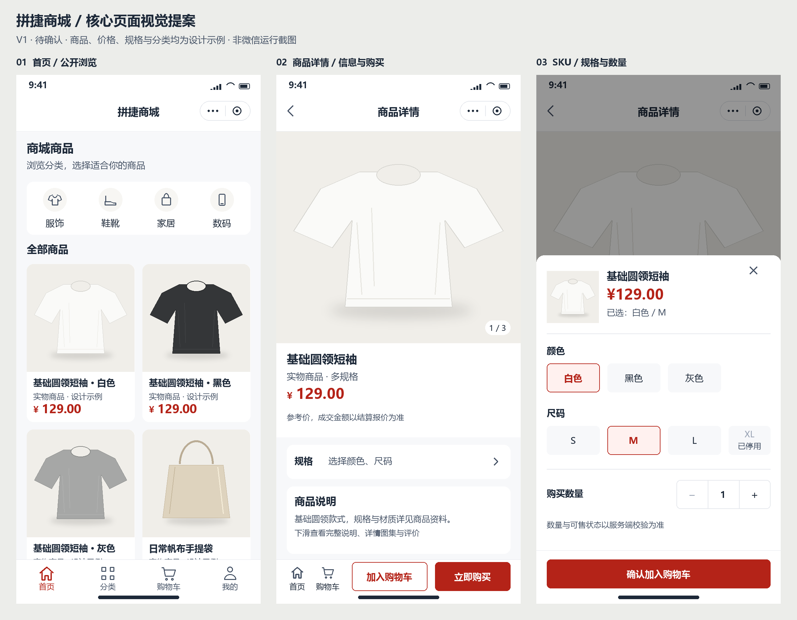

# 小程序页面设计

本目录保存微信小程序的页面设计资产。需求以[小程序 PRD](../../MINIAPP_PRD.md)为准，视觉 tokens 和组件要求引用[UI 规范](../../architecture/miniapp-ui-standard.md)，不在此维护第二套颜色、字号或功能标准。

## 当前完整图集

用户已确认 V1 视觉风格。当前完整设计为 V2，共 188 张独立页面、弹层和状态图，另有 36 张分组总览。沿用原有样式，按 PRD 和当前后端能力绘制；扩展页面与流程尚待用户评审。

- [打开完整图片图集](gallery-v2.html)：直接在本地浏览器打开，无需启动服务；按十个模块浏览，点击图片查看原图，展开每页的接口与设计边界。
- [完整页面目录](catalog-v2.md)：全部图片的稳定链接与能力分类。
- [接口与现有能力映射](api-coverage.md)：当前消费端接口、业务状态、源码证据和待补齐边界。

| 模块 | 独立图数量 | 覆盖内容 |
| --- | --- | --- |
| 浏览与商品 | 12 | 首页、分类、详情、规格、图集、虚拟商品、会员价格 |
| 购物车与结算 | 15 | 管理/失效条目、版本冲突、实物/虚拟/零应付、报价变更、下单未知 |
| 订单、支付与履约 | 20 | 列表目标、各状态详情、快照、付款结果、发货/虚拟交付、确认收货 |
| 售后与评价 | 14 | 整单退款、自动/人工审核、资金未知/完成、资格拒绝、评价 |
| 个人中心、身份与设置 | 16 | 登录/游客、资料、头像、设备、安全、退出、注销 |
| 收货地址 | 9 | 管理、选择、新增、编辑、地区、默认替补、冲突、上限、校验 |
| 会员、推荐与积分 | 9 | 档案、等级停用、首次推荐绑定、分享、积分接入前状态 |
| 钱包、佣金与提现 | 18 | 双钱包、欠款、佣金状态、提现申请限制与审核/执行/未知结果 |
| 帮助、隐私与服务 | 14 | 规则、联系信息缺失、协议草案、权限、断网、限流、刷新失败、更新 |
| 通用状态 | 61 | 18 个数据页面族的加载、失败及适用的空态/未登录 |

图片位于 `screenshots/v2/`，单页 750 × 1624，总览 1290 × 1920。所有商品、金额、资料、地址和编号均为设计示例。图库下方的接口与边界信息属于设计评审说明，不进入正式小程序用户页面。

`gallery-v2.html` 仅展示 PNG 图片，没有业务交互、API 请求或外部资源，不能作为 HTML/CSS 业务原型源文件。用户已授权直接实现 Taro 工程，当前公开浏览、基础交易、履约售后评价与帮助的交互源文件位于 apps/miniapp/src；独立 HTML/CSS 原型未生成。不启动 Web 服务，静态图片不代表全部目标能力已实现，具体见接口映射和阶段计划。

## V1 核心视觉基线

第一批核心页面 V1 的视觉风格已获用户确认，原始资产保留。三张页面均为 750 × 1624 PNG，按 375 × 812 逻辑尺寸理解；原生状态栏、导航和 TabBar 仅为布局示意，实际以微信工具和真机为准。总览为 2446 × 1904，供并排比较。首页和详情均展示首屏，未显示完整可滚动内容。

| 页面 | 预览 | 当前覆盖 |
| --- | --- | --- |
| 首页 | [home-v1.png](screenshots/home-v1.png) | 公开浏览、分类入口、两列商品、原生四项 TabBar |
| 商品详情 | [product-detail-v1.png](screenshots/product-detail-v1.png) | 主图、参考价格、规格入口、商品说明首屏、底部购买动作 |
| SKU 弹层 | [sku-sheet-v1.png](screenshots/sku-sheet-v1.png) | 已选规格、不可售选项、数量、确认加购；弹层约占视口 66% |
| 并排总览 | [overview-v1.png](screenshots/overview-v1.png) | 三页一致性与设计示例说明 |

商品插画为本项目自绘占位。商品名称、价格、分类、规格与文案均为设计示例，不来自真实商品或服务端报价，不能用于声称接口、库存或成交能力已接通。首版不新增搜索、装修轮播、优惠券或营销入口。

## 文件职责与维护

- `screenshots/`：版本化设计图；已确认版本保留，修改使用 `v2` 等新名称。
- [flows.md](flows.md)：页面衔接、边界和状态覆盖说明。
- [render_mockups.py](render_mockups.py)：当前静态 PNG 的绘图脚本，使用 Pillow 和本机已安装的中文字体。它用于重现设计提案，不属于小程序源码或 HTML 原型。
- [render_suite.py](render_suite.py)：完整图集绘图脚本，复用 V1 视觉基础，检查引用的消费端方法/路径确实存在于根 OpenAPI 后生成图片、总览、浏览页与目录。
- `screenshots/v2/manifest.json`：图片清单、用途、能力标记、对应现有接口与总览列表；属于设计元数据，不定义 API 契约。
- `prototypes/`：视觉确认后才创建，存放可直接打开的离线 HTML/CSS 原型；当前不存在。

当前截图采用程序化绘制，未使用 AI 图片服务，也未从可运行页面截取。绘图无需 Backend、Admin、Node 服务或网络；不修改根依赖和锁文件。使用有 Pillow 的 Python；Windows 默认使用系统微软雅黑，其他环境通过 `--font` 和 `--bold-font` 指定中文字体。V1 使用 `python docs/design/miniapp/render_mockups.py`，完整图集使用 `python docs/design/miniapp/render_suite.py --version v3` 创建后续版本。脚本拒绝覆盖已有版本，修订时明确新版本文件名。

独立 HTML/CSS 原型按需存放在本目录，当前公开浏览交互直接落地 Taro 源码，不重复制作业务 HTML。离线设计资料不启动 Web 服务，不进入冻结的 apps/web。正式 TabBar 图标已落地 apps/miniapp/src/assets，可由 scripts/design/render-miniapp-tab-icons.py 重现，小程序代码不引用设计目录。

## 确认与验收

V1 风格已确认，公开浏览已按该风格直接实现 Taro 页面。V2 私有交易与资金流程随对应专项继续验收；当前图片包含多数关键业务与通用状态，逐页覆盖以完整目录为准，图片数量不等于功能完成度。

验证范围为 PNG 文件/尺寸、布局辅助检查、消费端路径核验、图像人工核对和适用文档治理门禁。静态 PNG 无交互，不能证明 320/414 宽适配、键盘、安全区、无障碍、NutUI 兼容或微信真机体验。未执行应用构建、应用测试、浏览器自动化和真机验收。具体记录见[页面设计与原型计划](../../../plans/2026-10-09_小程序核心页面设计与原型计划.md)。
