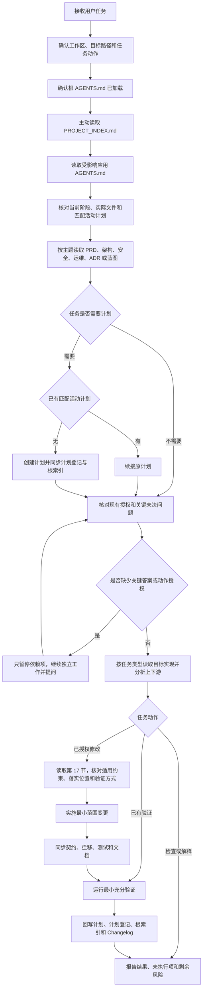

# AI 助手开发与文档读取指南

## 1. 文档目的

本文面向使用 AI 助手维护 `pinjie-mall` 的项目负责人、开发者和评审者，完整说明：

- AI 助手在任务开始时会自动获得哪些规则。
- 哪些项目文件需要 AI 使用文件工具主动读取。
- AI 如何根据任务类型、目标路径和风险判断追加读取范围。
- Backend、Admin、Web、API 契约、数据库、部署和文档任务的标准执行链。
- 计划、确认、实现、验证、交付与生产授权如何衔接。
- 用户如何检查 AI 是否漏读规则、误判当前状态或越过授权边界。

本文是日常操作指南，不替代被引用文件中的规则、需求、架构、运维步骤和历史事实。出现不一致时，以对应主题的权威来源为准。

## 2. 先记住四个结论

1. AI 自动获得的主要内容是工具支持的指令文件。普通 Markdown、源码、配置和契约不会因为存在于仓库中就自动进入上下文。
2. 本项目要求所有任务先确认根规则和[全项目索引](../../PROJECT_INDEX.md)，再根据任务范围读取应用规则、活动计划和专题文档；实现、修复或优化任务开始修改前必须读取本文第 17 节。
3. 文档链接只负责导航。AI 看到一个链接，不代表链接目标已被读取，仍需显式打开目标文件。
4. 无差别读取整个仓库会增加冲突和上下文噪声。本项目采用“固定入口 + 路径路由 + 主题触发 + 影响扩展”的读取方式。

## 3. 四种加载与读取方式

| 方式 | 含义 | 典型文件 | AI 需要做什么 |
| --- | --- | --- | --- |
| 平台自动加载 | AI 工具按照自身指令发现机制把规则加入当前任务上下文 | 根或当前目录链上的 `AGENTS.md`、Antigravity 匹配的 Workspace Rule | 核对实际工作目录和生效范围，不能凭印象假设 |
| 项目强制主动读取 | 已加载规则明确要求 AI 使用文件工具打开 | `PROJECT_INDEX.md`、目标应用 `AGENTS.md`、实现任务所需的本文第 17 节、`plans/README.md`、匹配的活动计划 | 在规定阶段读取相关文件或指定章节，确认内容已进入活动上下文 |
| 按任务触发读取 | 根据任务类型、目标路径、风险和下游影响选择 | PRD、专题架构、安全策略、运维手册、ADR、蓝图、契约 | 先判断主题，再打开该主题的权威来源 |
| 默认无需读取 | 当前任务与该文件职责没有关系 | 无关业务蓝图、无关应用规则、无关历史计划 | 不读取；影响范围扩大时重新评估 |

“主动读取”表示 AI 实际调用文件读取工具并获得文件内容。只列出文件名、在回复中提到文件或看到 Markdown 链接均不算完成读取。

本文的必读入口由根 `AGENTS.md` 的“任务读取与计划路由”规定，通过各应用对根规则的继承覆盖 Backend、Admin 和 Web。实施任务读取第 17 节后，再按范围读取本文专项章节，无需每次全文加载本指南。已读取、内容未变化且仍在活动上下文中的规则可以继续使用；无法确认内容或影响范围扩大时，先补读再修改。

## 4. Codex 如何自动发现规则

本节依据 2026-08-13 核验的 [OpenAI 官方 AGENTS.md 文档](https://learn.chatgpt.com/docs/agent-configuration/agents-md)和本项目 [ADR 0002](../adr/0002-Codex与Antigravity指令兼容决策.md)。工具升级后应重新核验官方行为。

### 4.1 Codex 原生发现顺序

Codex 在一次运行开始时建立指令链：

1. 在 Codex Home 中优先读取 `AGENTS.override.md`，不存在时读取 `AGENTS.md`，只取第一个非空文件。
2. 从项目根目录开始，沿目录层级向当前工作目录查找指令文件。
3. 每个目录依次检查 `AGENTS.override.md`、`AGENTS.md` 和配置的候选文件，每级最多取一份。
4. 指令按“全局、项目根、逐级子目录”合并，越靠近当前工作目录的规则越晚加入，因而拥有更具体的优先级。
5. 指令链达到 `project_doc_max_bytes` 限制后会停止追加。OpenAI 官方文档当前说明默认限制为 32 KiB，实际值可以由用户配置改变。

### 4.2 从 Monorepo 根目录启动的实际结果

本项目通常以以下目录作为 Codex 工作区：

```text
E:\fastapi\pinjie-mall
```

当 Codex 当前工作目录就是仓库根目录时，原生目录发现链到根目录结束，通常自动包含：

```text
个人全局 AGENTS.md
-> 仓库根 AGENTS.md
```

此时嵌套的 `apps/backend/AGENTS.md`、`apps/admin/AGENTS.md` 和 `apps/web/AGENTS.md` 不应仅依赖平台目录发现。根 [AGENTS.md](../../AGENTS.md) 已补充项目级路由，要求 AI 根据任务范围主动读取对应应用规则。

当 Codex 明确以 `apps/backend` 作为当前工作目录启动时，原生链通常为：

```text
个人全局 AGENTS.md
-> 仓库根 AGENTS.md
-> apps/backend/AGENTS.md
```

Admin 和 Web 同理。无论平台是否已经注入应用规则，AI 都要确认该规则处于活动上下文；已经加载时不重复读取。

### 4.3 Codex 不会自动读取的内容

除非用户个人配置把其他文件名加入指令候选列表，否则以下文件不会被 Codex 当作项目指令自动发现：

- `PROJECT_INDEX.md`
- `SECURITY.md`
- `docs/PROJECT_REQUIREMENTS.md`
- `docs/architecture/*.md`
- `docs/operations/*.md`
- `docs/adr/*.md`
- `docs/blueprints/*.md`
- `plans/*.md`
- `CHANGELOG.md`
- `README.md`
- 源码、配置、测试、迁移、Workflow 和生成契约

这些文件由根规则、应用规则、`PROJECT_INDEX.md` 中的权威入口和任务主题引导 AI 主动读取。

## 5. Antigravity 如何加载规则

Antigravity 使用 `.agents/rules/` 作为 Workspace Rules 入口，本项目通过小型桥接文件引用唯一规则正文：

| 桥接文件 | 激活方式 | 引用正文 |
| --- | --- | --- |
| [00-repository.md](../../.agents/rules/00-repository.md) | Always On | 根 `AGENTS.md` |
| [10-backend.md](../../.agents/rules/10-backend.md) | Glob：`apps/backend/**` | `apps/backend/AGENTS.md` |
| [20-admin.md](../../.agents/rules/20-admin.md) | Glob：`apps/admin/**` | `apps/admin/AGENTS.md` |
| [30-web.md](../../.agents/rules/30-web.md) | Glob：`apps/web/**` | `apps/web/AGENTS.md` |

执行含义：

1. 根规则由 `00-repository.md` 持续加载。
2. 操作目标匹配某个应用目录时，对应 Glob 规则加载该应用的 `AGENTS.md`。
3. 桥接文件只包含路由和 `@` 引用，不保存重复规则正文。
4. 纯讨论任务如果没有明确目标文件，应用 Glob 可能没有触发。根规则仍要求根据讨论范围主动读取对应应用规则和专题文档。
5. `SECURITY.md`、PRD、架构文档和运维手册仍属于按任务主动读取内容，普通 Markdown 链接不会自动展开。

Codex 与 Antigravity 的加载入口不同，但最终遵守同一组根和应用级 `AGENTS.md`。

## 6. 其他 AI 工具如何接入

无法证明某个 AI 工具支持 `AGENTS.md` 或 `.agents/rules/` 时，按以下最低协议显式加载：

1. 完整读取根 [AGENTS.md](../../AGENTS.md)。
2. 完整读取[全项目索引](../../PROJECT_INDEX.md)。
3. 根据目标路径读取 [Backend 规则](../../apps/backend/AGENTS.md)、[Admin 规则](../../apps/admin/AGENTS.md)或 [Web 规则](../../apps/web/AGENTS.md)。
4. 实现或治理变更继续读取[计划规范](../../plans/README.md)和匹配的活动计划。
5. 根据任务主题读取 PRD、架构、安全、运维、ADR、蓝图和契约。
6. 实现、修复或优化任务开始修改前读取本文第 17 节，完成适用约束、落实位置和验证方式的核对。
7. 无法确认规则是否生效时，先让工具列出已加载规则和当前工作目录，再开始修改。

其他 AI 工具不得因为缺少自动发现能力而跳过项目规则，也不得创建一份新的规则副本解决接入问题。

## 7. 项目权威来源分层

AI 判断事实前必须先判断问题属于哪一种信息。

| 要回答的问题 | 权威来源 | 常见误用 |
| --- | --- | --- |
| 项目长期必须遵守什么 | 根和应用级 `AGENTS.md` | 从历史计划推导当前规则 |
| 项目最终要做什么 | [PROJECT_REQUIREMENTS.md](../PROJECT_REQUIREMENTS.md) | 把目标能力说成已经实现 |
| 项目当前处于什么阶段、有哪些活动计划 | [PROJECT_INDEX.md](../../PROJECT_INDEX.md) | 用历史计划或 PRD 代替当前阶段 |
| 某项能力是否已经实现 | 实际源码、配置、迁移、生成契约和对应架构文档 | 只根据根索引阶段摘要或 Changelog 推断实现细节 |
| 当前任务准备或正在做什么 | 匹配的 `plans/*.md` | 新建重复计划或忽略用户确认 |
| 某项技术为何这样选择 | `docs/adr/*.md` | 在 PRD 中寻找技术论证 |
| 系统当前如何设计 | `docs/architecture/*.md` | 用操作手册替代架构契约 |
| 本地、部署或恢复如何执行 | `docs/operations/*.md` | 只看架构文档就执行生产操作 |
| 商城业务如何扩展 | `docs/blueprints/*.md`和商城业务文档 | 把蓝图当作已实现业务 |
| 已经交付了什么变化 | [CHANGELOG.md](../../CHANGELOG.md) | 用 Changelog 判断完整实现细节 |
| 代码和配置当前真实行为 | 源码、配置、测试、生成契约和运行验证 | 只相信文档而不核对实现 |
| 普通提交的精确历史 | Git log、diff、show 和 blame | 把普通 Commit SHA 重复写进文档 |
| OpenAPI 当前机器契约 | 根 [openapi.json](../../openapi.json) | 手工修改或从前端 DTO 反推契约 |

同一主题只保留一份完整事实。其他文档使用摘要和链接导航。

## 8. AI 如何判断需要读取什么

AI 按五类信号扩展读取范围。

### 8.1 任务动作

| 用户动作 | AI 的默认行为 |
| --- | --- |
| 解释、查询、扫描 | 只读检查，不新建计划，不修改文件 |
| 诊断 | 查明原因并提供证据，用户没有要求修复时不实施 |
| 规划 | 读取需求、现状、相关架构和计划规范，产出或更新计划，不提前写源码 |
| 实现、修复、重构 | 读取计划和全部受影响规则，确认后实施并验证 |
| 评审 | 读取目标实现、适用规则、架构和测试标准，优先报告问题与风险 |
| 启动、测试、构建 | 读取对应运维手册和应用规则，只运行当前已配置命令 |
| 发布、部署、回滚 | 读取发布运维、ADR、安全与活动计划，并检查独立授权 |
| 文档收尾、交接、PR 前审计 | 读取文档索引、计划永久登记、活动计划、Changelog 和影响矩阵，执行知识同步 |

### 8.2 目标路径

- `apps/backend/**` 触发 Backend 规则。
- `apps/admin/**` 触发 Admin 规则。
- `apps/web/**` 触发 Web 规则（当前已全面停用冻结，完全禁止开发与启动）。
- `packages/api-client/**` 或 `openapi.json` 触发 API 契约链检查。
- `apps/backend/alembic/**` 或 Model 变化触发数据库和迁移规则。
- `.github/workflows/**`、Compose、Dockerfile 触发发布、供应链和生产边界。
- `docs/**`、`plans/**`、`AGENTS.md` 触发文档治理、索引和 Markdown 验证。

### 8.3 任务关键词和主题

| 关键词或主题 | 追加读取 |
| --- | --- |
| 领域、模块、跨域、依赖、共享包、JOIN | `module-boundaries.md` |
| 异常、状态码、重试、超时、降级、结果未知 | `error-model.md` |
| 登录、Token、Cookie、RBAC、权限、审计 | `authentication-authorization.md` 和 `SECURITY.md` |
| 测试、Mock、Fixture、覆盖率、CI、验收 | `testing-strategy.md` |
| 日志、Trace、探针、SLO、容量、高可用 | `observability-reliability.md` |
| 环境变量、uv、pnpm、本地启动 | 对应本地运维手册 |
| 备份、恢复、迁移生产库 | `database-backup-restore.md` |
| 发布、镜像、digest、1Panel、回滚 | `release-and-rollback.md` 和 ADR 0008 |
| 故障、事故、止损、复盘 | `incident-response.md` |
| Breaking Change、双读、双写、兼容 | ADR 0007 |
| 派生、电商、CMS、业务领域 | PRD、相关蓝图和派生仓库文档 |

### 8.4 下游影响

目标文件不等于完整影响范围。例如修改 Backend Schema 还会影响：

```text
Backend Router 与 Schema
-> 根 openapi.json
-> packages/api-client/src
-> Admin 和 Web 消费者
-> 契约测试、生成漂移和 Breaking Change 检查
```

AI 在读取时必须沿真实依赖方向扩展，不能只读取用户最先提到的目录。

### 8.5 当前计划和历史证据

`PROJECT_INDEX.md` 存在匹配的活动计划时，AI 必须读取并维护同一份计划。已结束计划只在以下场景通过 `plans/INDEX.md` 定位并读取：

- 需要理解某个历史决策的实施背景或验证证据。
- 当前文件或 ADR 明确引用该计划。
- 排查回归、追溯来源或确认曾经排除的范围。

普通任务不遍历所有历史计划。

## 9. 所有任务的固定启动链



只有无法从现有事实解决且会改变当前结果的范围、权威来源或授权问题才需要提问。暂停范围限于依赖该问题的动作，独立的已授权工作继续。只读任务在读取后回答，不进入修改链；既有实现授权不因计划创建、Skill 切换或上下文续接失效。

## 10. 关键文件到底何时使用

### 10.1 根 `AGENTS.md`

| 项目 | 说明 |
| --- | --- |
| 是否自动加载 | Codex 从仓库根目录运行时通常自动加载；Antigravity 通过 Always On 桥接加载 |
| 每次任务是否需要 | 是，必须确认已生效 |
| 主要内容 | 全仓库规则、任务读取顺序、计划门禁、文档治理、安全、契约、Git 和交付边界 |
| AI 如何知道 | 工具原生发现或 `.agents/rules/00-repository.md` 桥接 |
| 何时复读 | 新任务上下文无法确认、规则发生变化或工具报告指令截断时 |

### 10.2 `PROJECT_INDEX.md`

| 项目 | 说明 |
| --- | --- |
| 是否自动加载 | 否 |
| 每次任务是否需要 | 是，由根规则强制主动读取 |
| 主要内容 | 项目身份、当前阶段、活动计划和权威入口 |
| AI 如何知道 | 根 `AGENTS.md` 的首要读取要求 |
| 不能替代 | PRD、计划正文、架构正文和 Changelog |

### 10.3 `plans/INDEX.md`

| 项目 | 说明 |
| --- | --- |
| 是否自动加载 | 否 |
| 每次任务是否需要 | 否，普通任务通过根索引定位活动计划即可 |
| 必须读取 | 新建计划、计划状态或结果变化、历史追溯、阶段交接和文档治理审计 |
| 主要内容 | 全部实施计划的路径、状态、结果、影响范围和用途 |
| 不能替代 | `plans/README.md` 的计划规则或 `plans/*.md` 的实施正文 |

### 10.4 应用级 `AGENTS.md`

| 文件 | Codex | Antigravity | 使用场景 |
| --- | --- | --- | --- |
| [Backend](../../apps/backend/AGENTS.md) | 从 Backend 目录运行时通常自动进入目录指令链；从根运行时主动保证读取 | Backend Glob 匹配时加载 | Backend 讨论、规划、实现、评审和验证 |
| [Admin](../../apps/admin/AGENTS.md) | 从 Admin 目录运行时通常自动进入目录指令链；从根运行时主动保证读取 | Admin Glob 匹配时加载 | B 端页面、状态、API、Ant Design 和构建 |
| [Web](../../apps/web/AGENTS.md) | 从 Web 目录运行时通常自动进入目录指令链；从根运行时主动保证读取 | Web Glob 匹配时加载 | Next.js、SSR、SEO、设计、状态和浏览器验证 |

跨应用任务在设计或规划时确认所有受影响应用规则，最迟在修改对应应用前完成读取。例如 Backend API 变化同时影响 Admin 和 Web 时，三份应用规则都需要读取。切换应用后继续遵守根规则和本文第 17 节；新发现的受影响路径及专题规则先补读再修改，已读取且未变化的内容无需因切换应用而重复全文读取。

### 10.5 `SECURITY.md`

| 项目 | 说明 |
| --- | --- |
| 是否自动加载 | 否 |
| 必须读取 | 漏洞、安全修复、认证授权、敏感数据、公开披露、供应链、高风险配置和生产安全变更 |
| 条件读取 | 普通功能涉及密码、Token、Cookie、上传、外部 URL、审计或权限时 |
| 通常无需读取 | 与安全边界无关的纯文案或只读状态查询 |
| 主要内容 | 漏洞报告渠道、响应目标、安全开发要求和披露边界 |
| AI 如何知道 | 根规则的安全入口、任务关键词、受影响文件和 PR 风险范围 |

`SECURITY.md` 是安全治理入口。具体认证、错误和事故机制继续读取其链接的专题文档。

### 10.6 `docs/PROJECT_REQUIREMENTS.md`

| 项目 | 说明 |
| --- | --- |
| 是否自动加载 | 否 |
| 必须读取 | 新增、修改、取消产品能力；创建实现计划；判断当前商城产品范围 |
| 条件读取 | 评审实现是否满足需求编号或验收条件 |
| 通常无需读取 | 不改变产品能力的局部修复或只运行既有检查 |
| 主要内容 | 目标用户、适用场景、目标能力、非目标、派生规则和验收边界 |
| 不能用于 | 判断当前能力是否已经实现，详细实现状态以实际源码、配置、迁移、生成契约和对应架构文档为准 |

### 10.7 Backend 工程实施标准

| 项目 | 说明 |
| --- | --- |
| 文件 | [backend-engineering-standard.md](../architecture/backend-engineering-standard.md) |
| 是否自动加载 | 否 |
| 必须读取 | Backend 详细技术设计、实施计划、代码实现、代码评审和验证 |
| 条件读取 | 只讨论某个 Backend 原则时，根据问题深度决定 |
| 通常无需读取 | 纯产品范围讨论、Admin 或 Web 独立任务 |
| AI 如何知道 | Backend `AGENTS.md` 的任务读取路由 |
| 主要内容 | 配置、Router、Schema、事务、SQLAlchemy、Model、Alembic、Redis、外部调用、日志、探针、测试和门禁的具体落地方式 |

同一任务首次进入详细设计或实现阶段时完整读取一次。标准变化、任务跨越较长周期或上下文无法确认时重新读取。

### 10.8 五份专题架构文档

| 文件 | 何时读取 | 负责回答 |
| --- | --- | --- |
| [module-boundaries.md](../architecture/module-boundaries.md) | 领域、Feature、共享包、跨应用或依赖方向变化 | 谁拥有数据、谁能依赖谁、跨边界如何协作 |
| [error-model.md](../architecture/error-model.md) | API 错误、异常、重试、外部失败、降级和结果未知 | 失败是什么、调用方看到什么、哪些故障隔离允许存在 |
| [authentication-authorization.md](../architecture/authentication-authorization.md) | 登录、会话、权限、资源授权和审计 | 身份在哪里解析、权限在哪里声明、最终授权在哪里执行 |
| [testing-strategy.md](../architecture/testing-strategy.md) | 实施计划、代码实现、评审、CI 和完成验收 | 各层测什么、依赖如何替换、何时能宣称完成 |
| [observability-reliability.md](../architecture/observability-reliability.md) | 日志、Trace、探针、容量、SLO、恢复和部署等级 | 怎样判断可用、怎样观测、怎样恢复 |

这些专题文档按任务组合读取，无需每次五份全读。Backend 详细实施通常先完整读取工程标准，再按涉及主题读取相应专题文档。

### 10.9 计划文件

| 文件 | 何时读取 | 用途 |
| --- | --- | --- |
| [plans/README.md](../../plans/README.md) | 实现、修复、重构、配置、依赖、迁移、部署和治理变更 | 判断是否建计划、计划格式、状态和完成条件 |
| [plans/INDEX.md](../../plans/INDEX.md) | 新建计划、状态或结果变化、历史追溯、交接和治理审计 | 全部计划的唯一永久登记 |
| 根索引中匹配的活动计划 | 任何继续实施、评审或验证该目标的任务 | 当前确认范围、实施顺序、风险、验证和待确认问题 |
| 已结束计划 | 追溯历史、排查回归、理解 ADR 背景或确认历史验证时 | 保存当时范围和证据，不代表当前活动工作 |

已有匹配活动计划时必须续接原文件。计划属于永久资产，AI 不删除、移动、重命名或替换。

### 10.10 ADR、蓝图和原始方案

- ADR 在理解重大技术选择、修改该选择或评估备选方案时读取。普通实现不遍历全部 ADR。
- `docs/blueprints/` 在商城具体业务领域设计时读取。蓝图是扩展参考，不能表述成已实现能力。
- `全栈Monorepo架构规划原始方案.md` 保存历史原始规划。当前规则、PRD、ADR和专题架构文档已经覆盖的问题优先使用当前权威来源，只有追溯原始背景时读取该文件。

### 10.11 运维手册

| 文档 | 使用场景 |
| --- | --- |
| [local-dev-environment.md](local-dev-environment.md) | Windows 本地环境、PostgreSQL、Redis、uv 和 pnpm 初始化 |
| [environment-variables-and-backend-local-run.md](environment-variables-and-backend-local-run.md) | 根与三端 `.env` 职责、VS Code、Backend 启动和 1Panel 目录关系 |
| [uv使用指南.md](uv使用指南.md) | Python 版本、虚拟环境、依赖添加和 uv 命令 |
| [pnpm使用指南.md](pnpm使用指南.md) | workspace、Node 依赖、锁文件和 pnpm 命令 |
| [release-and-rollback.md](release-and-rollback.md) | CI、镜像发布、生产部署、不可变版本和回滚 |
| [database-backup-restore.md](database-backup-restore.md) | 备份、恢复演练、迁移保护和生产恢复 |
| [incident-response.md](incident-response.md) | 事故分级、止损、恢复、沟通和复盘 |

执行某项操作前读取对应手册，不能依靠记忆拼接命令。涉及生产时还要检查当前活动计划和独立授权。

### 10.12 Changelog、README、契约和实际文件

- [CHANGELOG.md](../../CHANGELOG.md) 在交付收尾时读取和更新，只记录已经交付的变化。
- 根和应用 README 在了解使用入口、目录说明和本地命令时读取，不承担最高规则职责。
- 根 `openapi.json` 是机器可读 API 契约；修改公开接口和检查前后端一致性时读取或重新生成。
- `packages/api-client/src/` 是生成结果，消费者适配和漂移检查时读取，禁止手工修改。
- `pyproject.toml`、`package.json`、锁文件、Compose、Workflow 和脚本在任务直接涉及依赖、构建、运行或门禁时读取。
- 源码、测试和迁移始终按实际影响范围读取。文档只能帮助定位，不能替代实现证据。

## 11. 常见场景读取矩阵

下表中的“共同入口”均指：根规则、`PROJECT_INDEX.md` 和受影响应用规则。

凡进入实现、修复或优化阶段，还必须在修改前读取本文第 17 节；下表不在每行重复列出这一共同要求。计划是否必需以 `plans/README.md` 为准，局部修复不因表中概括描述自动新增计划。

| 场景 | 必须读取 | 条件读取 | 计划 | 关键验证或授权 |
| --- | --- | --- | --- | --- |
| 只读解释或状态查询 | 共同入口、实际文件 | 相关专题文档 | 通常不需要 | 不修改文件，说明依据和不确定性 |
| 只读代码评审 | 共同入口、目标实现、测试标准 | 专题架构、SECURITY、PRD、活动计划 | 不新增；有活动计划则读取 | Findings 优先，说明测试缺口 |
| 产品能力新增或调整 | 共同入口、PRD、计划规范 | ADR、架构、蓝图 | 必须新建或续接 | 用户确认范围和需求编号 |
| Backend 详细设计 | 共同入口、Backend 工程标准、测试策略 | 对应专题架构、SECURITY、PRD | 通常必须 | 先计划后实现，不写虚构路径 |
| Backend 实现或修复 | 上一项加目标源码、配置和测试 | 运维、迁移、契约 | 必须新建或续接 | 默认静态、导入和契约门禁；pytest 仅在用户明确授权后执行 |
| Admin 页面或状态 | 共同入口、Admin 规则、目标实现 | PRD、模块边界、认证、测试 | 实现时必须 | 默认 typecheck、lint；build、Vitest 和浏览器仅在用户明确授权后执行 |
| Web 页面、SSR 或 UI | 共同入口、Web 规则、目标实现 | PRD、模块边界、认证、测试 | 实现时必须 | 默认 typecheck、lint；build、Vitest 和浏览器仅在用户明确授权后执行 |
| 跨栈 API 变化 | 三端规则、PRD、计划、OpenAPI 链 | 错误、认证、迁移兼容 ADR | 必须使用一份全栈计划 | Backend 静态检查、契约、客户端和消费者类型联合验证 |
| Model 或 Alembic | Backend 规则、工程标准、测试、备份恢复 | 模块边界、错误、发布手册 | 必须 | 默认静态检查与迁移复读；`_test` PostgreSQL 验证需用户明确授权 |
| 认证、权限或审计 | 共同入口、SECURITY、认证授权、错误、测试 | Backend 标准、前端规则、事故手册 | 必须 | 默认拒绝、失败路径、敏感信息检查 |
| 外部 API 或副作用 | Backend 规则、工程标准、错误、测试 | SECURITY、可靠性 | 必须 | 超时、幂等、结果未知、网络隔离 |
| 日志、探针和可靠性 | 共同入口、可靠性、测试 | 错误、事故、发布手册 | 实现时必须 | Startup、Liveness、Readiness 语义和故障验证 |
| 本地环境或启动排障 | 共同入口、对应本地运维手册、实际配置 | 应用 README、工具官方文档 | 通常不需要 | 只运行已有命令，核对端口和进程 |
| 依赖或技术栈变化 | 共同入口、PRD、计划规范、实际依赖文件 | ADR、SECURITY、运维手册 | 必须 | 锁文件、审计、构建和消费者验证 |
| CI 或治理门禁 | 根规则、计划规范、脚本、Workflow | SECURITY、测试、发布手册 | 必须 | 正反例、Workflow 语法和治理检查 |
| 镜像发布 | 根规则、发布手册、ADR 0008、活动计划 | SECURITY、Workflow | 必须且单独授权 | 完整 SHA、SBOM、证明和 digest |
| 生产部署或回滚 | 根规则、发布手册、ADR 0008、活动计划、当前部署事实 | 备份恢复、事故手册、SECURITY | 必须且单独授权 | 固定 digest、审批、探针、回滚和记录 |
| 事故处理 | 根规则、SECURITY、事故手册、当前运行证据 | 发布、备份、可靠性 | 记录到相应计划或事故材料 | 先止损，再恢复和验证；生产动作单独授权 |
| 商城业务蓝图 | 根规则、PRD、相关蓝图、`PROJECT_INDEX.md` | 架构与当前 Git 事实 | 必须 | 在计划中记录业务范围、验证和偏离边界 |
| 文档治理或交接 | 根规则、`PROJECT_INDEX.md`、`plans/INDEX.md`、`docs/README.md`、活动计划、Changelog | 相关权威文档、Git 历史 | 影响治理结构时必须 | Markdown、链接、文本、计划登记和事实一致性 |
| 普通提交、推送、PR 或合并 | 根规则、当前计划、Git 差异 | Changelog、PR 模板 | 使用现有任务计划 | 只执行用户文字明确授权的动作 |
| 显式执行 `$git-sync` | 根规则、各交付范围计划、全部本地分支及 worktree 差异、PR 模板 | Actions 运维文档与第 18.1 节 | 续接各变更原计划，必要整合按计划规则登记 | 一次授权处理全仓本地可交付改动；错误自行修复、复验并继续，禁止绕过门禁 |

## 12. Backend 专项读取链

### 12.1 只讨论产品范围或原则

```text
根 AGENTS.md
-> PROJECT_INDEX.md
-> apps/backend/AGENTS.md
-> PROJECT_REQUIREMENTS.md（涉及产品能力时）
-> 对应专题架构文档
```

如果问题只涉及商城是否应提供某项能力，可以不读取完整 Backend 工程标准。讨论已经深入到 Router、事务、Schema、迁移或测试写法时，应继续读取工程标准。

### 12.2 详细设计、实施计划、代码实现或代码评审

```text
根 AGENTS.md
-> PROJECT_INDEX.md
-> apps/backend/AGENTS.md
-> plans/README.md 和匹配活动计划
-> 本指南第 17 节（实现、修复或优化前）
-> PROJECT_REQUIREMENTS.md（创建计划或改变能力时）
-> backend-engineering-standard.md（完整读取）
-> 按主题读取五份专题架构文档
-> 目标源码、配置、测试、迁移和下游消费者
```

### 12.3 专题路由

- 跨领域依赖读取 `module-boundaries.md`。
- API 错误、外部失败和重试读取 `error-model.md`。
- 身份、权限和审计读取 `authentication-authorization.md` 与 `SECURITY.md`。
- 实现、评审和验收读取 `testing-strategy.md`。
- 日志、探针、容量和部署设计读取 `observability-reliability.md`。
- 迁移生产数据继续读取数据库备份恢复与发布手册。

## 13. Admin 与 Web 专项读取链

### 13.1 Admin

```text
根 AGENTS.md
-> PROJECT_INDEX.md
-> apps/admin/AGENTS.md
-> plans/README.md 和活动计划（实现时）
-> 本指南第 17 节（实现、修复或优化前）
-> admin-engineering-standard.md（按任务读取相关章节，表格任务含 UI 与表格约定）
-> PRD（能力变化时）
-> module-boundaries.md（Feature 或共享边界）
-> authentication-authorization.md（认证与权限）
-> testing-strategy.md（实现、评审和验收）
-> 目标页面、组件、状态、API Client 和配置
```

Admin 保留 Ant Design 与 ProComponents。不能因为 Web 使用另一套 UI 标准而替换管理端组件体系。只读取 `apps/admin/AGENTS.md` 不足以完成实施前读取链，还需按上面的入口读取通用开发流程和相关专题标准。

### 13.2 Web

本项目定位为微信小程序商城，应用层完全不需要 Web 端，`apps/web` 已停用并冻结，完全禁止启动 Web 服务与端口。前阶段集中实现后端与管理后台，小程序端前阶段先不开发，因此不执行 Web 实现流程。

## 14. 跨栈 API 契约链

公开 API 发生变化时，读取和实施顺序固定为：

```text
PRD 与全栈计划
-> Backend、Admin、Web 三份 AGENTS.md
-> 本指南第 17 节与受影响应用的专项读取链
-> Backend 工程标准和相关专题架构
-> Backend Router、Schema 和现有测试资产
-> 根 openapi.json
-> packages/api-client/src
-> Admin 和 Web 消费者
-> Backend 静态检查、生成漂移与前端类型联合验证
```

实施顺序固定为：

1. 完成 Backend 实现，并维护相关测试资产。
2. 从 Backend 导出根 `openapi.json`。
3. 从根目录运行 `pnpm generate-api`。
4. 适配 Admin 和 Web 消费者。
5. 运行 Breaking Change、生成漂移和受影响应用轻量验证；构建与测试只在用户明确授权后执行。

三端模块可按 Backend、契约与客户端生成、Admin、Web 的顺序实施；Admin 与 Web 的先后按实际依赖安排。应用切换只需补齐尚未读取或发生变化的规则，不能把实施顺序当作延后识别其他端约束的理由。

禁止手工修改 `openapi.json` 或 `packages/api-client/src/`，也禁止只提交 Backend 一侧的破坏性契约变化。

## 15. 数据库与迁移链

涉及 Model、约束、索引、数据回填或迁移时：

```text
Backend 规则和工程标准
-> module-boundaries.md（数据所有权）
-> testing-strategy.md（真实 PostgreSQL）
-> database-backup-restore.md（备份与恢复）
-> release-and-rollback.md（共享或生产迁移）
-> Model、Alembic 配置、已有 revisions 和数据库测试
```

AI 可以在用户确认的实现计划中生成迁移文件，但执行到共享开发、预发布或生产环境前仍需人工审查和明确授权。生产迁移、数据库恢复和数据删除属于独立动作，普通代码实现授权不覆盖这些操作。

## 16. 计划与用户确认链

### 16.1 无需新计划

- 只读查询、解释和扫描。
- 用户只要求诊断且没有授权修复。
- 只运行仓库已经配置的验证命令。
- 不触及产品能力、依赖、契约、数据或安全边界的局部修复、样式调整、普通配置和文档勘误。简述范围和验证；已有匹配活动计划时维护原计划。

### 16.2 必须创建或续接计划

- 新增模块或功能。
- 跨模块重构、需要多阶段追踪的修复。
- 修改依赖、数据库 Model、迁移或安全配置。
- 修改 API 契约、生成流程、CI、发布或部署。
- 调整治理结构、执行授权边界或架构决策；普通规则勘误按影响判断。
- 跨 Backend、Admin、Web、API Client 或数据库的能力。

标准流程：

1. 读取 `plans/README.md`。
2. 从 `PROJECT_INDEX.md` 确认是否已有匹配活动计划。
3. 有匹配计划时更新原计划，禁止建立平行计划。
4. 没有匹配计划时创建新计划，同步登记 `plans/INDEX.md`，并把活动计划加入 `PROJECT_INDEX.md`。
5. 记录现有用户授权；只有缺少关键答案或操作授权时才标记“待确认”，暂停依赖项。
6. 授权覆盖范围且关键问题已解决时直接进入“待实施”或“实施中”，不重复确认计划文字。
7. 实施期间持续回写范围变化、验证和剩余问题。
8. 满足完成条件后标记“已结束 / 已完成”，更新 `plans/INDEX.md` 并从根索引移除已结束计划；永久登记继续保留。

“开始实现”“帮我修复”“审阅后帮我优化”等请求可以授权范围明确的实施；单纯评审继续只读。任务后来扩大到新的产品能力、高风险系统或生产动作时，只更新并确认新增部分。计划体量和完成条件以 `plans/README.md` 为准。

## 17. 实施、验证与交付链

### 17.1 实施前

AI 必须完成：

- 确认用户要求和非目标。
- 检查工作区已有修改，保护用户资产。
- 读取目标实现、配置和相关测试。
- 从已读取的根规则、应用规则和专题标准中提取本次适用约束，逐项对应到目标文件、实现动作和验证方式；仅说明“已阅读”不算完成核对。
- 核对准备复用的公共组件、样式、配置和权限入口在目标路径中实际生效。前端需检查组件引用、容器类名、样式选择器作用范围及页面覆盖，不能仅凭公共文件中存在相关定义就认定目标页面已遵守规则。
- 识别上游、下游、契约、迁移、安全和部署影响。
- 明确验证命令和可能产生的临时文件、进程、端口或数据库影响。

需要计划的任务在原计划中记录“规则来源、适用约束、落实位置、验证方式”；无需计划的局部任务在修改前简述这些对应关系，不为检查清单新增文档或审批。规则未变化且已在活动上下文中时不重复全文读取；新增影响路径或主题时，先补读对应规则再修改。缺少验证条件时记录缺口并继续可独立完成的授权工作。

### 17.2 实施中

- 保持修改范围最小且符合现有模式。
- 按实施前列出的适用约束核对实际改动，不能只完成新增字段或正常路径。复用公共实现时确认目标已接入；发现未覆盖时修复当前范围内的接入或实现，不以复制一套样式或逻辑代替核对。
- 修改页面或组件时，逐项检查受影响的加载、空数据、有数据、请求失败及适用的权限和操作结果状态。表格还需核对筛选无结果、分页、长文本和窄屏对列宽、表头、空态及滚动容器的影响；仅修改一个字段也要确认承载它的表格状态未被遗漏，不据此扩大为无关页面重设计。
- 发现范围扩大时先更新计划。
- 不修改生成文件，使用规定生成链。
- 不读取或输出真实 `.env`、密钥、Token、Cookie、生产数据和敏感样本。
- 不通过空值、默认值、假成功、静默降级或隐式兼容让流程继续。
- 不因为测试环境缺失而把跳过项表述成通过。

### 17.3 验证

默认自动验证范围固定为轻量门禁，风险增加不会自动扩大为重型验证：

```text
Admin / Web: typecheck + lint
Backend: Ruff + format + Mypy + import boundaries + compile + app import
公开 API: OpenAPI + API Client + breaking / drift
治理变更: documents + workspace + boundaries + text + Markdown
```

Vitest、pytest、production build、Playwright、浏览器自动化和测试数据库验证只有在用户对当前任务明确授权后才能追加。Markdown 修改至少运行 `pnpm lint:md`。治理和架构变更继续运行 `pnpm check:workspace`、`pnpm check:boundaries` 及适用的轻量治理命令。正式门禁使用仓库已配置命令，允许范围内只读诊断和辅助核验，但不能冒充正式门禁或绕过重型验证限制。

验证结果必须对应到适用约束，并区分证据能够支持的结论：

| 证据 | 可以说明 | 不能据此说明 |
| --- | --- | --- |
| 源码与样式复读 | 已检查实现路径、状态分支和选择器覆盖 | 页面在浏览器中显示正常 |
| typecheck、lint 等静态门禁 | 对应静态规则检查通过 | 空表、列宽、滚动和交互状态已经验收 |
| 已执行的测试或浏览器检查 | 实际覆盖的用例、数据状态和视口通过 | 未覆盖的状态、页面或完整跨栈流程通过 |
| 用户人工验收反馈 | 用户已反馈对应范围的结果 | AI 已执行自动验证 |

未获授权或缺少环境的动态验证明确标为“未执行”，列明尚未确认的状态和风险；测试源码存在不等于测试通过。已从源码确认的范围内违规应先修复，不能以未获浏览器验证授权为由保留。轻量门禁通过后可以按本次授权范围交付，但不得将其表述为视觉验收完成。

### 17.4 本地检查点与高风险文件编辑

只有已获当前任务本地提交授权时，才在同时满足以下条件后创建检查点。未获授权时继续实现和验证，不逐个功能单元询问；确有恢复价值时可在交付时建议一次：

1. 功能范围完整，没有已知的半实现或占位分支。
2. 受影响源码、配置、测试资产和文档已经复读。
3. 受影响范围的轻量门禁已经通过，未执行的重型验证已明确记录。
4. `git status --short` 和差异检查能够区分当前任务文件与用户已有修改。

用户已明确授权当前任务分阶段本地提交时，按“复读与轻量验证、精确暂存、检查暂存差异、本地提交、确认工作区状态”的顺序立即建立检查点。授权只覆盖用户文字明确的本地提交范围，不包含推送、Pull Request、合并、Tag、镜像、部署或生产变更。存在用户或其他任务修改时，只暂存当前功能单元文件；无法准确拆分时暂停提交并报告，继续不依赖提交的工作。

批量覆盖、整文件重写或一个命令写入多个既有文件属于高风险编辑。目标含未提交修改且没有可恢复检查点时，优先使用逐文件 `apply_patch`，禁止直接执行高风险编辑。确需批量机械写入时执行以下步骤：

1. 核对每个目标的绝对路径、Git 状态、预期内容和最近可恢复提交。
2. 保存并校验本次目标文件的原字节副本，或使用已授权的本地检查点；写入前核对原文未变化，不强制用户为安全编辑授权提交。
3. PowerShell 启用 `Set-StrictMode -Version Latest` 和 `$ErrorActionPreference = "Stop"`。
4. 在内存或同目录临时文件中完成全部转换，不边计算边覆盖目标。
5. 写入前校验预期非空、最小长度、关键签名、替换命中数量、编码和目标数量；任一校验失败时不写入任何目标。
6. 采用同目录临时文件替换目标，保存为 UTF-8 无 BOM并保留末尾换行。
7. 每写入一个目标立即复读具体修改行，检查长度、关键签名、括号、导入、缩进和字符串转义。
8. 任一写后校验失败时停止剩余写入，核对差异后仅修复本次改动，禁止用整文件恢复覆盖用户新修改，并明确报告已影响文件。
9. 运行受影响范围的轻量门禁和 `git diff --check`，删除本次创建的临时文件。

恢复副本和检查点提供恢复能力，不能降低写前校验、原子替换、写后复读和门禁要求。

### 17.5 交付收尾

1. 复读修改文件和 Git 差异，逐项核对实施前列出的约束、落实位置与验证证据；未落实项或证据不足项明确记录，不能用一条“检查通过”概括全部要求。
2. 清理本次验证产生的缓存、临时构建物、服务和可确认的测试标签。
3. 更新当前系统机制对应的文档。
4. 更新原计划的实施结果、验证和剩余问题。
5. 更新 `plans/INDEX.md` 中的计划状态和结果；只有项目身份、当前阶段、活动计划或权威入口变化时才更新 `PROJECT_INDEX.md`。
6. 把已交付变化写入 Changelog。
7. 最终说明修改内容、通过项、失败项、跳过项、未执行项和剩余风险。

## 18. 独立授权边界

以下动作相互独立，完成本地实现不会自动获得后续授权：

| 动作 | 是否需要明确授权 | 读取要求 |
| --- | --- | --- |
| 创建或修改本地源码 | 需要用户要求实现，并满足计划门禁 | 规则、`PROJECT_INDEX.md`、计划、相关架构和实现 |
| 安装或调整依赖 | 需要在已确认计划范围内 | 依赖文件、安全、工具手册和锁文件 |
| 执行共享数据库迁移 | 需要明确授权和人工迁移审查 | Backend 标准、备份恢复、活动计划 |
| 删除数据或不可逆操作 | 执行前核对准确目标、回滚和现有授权；缺少授权或目标变化时才补充确认 | 安全、备份恢复、事故和计划 |
| 普通 Git 暂存、检查点提交、推送、PR 或合并 | 各动作按用户文字明确范围执行；当前任务的分阶段本地提交授权允许在每个已验证功能单元后建立检查点 | Git 差异、计划和交付状态 |
| 显式执行 `$git-sync` | 视为当前仓库全部本地可交付改动的持续 Git 授权，含分支整合、冲突修复及引用对齐；不授权重型验证 | 全部分支与 worktree、Git 差异、相关计划、PR 模板和 Actions 状态 |
| 创建或推送 Tag | 需要独立授权 | ADR 0008、发布手册和完整 SHA |
| 发布 GHCR 镜像 | 需要独立授权 | 发布手册、Workflow 和候选提交 |
| 部署或回滚生产 | 需要独立授权 | 发布、备份、事故、安全和部署记录 |
| 修改生产密钥或环境 | 需要独立授权 | SECURITY、环境变量手册和部署计划 |

授权必须匹配准确的目标、环境和动作。对本地开发的授权不能扩展为生产操作授权。

`$git-sync` 的完整 Git 交付授权覆盖当前仓库全部本地可交付内容，操作规则见下一节。它不授权 Vitest、pytest、production build、Playwright、浏览器自动化、测试数据库验证、Tag、Release、GHCR、`workflow_dispatch`、部署、生产回滚、生产变更、Ruleset 修改、bypass 或强制推送。讨论、评审或修改技能本身不触发 Git 交付。

### 18.1 git-sync 仓库级授权与自动恢复

本地不执行 Security 扫描，不增加统一的 `pnpm check:security` 或其他本地安全扫描前置入口；各技术栈沿用项目已配置的轻量验证，Security 由 GitHub Actions 执行。线上失败读取日志、本地修复后由 CI 复验，完整边界见[工作流说明第 9.9 节](github-actions-workflows.md#99-本地与线上执行边界)。

1. 显式执行一次即授权盘点和处理全部本地分支、未交付提交，以及各本地 worktree 的暂存、未暂存和未跟踪可交付改动；提交与分支数量不限。除用户明确排除项外，不再因修改来自其他任务、暂存区已有内容、`main` 领先或分叉而请求相同 Git 授权。独立仓库、submodule 内容和无本地对应分支的远端分支不自动纳入。
2. 先记录完整 SHA、提交依赖、文件状态及对应 PR，保护原 tip、未提交原字节和暂存状态，再建立交付清单。`main` 或 detached HEAD 有待交付内容时直接从当前 HEAD 创建 `codex/*` 分支保留全部改动，不要求 `HEAD == origin/main`。秘密、真实环境文件、个人数据、数据库、缓存和不应入库的产物仅保留本地；误暂存项核对后取消暂存并保留文件。已纳入全仓交付清单的内容视为本次任务范围，精确暂存和验证规则继续适用。
3. 按依赖整合全部分支，必要时拆成多个 PR。未推送历史先保存再 rebase 或按确认顺序重放；已推送分支正常追加提交，需要改写时新建交付分支并保留原 PR，替代 PR 合并且变更去向核对完才关闭原 PR。冲突依据最新需求、原计划和实际实现自行修复，不以选择单侧内容丢弃另一方功能。并发修改先重新核对，不能覆盖其他 worktree 的新进度。
4. 允许为保留和整合本地提交自动更新本地引用，不再次确认。优先快进同步；需要更新 `main` 引用时，确保它未被任何 worktree 检出，原 tip 可恢复，全部独有变化已有交付或保留证据，目标为刷新后的 `origin/main`，写前重新核对引用与工作区；使用 `git update-ref` 的完整旧 SHA 条件校验并保留 reflog。纯 rebase 要求完整提交序列一一等价，含修复时逐项核对差异和验证，不能仅凭标题或最终树相同认定历史已处理。
5. 错误自动进入诊断、修复、复验和继续交付循环；同一错误累计三次修复或恢复后仍失败，立即中止本轮 git-sync，等待用户决策，禁止第四次尝试或继续其他提交、推送、PR、合并及破坏性清理。按检查项、规则 ID 或错误码、受影响对象及根因归并错误；首次发现为第 0 次，每次实际修复或有依据的恢复动作后复验仍失败计 1 次，只读查询、等待及同轮重复失败输出不重复计数。计数跨本地与 CI、分支、提交、PR、技能重入和上下文续接保留，不因行号或错误文字变化清零。保留文件、提交、PR 和恢复点，报告三次方案及结果、当前状态、风险和建议，等待用户明确继续、调整或暂停；再次继续需记录新额度，未指定时默认最多三次，历史记录继续保留。暂时网络或 CI 故障采用有界退避，无新证据不机械重试；禁止空提交、重复未知结果的外部写入、取消门禁或降低规则。
6. 用户撤回、平台限制、实际权限或人工评审缺失、服务持续不可用，以及证据无法解决且影响需求或数据的取舍，可在三次之前报告真实阻塞，不必凑满次数。此类阻塞先完成其余独立工作并保留恢复点，只请求缺失信息或外部动作，不重复请求已有授权。触发三次上限后仅允许必要只读核对及无损临时资源收尾，中止优先于其他继续执行条款。平台审批仍按准确命令执行，不自行创建定时任务或把未合并表述为成功。
7. 所有可交付清单均有对应合并与必需检查证据后，同步本地 `main`，核对分支旧 SHA 再清理已交付分支；长期保留分支、用户排除项及仍被占用的 worktree 明确保留。清理仅覆盖本次可确认归属的临时资源，未确认变更去向时保留恢复资料。最终报告各 PR、检查、`main` 一致性及保留项，不能以单个 PR 成功代替全仓完成。

## 19. 三个完整示例

### 19.1 “给 Backend 增加登录接口”

AI 应执行：

1. 确认根规则和 `PROJECT_INDEX.md`。
2. 读取 Backend `AGENTS.md`、计划规范和 PRD 中认证需求。
3. 读取 Backend 工程标准、认证授权、错误模型、测试策略和 SECURITY。
4. 确认是否有匹配活动计划；没有则创建全栈计划，因为登录还影响 Web、Admin 和 API Client。
5. 读取源码和配置以明确方案；现有授权覆盖范围时记录后实施，关键认证取舍无法推断时只确认该问题。
6. 导出 OpenAPI，生成客户端并适配受影响前端，相关测试资产随实现维护。
7. 运行 Backend 静态检查、契约和三端轻量门禁；安全失败路径测试只在用户明确授权后执行。
8. 更新计划和 `plans/INDEX.md`，按职责更新 `PROJECT_INDEX.md`、架构或运维文档及 Changelog。

### 19.2 “修复 Admin 表格在窄屏溢出”

AI 应执行：

1. 确认根规则和 `PROJECT_INDEX.md`。
2. 读取 Admin `AGENTS.md`、[Admin 工程实施标准](../architecture/admin-engineering-standard.md)中的表格约定、目标页面和现有样式，按第 17.1 节建立约束与实现的对应关系。
3. 读取计划规范；局部样式修复不新建计划，已有匹配活动计划时维护原计划。
4. 保留 Ant Design 和既有交互，核对公共表格样式是否覆盖目标组件，并按第 17.2 节检查空数据、有数据和其他受影响状态，不引入 Web 的 shadcn/ui 规则。
5. 实施后默认只运行 Admin typecheck 和 lint；build、桌面与移动端视觉检查由用户自行完成，或在用户明确授权后由 AI 执行。按第 17.3 节分别记录静态检查与视觉验收证据，未检查的空表或窄屏布局明确标为未验证。
6. 按实际影响更新已有计划和文档；仅为本次创建且已确认归属的临时资源执行清理，不扩展为新增列表或批量操作能力。

### 19.3 “解释根 `.env` 有什么用”

AI 应执行：

1. 确认根规则和 `PROJECT_INDEX.md`。
2. 读取环境变量与 Backend 本地运行手册、根 `.env.example` 和 Compose 实际配置。
3. 只读解释根部署变量与应用运行变量的区别。
4. 不创建计划，不读取真实 `.env`，不修改文件。

## 20. 常见错误

- 看到根 `AGENTS.md` 就假设三个应用规则全部自动加载。
- 把 Markdown 链接当作已经读取的内容。
- 每次任务全文读取全部 `docs/` 和全部历史计划。
- 使用 PRD 判断当前实现完成度。
- 使用 Changelog 代替实际源码、配置和测试。
- 修改 Backend API 后没有检查 API Client、Admin 和 Web。
- 看到 `SECURITY.md` 存在就认为所有安全细节已自动生效。
- 新建计划后没有同步 `plans/INDEX.md` 和根索引活动记录，或已有活动计划时重复建计划。
- 用户确认本地实现后自动提交、推送、发布或部署。
- 在没有本地检查点或逐文件补丁保护时，对含未提交修改的多个文件执行脚本整文件覆盖。
- 缺少运行条件时用替代检查宣称完整通过。
- 从参考项目复制业务规则、真实 `.env`、数据库或绝对路径依赖。

## 21. 用户检查 AI 是否正确读取

任务开始时可以要求 AI 回答以下问题：

1. 当前工作区和当前工作目录是什么？
2. 哪些 `AGENTS.md` 已经处于活动指令中？
3. 是否已经主动读取 `PROJECT_INDEX.md`？
4. 本任务是否需要读取 `plans/INDEX.md`，依据是什么？
5. 当前项目阶段和匹配的活动计划是什么？
6. 本任务将读取哪些专题文档，为什么？
7. 本任务是否需要计划和用户确认？
8. 哪些动作需要独立授权？
9. 预计影响 Backend、Admin、Web、API Client、Database、Deployment 中哪些范围？
10. 计划运行哪些验证，哪些当前没有执行条件？

AI 的回答应给出具体路径和理由。只回答“已阅读项目文档”不能证明读取链完整。

## 22. AI 开始前快速检查清单

- [ ] 已确认根规则生效。
- [ ] 已读取全项目索引。
- [ ] 已读取全部受影响应用的 `AGENTS.md`。
- [ ] 实现、修复或优化前已读取本指南第 17 节及相关专题章节，未把链接或文件名当作读取证据。
- [ ] 已确认目标能力、当前阶段、详细实现状态和交付历史分别来自哪个权威来源。
- [ ] 已判断是否需要 PRD、SECURITY、架构、运维、ADR 或蓝图。
- [ ] 已读取计划规范并确认是否存在匹配活动计划。
- [ ] 新建计划、状态变化、历史追溯或治理审计时已读取并同步 `plans/INDEX.md`。
- [ ] 已核对当前授权与关键未决问题；需要计划时已记录授权依据，没有重复请求相同确认。
- [ ] 已检查下游契约、数据库、前端、部署和安全影响。
- [ ] 已明确验证方式、临时资源和独立授权边界。
- [ ] 已按第 17.1 节把适用规则对应到实现动作与验证方式，并核对公共实现的实际覆盖范围。

## 23. AI 交付前快速检查清单

- [ ] 已复读修改文件和 Git 差异。
- [ ] 已按第 17 节逐项核对适用约束和受影响状态，区分源码检查、静态门禁与实际运行证据，未把未验证的视觉效果表述为正常。
- [ ] 已按影响范围运行最小充分验证。
- [ ] 已明确报告失败、跳过、未适用和未执行项。
- [ ] 已同步契约、迁移、测试和相关权威文档。
- [ ] 已回写原计划和 `plans/INDEX.md`；活动计划变化时已同步 `PROJECT_INDEX.md`；已交付变化已同步 Changelog。
- [ ] 已清理本次验证产生且可安全识别的缓存、服务、端口和临时产物。
- [ ] 未读取、提交或输出真实秘密与生产数据。
- [ ] 未在缺少明确授权时执行提交、推送、PR、合并、Tag、镜像发布、部署或生产变更；显式 `$git-sync` 只覆盖其定义的 Git 交付闭环。

## 24. 规则加载排查

### 24.1 Codex

可以要求 Codex“列出当前加载的指令来源”。使用 Codex CLI 时，OpenAI 官方文档还建议：

```powershell
codex --ask-for-approval never "Summarize the current instructions."
codex --cd apps/backend --ask-for-approval never "Show which instruction files are active."
```

如果结果不符合预期，检查：

- 当前工作目录是否正确。
- Codex Home 是否存在意外的 `AGENTS.override.md`。
- 项目目录中是否有距离更近的 override。
- 指令文件是否为空。
- 合并内容是否超过 `project_doc_max_bytes`。
- 修改规则后是否启动了新的运行或会话。

### 24.2 Antigravity

检查 Workspace Rules 中：

- `00-repository.md` 是否 Always On。
- Backend、Admin、Web Glob 是否与目标路径一致。
- `@` 引用能否解析到对应 `AGENTS.md`。
- 桥接文件是否只包含引用，没有产生第二份规则正文。

### 24.3 普通文档

让 AI 报告主动读取的文件路径和选择原因。普通文档没有自动加载证据时，一律按“尚未读取”处理，再显式打开。

## 25. 维护规则

以下变化发生时更新本文：

- Codex 或 Antigravity 的规则发现机制变化。
- 新增、移动或改变规则、索引、架构、运维文档的职责。
- 新增应用、共享包、生成契约或新的独立授权动作。
- 计划生命周期、文档单一来源或交付流程变化。
- 常见任务反复出现漏读并形成稳定修复方案。

更新本文时同步 [docs/README.md](../README.md)。项目身份、当前阶段、活动计划或权威入口变化时同步 `PROJECT_INDEX.md`；计划登记职责变化时同步 `plans/INDEX.md`。工具行为属于时效性事实，修改前重新查阅官方文档并记录核验日期。

## 26. Windows 原生 Codex 权限与 ACL 长期治理

本节只负责 AI 任务路由。配置位置、推荐模板、UI 模式、同机多项目、跨电脑迁移、Owner/ACL 分类、正反向验证、最小修复和回滚统一以 [Codex Windows 配置与 ACL 治理标准](codex-windows-config-acl-governance.md)为权威来源。

### 26.1 何时必须读取专项标准

出现以下任一任务时，除本指南外继续读取专项标准：

- 解释或修改用户级、项目级 `config.toml`。
- 切换 Custom、`elevated`、`unelevated`、沙箱、审批或网络设置。
- 处理 Owner、ACL、`EPERM`、`os error 5`、`SEC_E_NO_CREDENTIALS`、Cache 越界、系统 HTTPS 客户端或工作区外写入。
- 在同一电脑复用配置，或把开发环境迁移到另一台电脑。
- 对 `.git/`、`.agents/`、`.codex/` 等受保护路径申请升级授权。
- 评估 Owner/DACL 修复、完整访问权限或递归 `icacls` 操作。

### 26.2 当前项目基线

本项目由当前用户个人使用，Windows 原生 Codex 长期采用 `elevated + Custom (config.toml)`、`workspace-write`、默认联网、精确 uv Cache 可写根和代理环境过滤。Owner 为 `CodexSandbox*` 但操作正常时不属于故障。Windows `curl.exe` 或 PowerShell HTTPS 返回 `SEC_E_NO_CREDENTIALS` 时按专项标准分类，确需系统客户端时只升级准确宿主命令；提交、推送、发布和部署仍分别授权。

历史 ACL 实施证据保留在 [Codex Windows ACL 长期治理计划](../../plans/2026-08-22_CodexWindowsACL长期治理计划.md)，标准文档的建立记录保留在 [Codex Windows 配置与 ACL 标准文档计划](../../plans/2026-08-22_CodexWindows配置与ACL标准文档计划.md)，当前默认联网和 Schannel 边界记录保留在 [Codex Windows 网络与 Schannel 边界治理计划](../../plans/2026-08-23_CodexWindows网络与Schannel边界治理计划.md)。
